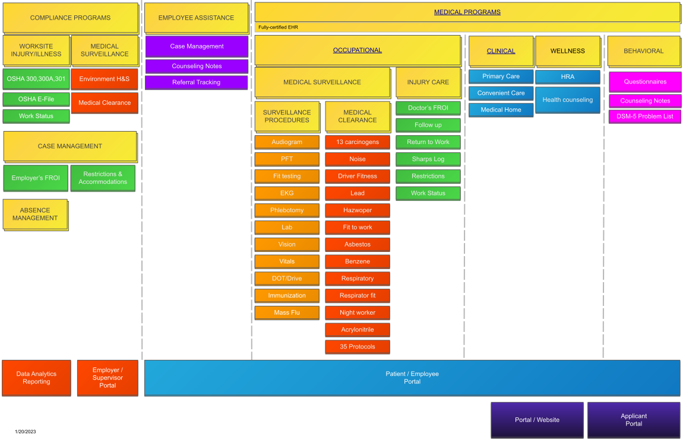

Information and resources designed to assist with the general use, setup, and configuration of the {} system. Additional information is also available for any troubleshooting or training needs.

## [Video Library](videos-and-demonstrations.md)

A powerful resource for all users. Check out our various modules, standard functionality, and prescribed workflows designed to streamline all of your clinical and administrative needs.

## Documentation

This documentation is organized into two sections "Programs" and "Functions."  The "Functions" are the low level features for {} and the "Programs" represent the combination of the functions to achieve a specific business purpose.  For example, Document Management is a Function and it is used across many Programs as the foundation of information management.  Another example Function would be EPCS (Electronic Prescribing of Controlled Substances) and would be in Clinical, Behavioral and Occupational Programs.

### [Programs](programs.md)

{}
{} offers various solutions for Enterprise Management of Health and Wellness. Check out our clinical and corporate solutions intended to streamline operations, reduce burden, and increase overall quality.  Programs are listed in yellow and some functions are highlighted below each program.

{}

{}
{} offers various solutions for Medical Practices. Check out our clinical and solutions intended to streamline operations, reduce burden, and increase overall quality.  Programs are listed in yellow and some functions are highlighted below each program.

{}

### [Functions](functions.md)

See an overview and detailed documentation of all our solutions.

## [Rapid Install & Deployment](rapid-deployment.md)

The {} system allows for a non-invasive experience for deploying and implementing a standard product. By using streamlined agendas and a straight-forward project plan, users can get back to basics and feel at ease with their new solution.
