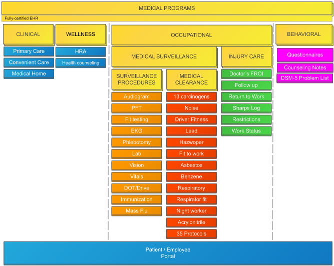

Information and resources designed to assist with the general use, setup, and configuration of the {} system. Additional information is also available for any troubleshooting or training needs.

## [Video Library](videos-and-demonstrations.html)

START HERE! A powerful resource for all users. Check out our various modules, standard functionality, and prescribed workflows designed to streamline all of your clinical and administrative needs.

## [Programs](programs.html)

{} offers various solutions for your every-day needs. Check out our clinical and corporate solutions intended to streamline operations, reduce burden, and increase overall quality.

## [Rapid Install & Deployment](rapid-deployment.html)

The {} system allows for a non-invasive experience for deploying and implementing a standard product. By using streamlined agendas and a straight-forward project plan, users can get back to basics and feel at ease with their new solution.

## [General Functionality](general-functionality.html)

See an overview and detailed documentation of all our solutions.

{}

<object type="image/svg+xml" data="diagrams/wc-positioning.svg"></object>

{}

{}

<object type="image/svg+xml" data="diagrams/eh-positioning.svg"></object>

{}

Contact Us

<table>
  <tr>
    <td>Phone</td>
    <td>(260) 459-6270 Option 1</td>
  </tr>
  <tr>
    <td>Toll-free</td>
    <td>1-888-498-3484</td>
  </tr>
  <tr>
    <td>Email</td>
    <td>support@mieweb.com</td>
  </tr>
</table>

