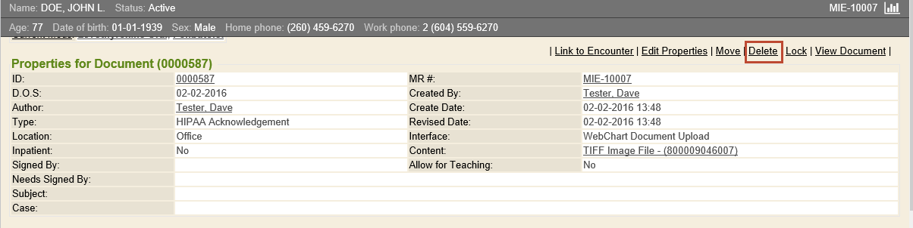
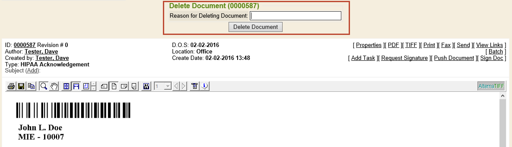
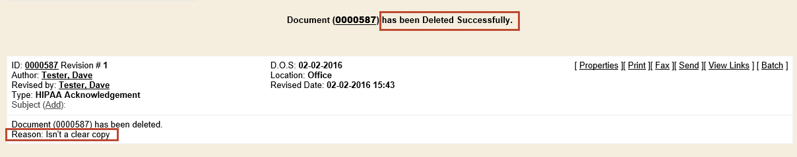
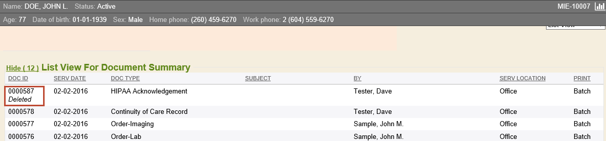
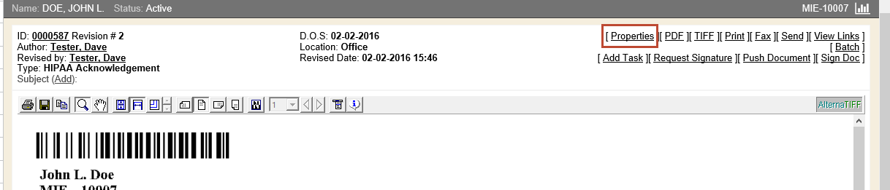
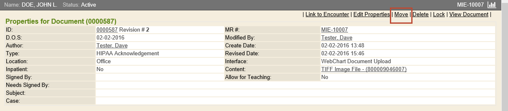
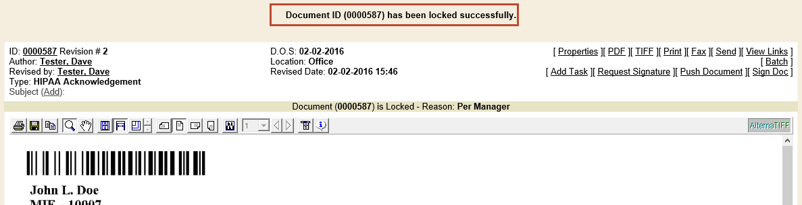

In order to delete, move, or lock documents found within a chart, users must have the proper security permissions granted. There are a few specific security permissions that control what can be done with documents within a chart. These security permission settings are: _Document Move_, _Document Lock_, _Document Delete_, and _Document Un-Delete_.

## Delete Documents

The security permission **Document Delete** must be set to **Yes** in order to delete a document from a chart. If the user has the **Document Un-Delete** permission set to **Yes**, then that user would be able to _undelete_ documents. Undeleting documents will reactivate them in the chart.

{}
Deleting a document in {} will simply remove the contents from being visible. The document will continue to show as a line item on lists, marked as _deleted_. This provides visibility to documents that once existed and have since been removed, or deleted.
{}

To delete a document from a chart, find and open the document needing to be deleted. While viewing the document, click the **Properties** link near the upper-right corner of the page.

Once the page reloads, click the **Delete** link.

The _Delete Document_ confirmation prompt will load at the top of the document. This shows the document ID in parentheses, and a free-text field to state _Reason for Deleting Document_. To proceed with deletion, it is required to provide the reason for deleting the document. Click the **Delete Document** button, when finished.

After deleting, a confirmation will appear stating, _Document (ID#) has been Deleted Successfully_. All content of the document will be removed and replaced with verbiage of the document's deletion and the reason for deleting.

{} will keep a record of document deletions in the revision history of the chart. The document(s) will be kept in the chart, with the contents removed. Some chart tabs are configured to omit deleted documents from the view, by default (e.g., Document Summary chart tab). Other chart tabs can be configured to omit deleted documents from view, if preferred. Otherwise, chart tabs will display a deleted document in the List View.

{}
MIE can also set up a Deleted Documents chart tab, configured to house any/all deleted documents, for easy viewing in a separate chart tab.
{}

## Move Documents

The security permission **Document Move** must be set to **Yes** in order to move documents between charts. With this permission set, users may move documents from one chart into another. This is typically reserved for instances where a document was accidentally indexed into the wrong chart.

To perform moving a document from one chart to another, find and open the document needing moved. While viewing the document, click the **Properties** link near the upper-right corner of the page.

Once the _Properties for Document_ screen loads, click the **Move** link.

The _Move Document_ confirmation prompt will display at the top of the screen. This shows the document ID in parentheses, an autocomplete field to specify where the document is going, and a free-text field to provide _Reason for Moving Document_.

To proceed moving the document, use the _Move To Employee/Patient_ autocomplete field to specify the appropriate chart the document needs moved into. The autocomplete field functions as a search for finding the correct chart, because the necessary chart must already exist in order to move the document. Use the help bubble for assistance with searching for the appropriate chart.

After selecting, be sure to fill in the _Reason for Moving Document_ field, and click the **Move Document** button.

{}
If there are duplicate, or matching patients, these will display above the chart search. Click **Select** next to the appropriate chart the document is being moved into.
{}

Once finished, a confirmation will populate at the top of the page, stating _Document (ID#) has been moved to patient MR: # successfully_.

{} will keep a record of document moves in the revision history of the chart. In the List View of the original chart, documents will display as _Deleted_, because the document is considered _deleted_ from the original chart and _moved_ into the correct chart. The full contents of the document can be viewed from the correct chart.

{}
When moving a document, any/all encounters linked to the document will be unlinked, to prevent any unwanted links to other charts.
{}

## Lock Documents

The **Document Lock** security permission must granted in order for a user to be able to lock documents. There are varying levels of security when it comes to locking documents. For example, users can be granted permission to lock only their documents, or they can be given permission to lock any/all documents.

To lock a document, find and open the document needing locked. While viewing the document, click the **Properties** link near the upper-right corner of the page.

Once the page reloads, click the **Lock** link.

The _Locking Document_ confirmation prompt will load at the top of the document. This shows the document ID in parentheses, and a free-text field to state _Reason for Locking Document_. To proceed with locking, it is required to provide the reason. Click the **Lock Document** button, when finished.

After locking, a confirmation will appear stating, _Document ID (#) has been locked successfully_. {} will keep a record of this locked document in the revision history of the chart.

When viewing document List Views, all locked documents will display in the list; however, all locked documents indicate their locked status, along with the provided reason for locking.

Users without permission to view locked documents will not see any contents when trying to access a locked document. Only users with proper security permissions to lock documents can view locked documents. There are also security options for users to be able to print locked documents, if necessary.

## Remove Old Record Locks

With the proper security permission, a user may review a full listing of current record locks on documents. Simply navigate to the **Control Panel** and select the [Record Locks](https://docs.enterprisehealth.com/functions/system-administration/system-controls/locking-individual-or-specific-charts/) tab. Authorized users can remove locks on individual documents, or utilize the **Remove Old Record Locks** link in the top-right corner of the page. This will remove all record locks on the list, en masse.

