To begin, go to **START** at the bottom left corner of your computer desktop and move your mouse to

**ALL PROGRAMS**. Next, find and select the program named **SpeechMike Driver Utility** then another branch will open. Click **Control Application** to run the Control Application for the SpeechMike Driver Utility.

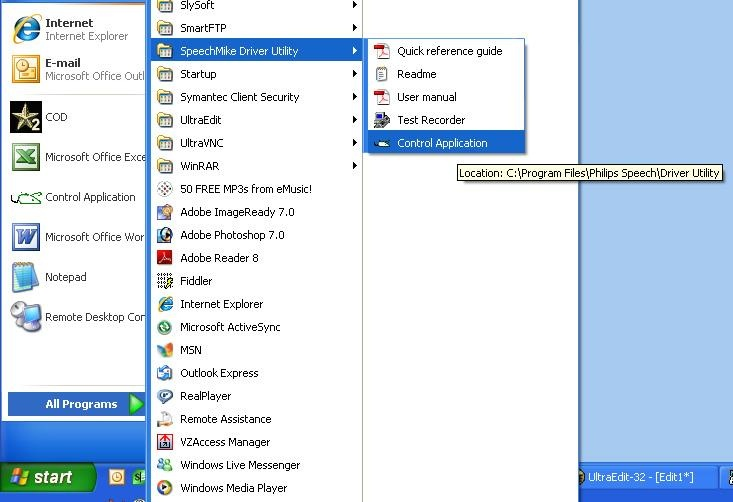

The *Control Utility* screen will open. This is where you will make some selections for setup.

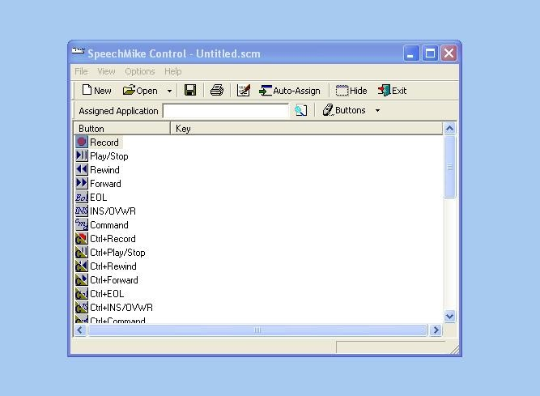

Click on **Options** at the top toolbar, then select **Buttons**. The Buttons options will branch out. In the Buttons options, select the name of your SpeechMike.

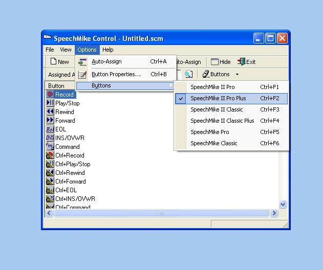

After you have selected your SpeechMike name, click on **Options** again in the top toolbar.

Then select **Auto-Assign.**

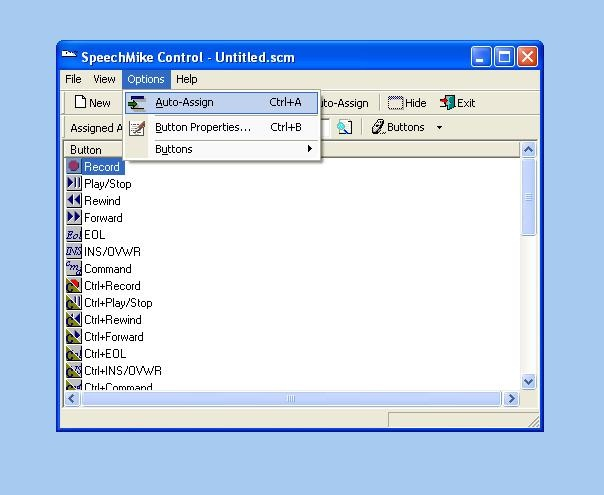

Notice that the Auto-Assign button is pressed in. Now click on the "Browse" icon. The *browse* icon is the icon that looks like a yellow folder w/ a magnifying glass on it. It is to the right of *Assigned Application* field.

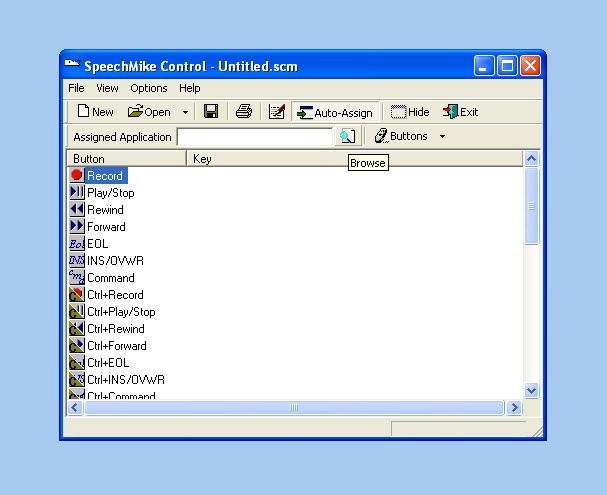

After you have clicked browse, find the Internet Explorer program **in Local Disk (C: ) -> Program Files -> Internet Explorer.** Click Local Disk (C:), then click Program Files, then click Internet Explorer.

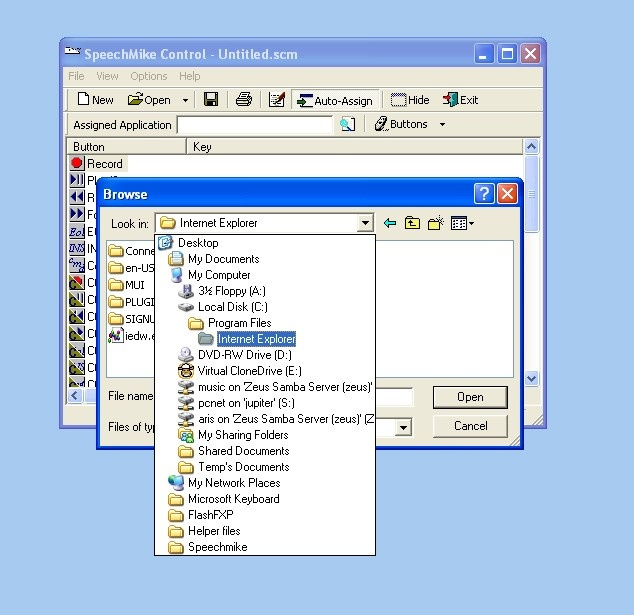

When the Internet Explorer folder opens, click on **iexplore.exe.**

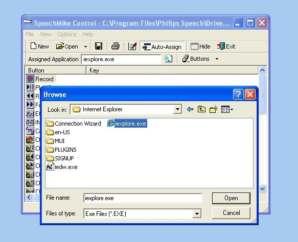

Then, click on the **EOL** button. This is to assign the button for uploading.

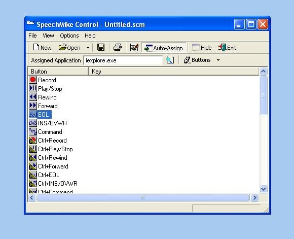

Now you need to assign a Keyboard Input command. For example hold the Alt key down with U.

Make sure this combination doesn't already exist in your program.

Internet explorer is already using Alt + F, Alt + E, Alt + V, Alt + T, Alt + H.

The "Dictation" layout or any other layout used here, needs to have the access keys assigned to the buttons for uploading a dictation. When done, click the *close* button.

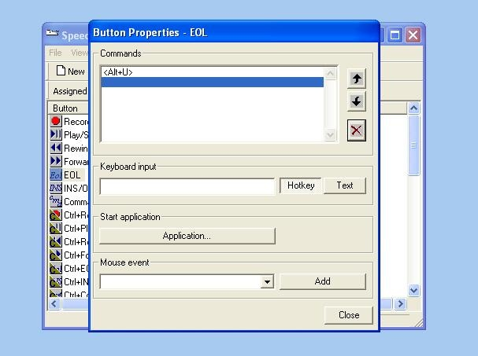

When done, click on **File** from the top toolbar, then click **Save**.

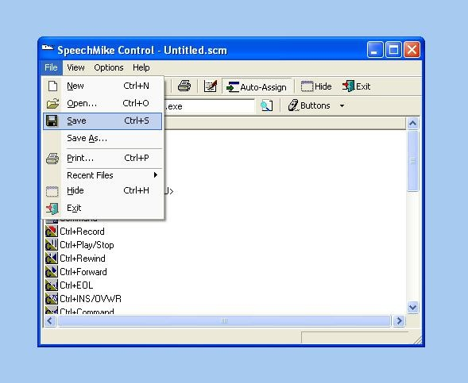

After you click Save, it will pop open a SAVE AS screen in the Driver Utility.

Type in the *File name* field **Webchart.scm** to save as **Webchart.scm**.

Make sure *Save as type* says Scheme files (.SCM) and click SAVE.

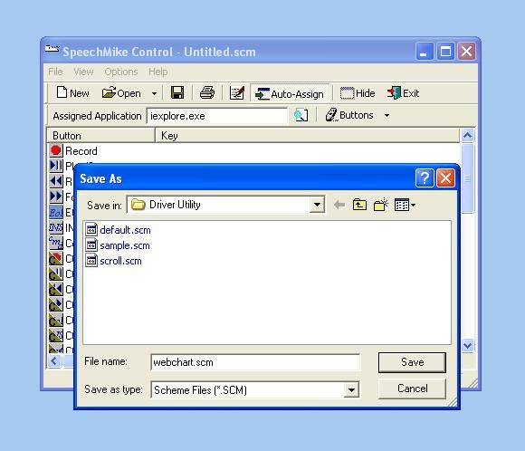

