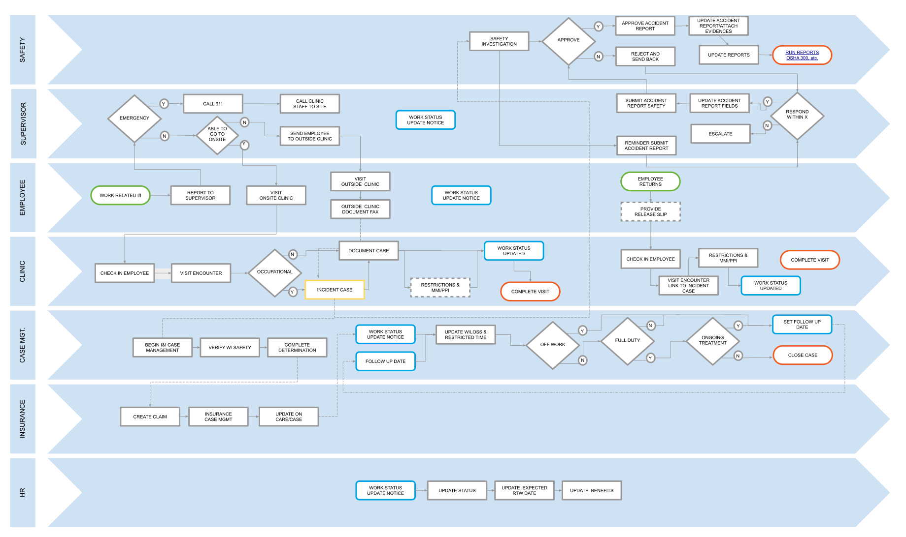

{} can be used for treating, documenting, managing, *and* reporting injuries and illnesses, which can be initiated from a visit to the clinic, or in advance, via an employee portal. This allows incidents to be reported anytime, day or night. And regardless of how the information is captured, {} can compile the recorded data into form overlays, minimizing the need for redundant data entry, while also easing reporting burdens. Overall, {} not only incorporates streamlined processes for recording and treating injuries and illnesses, it also provides tools for easy tracking and follow-up through the use of its integrated worklists and tasking module.

## Case Management

In addition to the ongoing assessment, planning, and evaluation of incidents, implementing preventive systems and appropriating all necessary resources are key factors of successful case management. Ensuring the worker a timely and cost effective return to work has never been easier, thanks to the {} platform incorporating design and functionality intended to streamline these processes and provide workers the quality care they deserve.

{}
