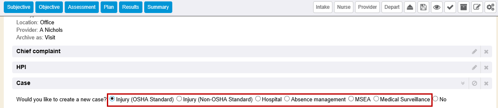
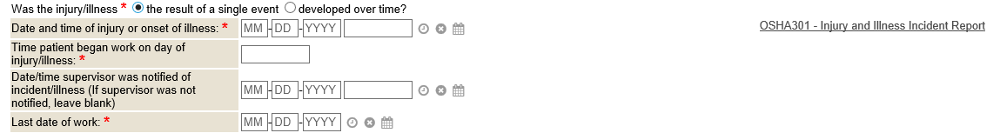
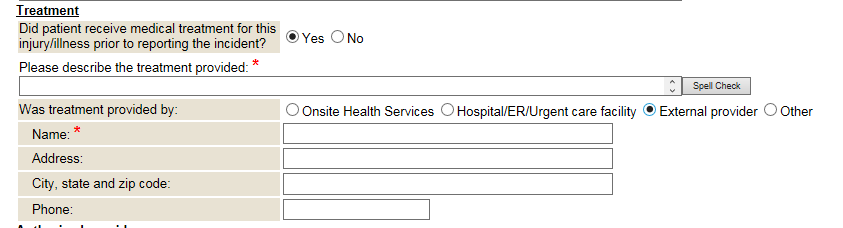

A case is a full report of a workplace injury, or incident, for an employee (patient). The case is created in an initial visit (encounter), and is then linked to subsequent visits. A case links all follow up visits (encounters), restrictions, accommodations, conditions, and nature of injury information. All of the documents pertaining to the case are grouped together within the chart for reporting purposes. There are several case types, which designate different required fields as well as state specific incident questions and forms. The terms case and incident may be used interchangeably in a system.

## Create a New Injury OSHA Case

If you wish to document a new case, expand to open the Case section in the dynamic encounter.

Once the Case section is expanded, indicate which type of case to create on the chart by selecting the appropriate radio button. Depending on the type of case radio button selected will determine other fields or radio button data to complete. Once you open/create a case, any documentation, encounter visit documentations, etc can be linked to a specific case/incident the chart has had.

This help documentation will describe the steps for creating and documenting an Injury OSHA Standard case type.   Injury (OSHA Standard) case types would be your most common selected case type, even if the injury isn't OSHA reportable.  Injury Non-OSHA case types are typically used by clients who aren't in the US and need a way to document cases/incidents but aren't under US OSHA regulations.

{}
Your MIE Implementer can also turn on a feature that will automatically also generate a ‘Case Management' encounter when a case is created for a visit encounter.
{}

By default, the Case section in encounters will display the following case types: Injury (OSHA Standard), Injury (Non-OSHA Standard), Hospital, Absence Management, MSEA, and Medical Surveillance.

### Injury OSHA Standard Case Details

After selecting to create an Injury OSHA Standard case, a question will branch open to document if the injury/illness was result of a single event or developed over time.

#### Dates/Times of Injury or Illness

Upon documenting the radio button selection, the case section will branch open to document the details of the case.  The first section is to key in the date/time of onset, and other date/times to note for specific work information. Many of the fields and data pull onto report of injury forms and/or reports.  Several fields are required and noted with a red asterisk.

#### Return to Work (RTW)

The return to work (RTW) dates may be entered now or in later during the case management process if applicable.

#### Work-Related

The work related section is to document details regarding if the incident is work related or not, and depending on what radio buttons are selected, other data fields may branch open to document.  Fields with a red asterisk are required to fill out before a case can be saved to the chart. The field Work Related will most commonly be the answer will always be Yes if you are a client who tracks and records cases/incidents on your employee's for injuries and illnesses.  The Workers' Comp Related field is separate data to note if the case/incident is Workers' Comp related and will be going to the third party insurance administrator for your company as a claim.  If you answer "yes" to Workers' Comp Related, other fields will expand to document more comprehensive data regarding the Worker's Comp claim.

The field Date Determined Recordable means it's an OSHA reportable injury or illness.  If a date is entered into this field, this case/incident details will populate on the OSHA log report.

If the System Setting *Workers Comp Fields* is disabled, the fields *Record Only*, *Do you question the validity of the claim?*, and *Reason for questioning the validity of this claim* will no longer be displayed. By default, this setting is enabled. These fields are primarily used for a workers' comp integration.

### Location

The location section displays to document where the injury occurred specifically.

Onsite Location: If selecting Onsite Location as to where the injury/illness occurred, you can then (optionally) fill out where specifically the injury/illness occurred onsite using an auto-complete of choices.  The choices displayed in the auto-complete are a sample default list and you would need to give a complete list of location areas to your MIE Implementer in an excel spreadsheet for an MIE developer to import.  It can be a general list or a very granular hierarchical location of choices. The auto-complete field is optional just to provide more granular reporting needs if the client desires. Otherwise, one must just free-type in where the event occurred in the field noted by a red asterisk.

Select Supervisor field: Supervisor selections in this auto-complete field in the case is not necessarily the employee's supervisor, so we output selection choices (in this auto-complete) of anyone who has a ‘supervisor' relationship in the system, not just limiting to supervisors directly from the employee chart being worked in.

If the System Setting *Select Supervisor* is disabled, the field *Please select supervisor* will no longer display within the ‘onsite location' fields. By default, the system setting is enabled. This field is primarily used for workers' comp integration. In addition, users may also input any supervisor in the Authorized Users section at the bottom of the Case section.

NOTE: Supervisor(s) of an onsite location where an injury/illness occurred may not necessarily the employee's supervisor, so the auto-complete field outputs search choices of anyone who has a ‘supervisor' relationship in the system, not just limiting to supervisors directly from the employee chart being worked in.

Offsite Location: If selecting offsite location, then the fields that branch open are required free text fields to note the offsite location details.

### Incident Details

In the incident details section are some checkbox choices and also where you free-type answers to 3 required questions on how the injury occurred, what happened, and what harmed.

Event and Source drop-down fields are not displayed Injury-OSHA case type by default but can be configured into your system if needed.  Otherwise, these are only offered in the Non-OSHA case type. If you wish to have those input fields also, please contact your MIE Implementer to have that configured.    Drop-down choices for these can be customizable.

### Treatment

In the optional treatment section, you can indicate an answer if the patient received medical treatment prior for this case/incident and by whom.

Depending on various radio button answers selected, other fields may branch open to document in where some are required and others are optional.

The treatment provided by onsite health services radio button choice points to a location drop-down that shows choices of inside & outside locations set in your {} system via the Locations Manager tab found in Control.

The treatment provided by hospital/er/urgent care facility radio button choice show free text fields available to key in information.  Again, information keyed in these sections usually overlay on specific forms that you generate from forms library.

The treatment provided by external provider or other radio button choices show free text fields available to key in information.

### Authorized Providers

This optional section is provided to be able to document what providers are working on the case/incident, especially if you maintain a directory of outside providers in {} .  This auto-complete of choices in the authorized providers section points to the department "Physicians".  This will display active & login disabled users tied to that department. This is an optional section and doesn't need to be filled out unless you want to be granular in documenting this.

### Nature of Injury/Body Parts

Here you can document the nature of injury or illness using a drop-down selection list.  The fields  Nature of Injury and Body Part are drop-downs of choices.  Contact your MIE Implementer if need additional choices added to these drop-downs.

.. Note:: Selecting Contaminated Sharp as the nature of injury will expand 3 additional fields for you to document.  These additional fields of data pull on Sharps Log reports.

### Work Status (or Lost Time) Section

Lost time would be documented using the Restrictions and Accommodations section.  Refer to the [Restrictions and Accommodations](../adding-restrictions.md) help documentation for more information.

### Restrictions and Accommodations

Refer to help documentation named [Restrictions and Accommodations](../adding-restrictions.md).

## Linking Documents to Cases

Documents can be linked to cases.  This can be done when in Add Document mode, via the Edit Properties of an existing stored document.  Documents can also be linked to cases when indexing a document from WebScan. Scheduled appointments can also be linked to cases when in the Add Appointment wizard.

## Case/Incident Summary in Dynamic Encounters

Some dynamic encounters offer an Incident Summary section.  This is an expandable section to review or edit specific case data while a provider works their portion of the encounter.  Usually the nurse creates a case and documents the case details from the employee's/patient's statements, but while the provider is seeing the patient/employee, the provider may deem to change high priority fields/data of the case and this section offers that ability, instead of scrolling back up to the case section to expand and edit all the details.

{}
Various forms, in forms library, can be programmed to pull in case data details that were documented.  Contact your MIE Implementer if have specific forms that need generated routinely that may need case (incident) data overlaid.
{}

## Add Case from an Incident Report via the Portal

If an employee has reported an incident via the employee portal, a document summarizing that information is available in the employee chart. The document is stored with the document type description **Questionnaire-Report Injury or Illness**.  Workflows may be configured based on need to task these documents to an individual or department such as Nursing, Case Management or Safety Team for review. Once the report has been reviewed by the appropriate personnel and it is deemed that it should be made into a case, click the **Add Case** button from the **Questionnaire-Report Injury or Illness** summary document.

A confirmation message will display in the **Add Case Details** dialog box indicating if the documentation was successfully added as a case, along with the system generated case number and a link to the case summary document.

Once the summary document has been made into a case, users may link the case to any encounter with the Case encounter section.

Once linked, the case will default to the Injury (OSHA Standard) Case Type. The user will be prompted to indicate if the injury/illness was a pre-existing injury, the result of a single event or developed over time, before any other case fields will display. From this point, users may update or add additional information to the case.

## Learning Management System

To learn more about Adding an OSHA Case, follow the link below to the Learning Management System course:

* [Workers' Compensation Management](https://mie.talentlms.com/shared/start/key:ALTHRKMF)
