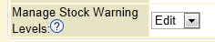
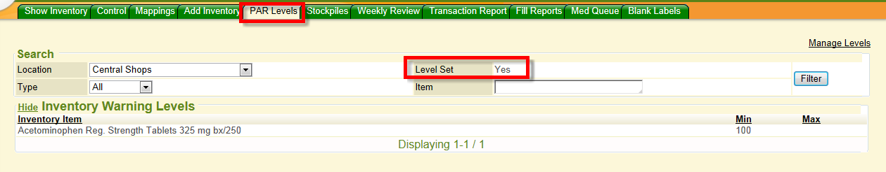
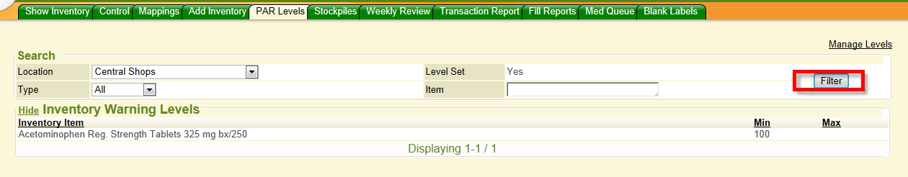
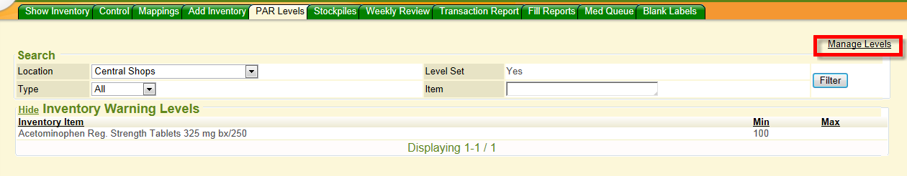
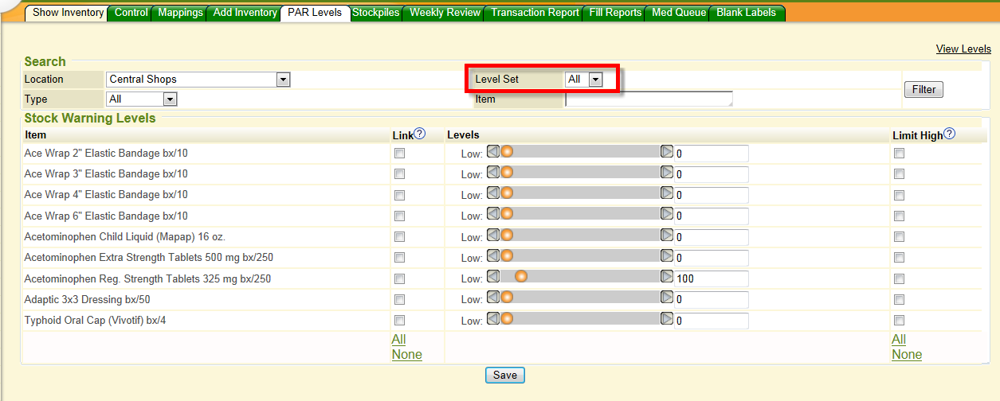
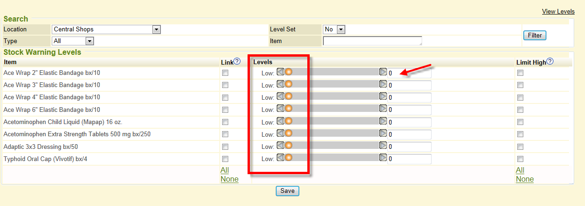
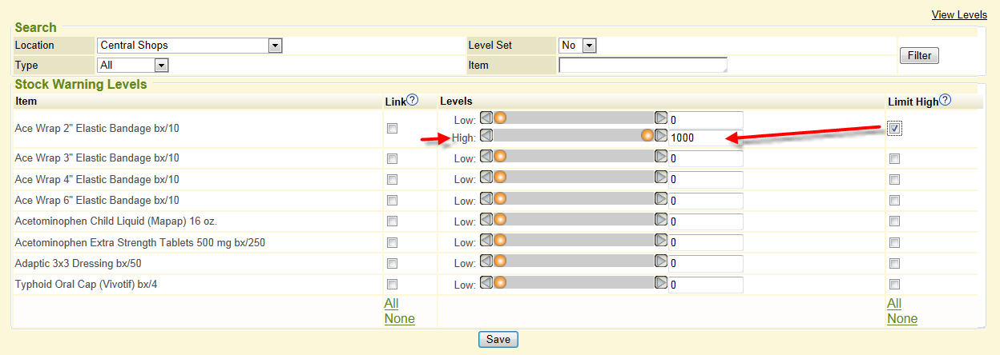
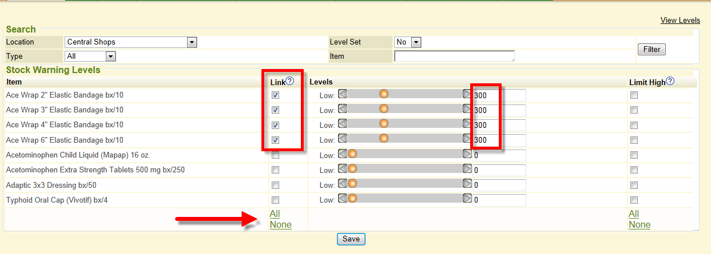
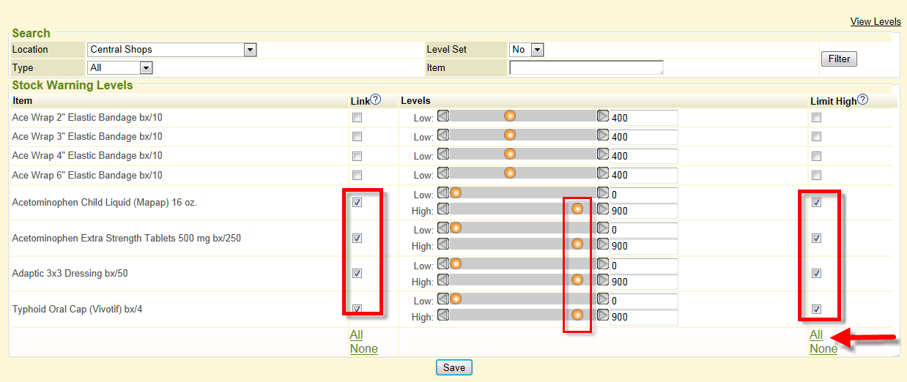
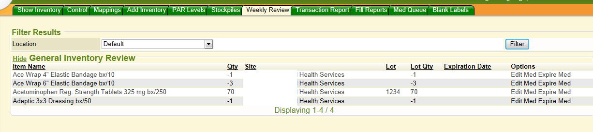

In order to view or edit Par Levels, the user must have security permission level for *Manage Stock Warning Levels* set.

## Viewing Par Levels

Your inventory items that are set up with minimum and/or maximum par levels will be shown on the view when you click the sidemenu tab *Inventory*, then click the *Par Levels* tab. By default it will show the location your ‘My Settings' preference location is set to. You can see inventory items with min and/or max par levels currently set for that default location. By default your view is showing only the inventory items with current par levels set.
That is what **Level Set: Yes** means on the screen.

You can use the search criteria field filters at the top to render more results or different searches to see current par levels set on inventory items. Click the FILTER button to render the search based on criteria you are searching for using the fields provided. The results will render down in the Inventory Warning Levels section of the screen listing the Inventory name and the min/max par level that is set for it.

## Adding Par Levels

You can add/edit par levels by clicking the **Manage Levels** hyperlink on the right side of the Par Levels screen.

Once you click Manage Levels, the screen will show all inventory items for that location that do or do not have par levels set. The default is *Level Set: All* when you land on that screen. You see the combination of inventory items that do and do not have par levels set. If you wish to just see and work on the inventory items that do not have par levels set, you would change your *Level Set* drop-down to No. Level Set: No means those inventory items exist but to not have par levels set to them. Level Set: Yes means those inventory items exist and have par level(s) set. Level Set: All means you are viewing all inventory items with and without par levels set combined on your screen.

Change any filter criteria at the top to narrow down the results of the inventory items you want to set par levels for and click the FILTER button. The results will display underneath.

## Setting Low Par Level

By default the LOW par level setting displays. You can drag the orange ball to set the low par level or you can type in a specific number in the field where it currently displays 0 and the orange ball will move to the appropriate position on the slide. You can drag to set or you can type in a specific number for Low par level setting or you can even use the left or right arrow icons on the slider bar to set the low par level.

## Setting High Par Level

If you wish to set also a High par level to the inventory item, you would checkmark the *Limit High* checkbox next to the specific inventory item. As soon as you checkmark ‘limit high' checkbox, it will open a *High* slider bar where you can now slide the orange ball to the proper ‘high' level you wish to set or you can manually type in a specific number in that "high" level field that opened and the orange ball will slide to proper position. You can even also use the left and right arrow icons on the slider to set the par level. Each inventory item you wish to set a High Par level for, you would checkmark the **limit high** box next to the specific inventory item to set a high level for.

When you are done, click the SAVE button at the bottom.

## Setting Multiple Items to Same Low Par Level

You can set inventory items in mass to the same low and/or high par level. You can individually checkmark the specific inventory items you are going to set the same low par level to. You can also select *all* inventory items in mass by clicking the **All** link at the end of the link column. If you accidently select that and want to reverse, you can click **None** link to uncheckmark and start over.
You then grab any orange ball from any of the inventory items that is checkmarked to link and drag the orange ball to the position and as soon as you let go of the orange ball, all the inventory items selected will respect that setting. You do not need to set each one individually. Just grab to set one and all will follow in retrospect. You can use the left and right arrow icons too and set the low par level using that method. Or you can type in a specific low par level in the text box and use your tab key or click your mouse somewhere on the screen and all the inventory items you had checked to ‘link' will also be set to that low par level in mass. When done, click the SAVE button at the end of the screen to save your work.

## Setting Multiple Items to Same High Par Level

You can set ‘high' par levels to multiple inventory items at a time also. First select which Inventory items you will "link" the same high par level to by checkmarking each in the Link checkbox or using the **all** button at the end of the list. Then checkmark those same inventory items for **Limit High** checkbox to open up the "high" par level sliders (or you can use the **all** button at the end of that column to set all of them to a high par level). The "high" par level sliders will open to display on the screen.
You then grab any orange ball from any of the inventory items that is checkmarked to link and drag the orange ball to the position and as soon as you let go of the orange ball, all the inventory items selected will respect that setting. You do not need to set each one individually. Just grab to set one and all will follow in retrospect. You can use the left and right arrow icons too and set the high par level using that method. Or you can type in a specific high par level in the text box and use your tab key or click your mouse somewhere on the screen and all the inventory items you had checked to ‘link' will also be set to that high par level in mass.

When done, click the SAVE button at the end of the screen to save your work.
Your MIE Implementer can have par levels imported if you have a spreadsheet with the specific Inventory ID it is in {} , the low & high valued and identified the location and stockpile if applicable.
If the inventory item falls below the low par level, you can see it listed in the WEEKLY REVIEW tab. This is the tab you would look to see what is a negative quantity or below the low par level.

Your MIE Implementer can also have a cron job set up to trigger an email to someone you specify to receive and email when an inventory items hits a minimum or maximum par level threshold or any other criteria you may want to trigger for notification/ordering purposes.
