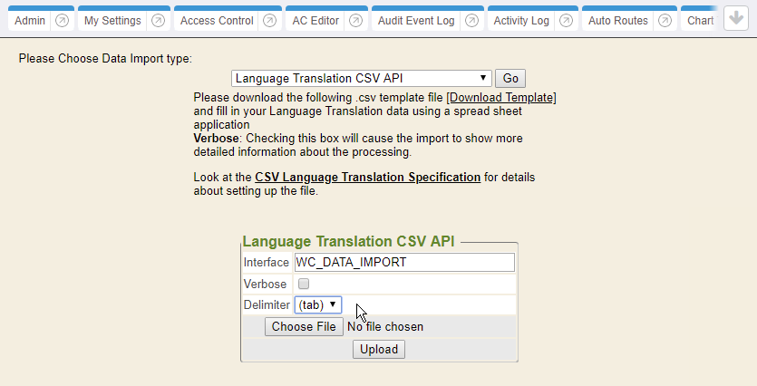

This document explains how to import your language translation data into  {} .

What you will need:

* Spreadsheet software (Microsoft Excel or Google Sheets)
* End user with administrative rights

## Create Language Translation Text File

The following table provides optional or required **Field Names** and **Descriptions**, as indicated by the **Requirement** column. The order of the remaining fields does not matter.

<table>
<tr>
<td><strong>Field Name</strong></td>
<td><strong>Description</strong></td>
<td><strong>Requirement</strong></td>
<td><strong>Column Header Name</strong></td>
</tr>
<tr>
<td>LANGUAGE CODE</td>
<td>Code that identifies the language. Examples: sp = Spanish, zh-hans = Simplified Chinese 
See: <a href="https://www.iana.org/assignments/language-subtag-registry/language-subtag-registry">https://www.iana.org/assignments/language-subtag-registry/language-subtag-registry</a></td>
<td><strong>Required</strong></td>
<td>LANGUAGE CODE</td>
</tr>
<tr>
<td>CONTEXT</td>
<td>Used to disambiguate phrases that may need to be translated differently depending on product area.</td>
<td><strong>Optional</strong></td>
<td>CONTEXT</td>
</tr>
<tr>
<td>ENGLISH</td>
<td>The original English text</td>
<td><strong>Required</strong></td>
<td>ENGLISH</td>
</tr>
<tr>
<td>TRANSLATION</td>
<td>Translated text</td>
<td><strong>Required</strong></td>
<td>TRANSLATION</td>
</tr>
</table>

In Excel, save the sheet as Unicode Text.  This is important because **saving as CSV will NOT work** for many languages.

## Upload Language Translation Text File

1. Login as a user with administrator rights.
2. Navigate to the Control Panel from the side menu.

3. Select the Data Import tab.

4. Select the Language Translation CSV API from the drop-down menu and click Go.

5. Choose Delimiter: (tab), select the Language Translation Text File and click Upload.

## Example Files

* - UTF-8 encoded (preferred format for manually constructed files)
* - UTF-16LE encoded (accepted format for export from Excel)

## Resources

* [Language Subtag Registry](https://www.iana.org/assignments/language-subtag-registry/language-subtag-registry)

## Troubleshooting

Ensure that all of the fields marked as **Required** have valid content. The file uploaded must be saved as a Unicode Text formatted, tab delimited file. In case of any errors, contact Technical Support.
