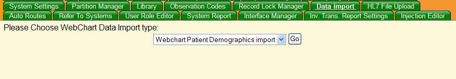
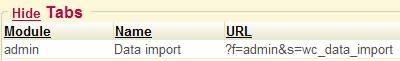
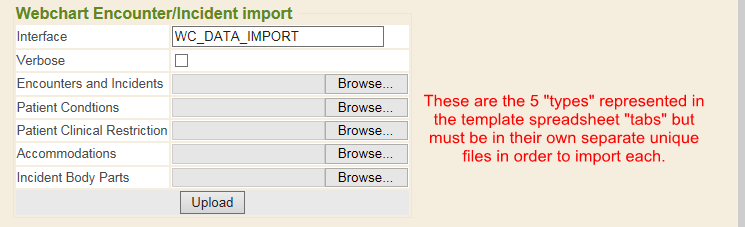

Must have security access to access the DATA IMPORT tab found in Control Panel sidemenu tab. The security needed is *Allow .csv Data Import* set to Yes. The default security is currently set to No for users.

If user(s) have security permission to allow .csv data import, then the user(s) can access the DATA IMPORT tab, this feature allows the user access to download a .csv template file and fill in patient demographic data using a spreadsheet application. If you have it set to NO, you can't view or access the Data Import tab at all.

If your system does not have a Data Import tab, please contact your MIE Implementer to have the tab programmed on your system.

Once in the Data Import tab, use the drop down to select the specific {} data import type and click the GO button.

## Lost Time Import

In this help document we will be going through the {} Lost Time import type.

Once you've made the drop-down selection from the Data Import tool type and clicked the GO button for {} Lost Time import, you can download the.csv template file [[Download Template](https://docs.google.com/spreadsheets/d/1Gi1bPGobEOuUJX40_lXf-oDSEpriLBUXyeJACUy7DaQ/edit#gid=503618203)]. From your own downloaded copy, fill in your Lost Time data using a spreadsheet application.

This {} import tool allows the creating of encounters and creation of cases/incidents in a patient's chart with the data provided in the import spreadsheet.

{}
Look at the CSV Lost Time Import Specification sheet to help identify what columns of recommended data and values to import. This is shareable information regarding more data, values, columns, spreadsheet example, etc.
{}

{}
There are 5 different parts that could be imported regarding Lost Time. Not all 5 are needed, but each type has to be in its own separate unique spreadsheet file to import using this tool. Even though the template spreadsheet shows 5 tabs (one for each Encounters and Incidents, Patient Conditions, Patient Clinical Restriction, Accommodations, and Incident Body Parts) you must save each "type" into its own separate spreadsheet with only that tab of data. Do not have one spreadsheet with tabs for each import type (even though our spreadsheet template shows 5 tabs, please separate into specific unique individual files before importing).
{}

INTERFACE allows you to specify which interface to store to find the patient.

VERBOSE mode will print out what the import is doing to the screen and the log file.

## Template

You can view the [spreadsheet template](https://docs.google.com/spreadsheets/d/1Gi1bPGobEOuUJX40_lXf-oDSEpriLBUXyeJACUy7DaQ/edit#gid=503618203) and download your own copy. Again, even though our template shows 5 tabs for each of the 5 types of Lost Time imports available, each must be on its own unique separate file when you go to import that type.

## Data and Values for Encounters and Incidents

An encounter documents a visit with a patient, and is also known as a patient visit. An encounter is a template of specific items to be addressed, in part or completely, during a patient appointment.

A case/incident contains a full report of a workplace injury, or incident, for a patient (employee). {} stores "cases/incidents" within an encounter. This import tool file would import/create encounters and cases/incidents.

<table>
<tr>
<td><strong>Column</strong></td>
<td><strong>Description</strong></td>
<td><strong>Length</strong></td>
<td><strong>Example</strong></td>
</tr>
<tr>
<td><strong>encounters.ext_id</strong></td>
<td><strong>Required Field</strong> External identifier–used for {} systems. Typically populated by third party interfaces.</td>
<td>30</td>
<td>ABC123 or 54321</td>
</tr>
<tr>
<td><strong>encounters.patient_mrn.</strong></td>
<td><strong>Required Field</strong> Unique patient identifier.  The value of this field will be the MRN in the partition defined by the column name.Replace with the partition to be used</td>
<td>50</td>
<td>123456789</td>
</tr>
<tr>
<td>encounters.visit_type</td>
<td> 
<strong>Recommended Field</strong> Description from the ‘encounter_visit_types' table. _What encounter visit type you want to be created when you import Lost Time. Must be the specific visit type code from your {} system</td>
<td>10</td>
<td>Visit</td>
</tr>
<tr>
<td>encounters.priority</td>
<td>Configurable setting to set priority of encounter (client-specific use).</td>
<td>10</td>
<td>1</td>
</tr>
<tr>
<td>encounters.serv_date</td>
<td><strong>Recommended Field</strong> Inserts the Date of Service for the encounter specified (when using <em>encounters.visit_type</em> field). If not indicated, the encounter will be created without a service date (will be blank).Must be in this date & time format: YYYY-MM-DD HH:MM:SS</td>
<td>19</td>
<td>2001-01-08 08:30:00</td>
</tr>
<tr>
<td>encounters.discharge_date</td>
<td>Date discharged from hospital for inpatient care.Must be in YYYY-MM-DD format.</td>
<td>19</td>
<td>2001-01-08 08:30:00</td>
</tr>
<tr>
<td>encounters.comment</td>
<td>Free text comment regarding the encounter</td>
<td>Text</td>
<td>This encounter will be used for a Lost Time import</td>
</tr>
<tr>
<td>encounters.chief_complaint</td>
<td>Chief complaint of encounter (reason for visit).</td>
<td>Text</td>
<td>Here for consultation for diabetes, hypertension and GERD.</td>
</tr>
<tr>
<td>encounters.location</td>
<td>Location code.  This is the ‘description' field from the {} ‘location' manager</td>
<td>60</td>
<td>OFFICE</td>
</tr>
<tr>
<td>encounters.closed</td>
<td><strong>Recommended Field</strong> Inserts the encounter visit type specified (when using <em>encounters.visit_type</em> field) as open or closed.Options include: 
<ul><li>0 (would be value Open)</li><li>1 (would be value Closed)</li></ul></td>
<td>11</td>
<td>1</td>
</tr>
<tr>
<td>encounters.stage</td>
<td>The current stage of encounter.</td>
<td>40</td>
<td>Intake</td>
</tr>
<tr>
<td>encounters.account_number</td>
<td>Often used for inpatient care for an external identifier tied to the encounter.</td>
<td>30</td>
<td>123456</td>
</tr>
<tr>
<td>encounters.due_date</td>
<td>Date encounter is due for panel action.Must be in YYYY-MM-DD format.</td>
<td>19</td>
<td>2001-01-08 08:30:00</td>
</tr>
<tr>
<td><strong>incidents.inc_datetime</strong></td>
<td> 
<strong>Required Field</strong> Maps to {} incident field "Date & time of injury or onset of illness". Incident datetime.Must be in date format of YYYY-MM-DD and time format of HH:MM:SS</td>
<td>19</td>
<td>2001-01-08 08:30:00</td>
</tr>
<tr>
<td>incidents.case_number</td>
<td> 
A string representing the incident. If a unique case id# from other system, indicate here. If not indicated, then {} will not have a case # on the case/incident and will show "view" in that column.</td>
<td>30</td>
<td>ABC123 or 54321</td>
</tr>
<tr>
<td>incidents.case_type</td>
<td> 
<strong>Recommended Field</strong> Maps to {} incidents field named "Case Type". The type of case the incident refers to.Options include:* Injury-OSHA (would be value Injury) 
<ul><li>Injury NON-OSHA (would be value Injury NO)</li><li>Hospital (would be value Hospital)</li><li>Billing (would be value Billing)</li><li>Absence management (would be value Absence management)</li><li>MSEA (would be value MSEA)</li></ul></td>
<td>enumeration</td>
<td>Injury</td>
</tr>
<tr>
<td>incidents.facility_code</td>
<td>Facility location.  This is the ‘description' field from the ‘locations' manager.</td>
<td>60</td>
<td>OFFICE</td>
</tr>
<tr>
<td>incidents.on_premises</td>
<td>Flags the incident if it occurred on employer's premises. Options include: 
<ul><li>1 - yes</li><li>0 - no</li></ul></td>
<td>1</td>
<td>1</td>
</tr>
<tr>
<td>incidents.loc_description</td>
<td> 
<strong>Recommended Field</strong> Description for a location that does not appear on the {} locations table.</td>
<td>Text</td>
<td>CompanyABC Hospital</td>
</tr>
<tr>
<td>incidents.loc_address1</td>
<td> 
Address 1 for a location that does not appear on the {} locations table.</td>
<td>50</td>
<td>123 Main Street</td>
</tr>
<tr>
<td>incidents.loc_address2</td>
<td> 
Address 2 for a location that does not appear on the {} locations table.</td>
<td>50</td>
<td>Apt 23</td>
</tr>
<tr>
<td>incidents.loc_city</td>
<td>City for a location that does not appear on the {} locations table.</td>
<td>30</td>
<td>Smallville</td>
</tr>
<tr>
<td>incidents.loc_state</td>
<td>State for a location that does not appear on the {} locations table.</td>
<td>3</td>
<td>MN</td>
</tr>
<tr>
<td><em>incidents.loc_zip</em></td>
<td>Zip for a location that does not appear on the {} locations table.</td>
<td>11</td>
<td>12345 or 12345-6789</td>
</tr>
<tr>
<td>incidents.loc_county</td>
<td> 
County for a location that does not appear on the {} locations table.</td>
<td>50</td>
<td>Pima</td>
</tr>
<tr>
<td><em>incidents.loc_country</em></td>
<td> 
Country for a location that does not appear on the {} locations table.</td>
<td>30</td>
<td>USA</td>
</tr>
<tr>
<td>incidents.hospitalized</td>
<td>Flag indicates if employee was hospitalized due to injury. Options include: 
<ul><li>1 - yes</li><li>0 - no</li></ul></td>
<td>1</td>
<td>1</td>
</tr>
<tr>
<td>incidents.emergency_room</td>
<td>Indicates if injury included an emergency room visit:Options include: 
<ul><li>1 - yes</li><li>0 - no</li></ul></td>
<td>1</td>
<td>1</td>
</tr>
<tr>
<td>incidents.treatment_loc_type</td>
<td> 
Maps to {} field "Was treatment provided by". Location where employee/patient was treated. Options include: 
<ul><li>Onsite Health Services</li><li>ER</li><li>External Provider</li><li>Other</li></ul></td>
<td>enumeration</td>
<td>External Provider</td>
</tr>
<tr>
<td>incidents.ohs_location</td>
<td>Onsite health services location.  This is the ‘description' field from the ‘locations' manager.</td>
<td>60</td>
<td>OFFICE</td>
</tr>
<tr>
<td>incidents.hospital_name</td>
<td>Hospital name (if patient is hospitalized).</td>
<td>50</td>
<td>CompanyABC Hospital</td>
</tr>
<tr>
<td>incidents.hospital_address</td>
<td>Hospital address (if patient is hospitalized).</td>
<td>100</td>
<td>123 Main Street</td>
</tr>
<tr>
<td>incidents.hospital_city</td>
<td>Hospital city (if patient is hospitalized).</td>
<td>50</td>
<td>Smallville</td>
</tr>
<tr>
<td>incidents.hospital_state</td>
<td>Hospital state (if patient is hospitalized).</td>
<td>20</td>
<td>MN</td>
</tr>
<tr>
<td>incidents.hospital_zip</td>
<td>Hospital zip (if patient is hospitalized).</td>
<td>20</td>
<td>12345 or 12345-6789</td>
</tr>
<tr>
<td>incidents.hospital_phone</td>
<td>Hospital phone (if patient is hospitalized).</td>
<td>30</td>
<td>5558765309</td>
</tr>
<tr>
<td>incidents.primary_physician</td>
<td>Name of patient's physician if outside of the company/facility.</td>
<td>255</td>
<td>John Brown</td>
</tr>
<tr>
<td>incidents.physician_address</td>
<td>Address of patient's physician if outside of the company/facility.</td>
<td>100</td>
<td>123 Main Street</td>
</tr>
<tr>
<td>incidents.physician_city</td>
<td>City of patient's physician if outside of the company/facility.</td>
<td>50</td>
<td>Smallville</td>
</tr>
<tr>
<td>incidents.physician_phone</td>
<td>Phone of patient's physician if outside of the company/facility.</td>
<td>20</td>
<td>5558765309</td>
</tr>
<tr>
<td>incidents.osha_work_related</td>
<td> 
<strong>Recommended Field</strong> Maps to {} incident field "Work Related". Flags injury as OSHA work-related. Options include: 
<ul><li>Yes</li><li>No</li><li>Undetermined</li><li>N/A</li></ul></td>
<td>enumeration</td>
<td>Yes</td>
</tr>
<tr>
<td>incidents.osha_completed_dt</td>
<td> 
<strong>Recommended Field</strong> Maps to {} incident field "Date determined recordable". Timestamp when incident was reported to OSHA.Must be in date format of YYYY-MM-DD and time format of HH:MM:SS</td>
<td>19</td>
<td>2001-01-08 08:30:00</td>
</tr>
<tr>
<td>incidents.osha_itype</td>
<td> 
<strong>Recommended Field</strong> Maps to {} incident field "Injury/illness type". Injury or illness type (OSHA list). Value choices: I=injury; S=skin disorder; R=respiratory condition; P=poisoning; H=hearing loss; A=all other illnesses</td>
<td>65</td>
<td></td>
</tr>
<tr>
<td>incidents.privacy_case</td>
<td> 
<strong>Recommended Field</strong> Maps to {} incident field "Privacy Case" checkbox. Flag if incident is sensitive. Name of employee is hidden on OSHA log. Options include: 
<ul><li>1 - yes</li><li>0 - no</li></ul></td>
<td>1</td>
<td>1</td>
</tr>
<tr>
<td>incidents.suppress_osha</td>
<td> 
Flag indicates if a record should be sent over an interface for OSHA reporting.Options include: 
<ul><li>1 - do not send over interface</li><li>2 - send over interface</li><li>0 - send send over interface to safety system for OSHA reporting that is separate from {}</li></ul></td>
<td>1</td>
<td>1</td>
</tr>
<tr>
<td>incidents.workcomp_related</td>
<td> 
<strong>Recommended Field</strong> Maps to {} incident field "Workers' comp related". Indicates that the incident is compensable by a work comp provider.Options include: 
<ul><li>Yes</li><li>No</li><li>Undetermined</li><li>N/A</li></ul></td>
<td>enumeration</td>
<td>Yes</td>
</tr>
<tr>
<td>incidents.workcomp_completed_dt</td>
<td>Timestamp when ‘workcomp_related' status was determined. Used for communicating with work comp provider.</td>
<td>19</td>
<td>2001-01-08 08:30:00</td>
</tr>
<tr>
<td>incidents.workcomp_assigned_cm_dt</td>
<td>Datetime incident was assigned to a case manager.</td>
<td>19</td>
<td>2001-01-08 08:30:00</td>
</tr>
<tr>
<td>incidents.workcomp_first_contact_dt</td>
<td>Datetime the work comp case manager first makes contact with employee.Must be in date format of YYYY-MM-DD and time format of HH:MM:SS</td>
<td>19</td>
<td>2001-01-08 08:30:00</td>
</tr>
<tr>
<td>incidents.hospital_discharge_dt</td>
<td>Datetime discharged from hospital.Must be in date format of YYYY-MM-DD and time format of HH:MM:SS</td>
<td>19</td>
<td>2001-01-08 08:30:00</td>
</tr>
<tr>
<td>incidents.disability_begin_dt</td>
<td>Datetime designated disabled for work comp.Must be in date format of YYYY-MM-DD and time format of HH:MM:SS</td>
<td>19</td>
<td>2001-01-08 08:30:00</td>
</tr>
<tr>
<td>incidents.workcomp_claim_reopen_dt</td>
<td>Datetime work comp case claim was reopened (if applicable).Must be in date format of YYYY-MM-DD and time format of HH:MM:SS</td>
<td>19</td>
<td>2001-01-08 08:30:00</td>
</tr>
<tr>
<td>incidents.workcomp_reported_to_carrier_dt</td>
<td>Datetime the work comp case manager reported the injury to the employee/patient's insurance company.Must be in date format of YYYY-MM-DD and time format of HH:MM:SS</td>
<td>19</td>
<td>2001-01-08 08:30:00</td>
</tr>
<tr>
<td>incidents.return_to_work_dt</td>
<td> 
Maps to {} incident field "Actual return to work date". Datetime employee returned to work post-injury.Must be in date format of YYYY-MM-DD and time format of HH:MM:SS</td>
<td>19</td>
<td>2001-01-08 08:30:00</td>
</tr>
<tr>
<td>incidents.target_return_to_work_dt</td>
<td> 
Maps to {} incident field "Expected return to work date". Goal datetime employee will return to work post-injury.Must be in date format of YYYY-MM-DD and time format of HH:MM:SS</td>
<td>19</td>
<td>2001-01-08 08:30:00</td>
</tr>
<tr>
<td>incidents.last_treatment_dt</td>
<td>Datetime for last treatment for injury.Must be in date format of YYYY-MM-DD and time format of HH:MM:SS</td>
<td>19</td>
<td>2001-01-08 08:30:00</td>
</tr>
<tr>
<td>incidents.initial_est_return_to_work_dt</td>
<td>Estimated datetime when employee will to return to work (if not working due to injury).Must be in date format of YYYY-MM-DD and time format of HH:MM:SS</td>
<td>19</td>
<td>2001-01-08 08:30:00</td>
</tr>
<tr>
<td>incidents.claimant_first_admitted_dt</td>
<td>Datetime if employee was admitted to hospital (for work comp)Must be in date format of YYYY-MM-DD and time format of HH:MM:SS</td>
<td>19</td>
<td>2001-01-08 08:30:00</td>
</tr>
<tr>
<td>incidents.date_last_worked</td>
<td> 
<strong>Recommended Field</strong> Maps to {} incident field "Last date of work". Datetime the employee last time worked before the incident.Must be in date format of YYYY-MM-DD and time format of HH:MM:SS</td>
<td>19</td>
<td>2001-01-08 08:30:00</td>
</tr>
<tr>
<td>incidents.days_away</td>
<td>Number of days employee was away from work (if applicable) due to injury.</td>
<td>10</td>
<td>15</td>
</tr>
<tr>
<td>incidents.days_restricted</td>
<td>Number of days a work restriction applies.</td>
<td>10</td>
<td>30</td>
</tr>
<tr>
<td>incidents.suppress_workcomp</td>
<td> 
Flag indicates if a record should be sent over an interface for work comp reporting.Options include: 
<ul><li>1 - do not send over interface</li><li>2 - send over interface</li><li>0 - send send over interface to safety system for work comp reporting that is separate from {}</li></ul></td>
<td>1</td>
<td>1</td>
</tr>
<tr>
<td>incidents.workcomp_claim_num</td>
<td> 
Work comp claim number from client (can be thru interface or documented manually). This maps to the {} field "Claim Number" found in the <strong>incident/case summary</strong> section of an encounter for work comp.</td>
<td>255</td>
<td>ABC12345</td>
</tr>
<tr>
<td>incidents.workcomp_contact</td>
<td> 
Name of work comp contact. Used for communicating with work comp provider. This maps to the {} field "Adjuster/Examiner" found in the separate <strong>incident/case summary</strong> section of an encounter for work comp.</td>
<td>255</td>
<td>John Sample</td>
</tr>
<tr>
<td>incidents.workcomp_phone</td>
<td>Work comp provider phone number. This maps to the {} field "Phone number" found in the separate <strong>incident/case summary</strong> section of an encounter for work comp.</td>
<td>30</td>
<td>5558765309</td>
</tr>
<tr>
<td>incidents.workcomp_fax</td>
<td> 
Work comp provider fax number. This maps to the {} field "Fax number" found in the separate <strong>incident/case summary</strong> section of an encounter for work comp.</td>
<td>30</td>
<td>5558765310</td>
</tr>
<tr>
<td>incidents.workcomp_addr1</td>
<td> 
Work comp provider address. This maps to the {} field "Address" found in the separate <strong>incident/case summary</strong> section of an encounter for work comp.</td>
<td>30</td>
<td>123 Main Street</td>
</tr>
<tr>
<td>incidents.workcomp_addr2</td>
<td> 
Work comp provider address. This maps to the {} field "Address2" found in the separate <strong>incident/case summary</strong> section of an encounter for work comp.</td>
<td>30</td>
<td>Apt 23</td>
</tr>
<tr>
<td><em>incidents.workcomp_city</em></td>
<td> 
Work comp provider address. This maps to the {} field "City" found in the separate <strong>incident/case summary</strong> section of an encounter for work comp.</td>
<td>30</td>
<td>Smallville</td>
</tr>
<tr>
<td><em>incidents.workcomp_state</em></td>
<td>Work comp provider address. This maps to the {} field "State" found in the separate <strong>incident/case summary</strong> section of an encounter for work comp.</td>
<td>4</td>
<td>MN</td>
</tr>
<tr>
<td><em>incidents.workcomp_zip</em></td>
<td> 
Work comp provider address. This maps to the {} field "Zip code" found in the separate <strong>incident/case summary</strong> section of an encounter for work comp.</td>
<td>11</td>
<td>12345 or 12345-6789</td>
</tr>
<tr>
<td>incidents.employee_starttime</td>
<td> 
<strong>Recommended Field</strong> Maps to {} incident field "Time patient began work on day of injury/illness". Time employee began shift on day of injury.The following time formats are supported: 
<ul><li>HH:MM:SS</li><li>HH:MM:SSAM</li><li>HH:MM:SSPM</li></ul></td>
<td>8</td>
<td>11:12:00AM</td>
</tr>
<tr>
<td>incidents.assigned_dept</td>
<td>Freetext department name. Documents the department the employee was in when the incident occurred.</td>
<td>50</td>
<td>DX535</td>
</tr>
<tr>
<td>incidents.assigned_super</td>
<td></td>
<td></td>
<td></td>
</tr>
<tr>
<td>incidents.assigned_super_type</td>
<td></td>
<td></td>
<td></td>
</tr>
<tr>
<td>incidents.ppi</td>
<td>Percent permanent impairment–a disability rating: 
<ul><li>1 - yes</li><li>0 - no</li></ul></td>
<td>1</td>
<td>1</td>
</tr>
<tr>
<td>incidents.ppi_datetime</td>
<td>Datetime for PPI rating in ppi column.Must be in date format of YYYY-MM-DD and time format of HH:MM:SS</td>
<td>19</td>
<td>2001-01-08 08:30:00</td>
</tr>
<tr>
<td>incidents.mmi</td>
<td>Maximum medical improvement (plateau): 
<ul><li>1 - yes</li><li>0 - no</li></ul></td>
<td>1</td>
<td>1</td>
</tr>
<tr>
<td>incidents.mmi_datetime</td>
<td>Datetime patient was declared improved (maximum medical improvement).Must be in date format of YYYY-MM-DD and time format of HH:MM:SS</td>
<td>19</td>
<td>2001-01-08 08:30:00</td>
</tr>
<tr>
<td>incidents.others_injured</td>
<td>Indicates if another employee was injured. Options: 
<ul><li>1 - yes</li><li>0 - no</li></ul></td>
<td>1</td>
<td>1</td>
</tr>
<tr>
<td>incidents.employee_died</td>
<td> 
Maps to {} incidents field "Patient died". Indicates if employed died.Options: 
<ul><li>1 - yes</li><li>0 - no</li></ul></td>
<td>1</td>
<td>0</td>
</tr>
<tr>
<td>incidents.employee_deathdate</td>
<td>Datetime documented if the employee died due to injury.Must be in date format of YYYY-MM-DD and time format of HH:MM:SS</td>
<td>19</td>
<td>2001-01-08 08:30:00</td>
</tr>
<tr>
<td>incidents.reported_super_datetime</td>
<td> 
<strong>Recommended Field</strong> Maps to {} incident field "Date/time supervisor notified". Datetime incident was reported to the employee's supervisor.Must be in date format of YYYY-MM-DD and time format of HH:MM:SS</td>
<td>19</td>
<td>2001-01-08 08:30:00</td>
</tr>
<tr>
<td>incidents.reported_ehs_datetime</td>
<td>Datetime injury was reported to health services.Must be in date format of YYYY-MM-DD and time format of HH:MM:SS</td>
<td>19</td>
<td>2001-01-08 08:30:00</td>
</tr>
<tr>
<td>incidents.reported_by</td>
<td></td>
<td></td>
<td></td>
</tr>
<tr>
<td>incidents.reported_by_type</td>
<td></td>
<td></td>
<td></td>
</tr>
<tr>
<td>incidents.reported_by_title</td>
<td>Title of person who reported (employee).</td>
<td>50</td>
<td>Chief Architect</td>
</tr>
<tr>
<td>incidents.reported_by_phone</td>
<td>Phone number of person who reported the incident.</td>
<td>30</td>
<td>5558765309</td>
</tr>
<tr>
<td>incidents.reported_datetime</td>
<td> 
Datetime incident was reported. When manually creating a new case in {} via an encounter in an employee's chart, the reported date assumes "current date/time" as the reported date in the background and this is displayed in view only on encounter and a column in the Common Case Report. There is no editable field in front-end of {} for this reported date. If client has ability for their employees to report incidents via their portal, it would be the date they reported it via the portal.Must be in date format of YYYY-MM-DD and time format of HH:MM:SS</td>
<td>19</td>
<td>2001-01-08 08:30:00</td>
</tr>
<tr>
<td>incidents.comment_activity</td>
<td> 
<strong>Recommended Field</strong> Maps to {} incidents field "What was the employee doing just before the incident occurred?" Documents action employee was performing before incident happened. Corresponds to OSHA form.</td>
<td>Text</td>
<td>Climbing a ladder</td>
</tr>
<tr>
<td>incidents.comment_explanation</td>
<td><strong>Recommended Field</strong> Maps to {} incident field "What happened?" Explanation of how injury occurred. Corresponds to OSHA form.</td>
<td>Text</td>
<td>When ladder slipped</td>
</tr>
<tr>
<td>incidents.comment_cause</td>
<td> 
<strong>Recommended Field</strong> Maps to {} incident field "What object or substance directly harmed the employee?" Object or substance that harmed the employee. Corresponds to OSHA form.</td>
<td>Text</td>
<td>concrete floor</td>
</tr>
<tr>
<td>incidents.comments</td>
<td>Freetext comment on incident.</td>
<td>Text</td>
<td>This happened on the job while using a ladder.</td>
</tr>
<tr>
<td>incidents.status</td>
<td> 
<strong>Recommended Field</strong> Populates the "case/incident" in {} as opened or closed. If bringing/importing in open cases, you want this value to be 1. Options include: 
<ul><li>1 - current</li><li>2 - closed</li><li>0 - created but not entered</li></ul></td>
<td>1</td>
<td>1</td>
</tr>
<tr>
<td>incidents.conclusion_date</td>
<td>Datetime documents when incident ends.Must be in date format of YYYY-MM-DD and time format of HH:MM:SS</td>
<td>19</td>
<td>2001-01-08 08:30:00</td>
</tr>
<tr>
<td>incidents.outside_reported</td>
<td>Indicates if an injury was reported via outside source such as employee portal or physical therapist. Options: 
<ul><li>1 - yes</li><li>0 - no</li></ul></td>
<td>1</td>
<td>0</td>
</tr>
<tr>
<td>incidents.verified</td>
<td>If the incident was reported from outside of the organization, and needs to be verified internally. Options include: 
<ul><li>No</li><li>Yes</li><li>Declined</li></ul></td>
<td>enumeration</td>
<td>Yes</td>
</tr>
<tr>
<td>incidents.witnesses</td>
<td>Freetext of witness names for witnesses of the incident.</td>
<td>Text</td>
<td>John Sample, Joe Butler</td>
</tr>
<tr>
<td>incidents.case_related_to_auto_accident</td>
<td>Used specifically for Kareo billing.</td>
<td>1</td>
<td></td>
</tr>
<tr>
<td>incidents.case_related_to_auto_accident_state</td>
<td>Used specifically for Kareo billing.</td>
<td>4</td>
<td></td>
</tr>
<tr>
<td>incidents.case_related_to_employment</td>
<td>Used specifically for Kareo billing.</td>
<td>1</td>
<td></td>
</tr>
<tr>
<td>incidents.case_related_to_pregnancy</td>
<td>Used specifically for Kareo billing.</td>
<td>1</td>
<td></td>
</tr>
<tr>
<td>incidents.case_related_to_abuse</td>
<td>Used specifically for Kareo billing.</td>
<td>1</td>
<td></td>
</tr>
<tr>
<td>incidents.case_related_to_homebound</td>
<td>Used specifically for Kareo billing.</td>
<td>1</td>
<td></td>
</tr>
<tr>
<td>incidents.case_related_to_other</td>
<td>Used specifically for Kareo billing.</td>
<td>1</td>
<td></td>
</tr>
<tr>
<td>incidents.case_related_to_epsdt</td>
<td>Used specifically for Kareo billing.</td>
<td>1</td>
<td></td>
</tr>
<tr>
<td>incidents.case_related_to_epsdt_reason</td>
<td>Used specifically for Kareo billing.</td>
<td>50</td>
<td></td>
</tr>
<tr>
<td>incidents.case_related_to_family_planning</td>
<td>Used specifically for Kareo billing.</td>
<td>1</td>
<td></td>
</tr>
<tr>
<td>incidents.case_related_to_emergency</td>
<td>Used specifically for Kareo billing.</td>
<td>1</td>
<td></td>
</tr>
<tr>
<td>incident_extended_fields.ca_dwc1_form</td>
<td> 
<strong>Recommended Field</strong> Maps to {} incidents field "Date/time workers comp forms were given". Work comp form in California.Must be in date format of YYYY-MM-DD and time format of HH:MM:SS</td>
<td>19</td>
<td>2001-01-08 08:30:00</td>
</tr>
<tr>
<td>incident_extended_fields.dc_dwdc7_form</td>
<td>DC work comp form.</td>
<td>19</td>
<td>2001-01-08 08:30:00</td>
</tr>
<tr>
<td>incident_extended_fields.workcomp_claim_type</td>
<td>[interface-specific use]</td>
<td>100</td>
<td></td>
</tr>
<tr>
<td>incident_extended_fields.cause_of_injury</td>
<td> 
Maps to {} incident field "CAUSE" dropdown. Object that caused injury (limited use).</td>
<td>100</td>
<td></td>
</tr>
<tr>
<td>incident_extended_fields.nature_of_injury</td>
<td> 
Maps to {} incident field "EVENT" dropdown. Type of injury (limited use).</td>
<td>100</td>
<td></td>
</tr>
<tr>
<td>incident_extended_fields.location_claim_assigned_code</td>
<td>[interface-specific use]</td>
<td>6</td>
<td></td>
</tr>
<tr>
<td>incident_extended_fields.location_loss_reported_code</td>
<td>[interface-specific use]</td>
<td>2</td>
<td></td>
</tr>
<tr>
<td>incident_extended_fields.claimant_appeal_claim</td>
<td>[interface-specific use]</td>
<td>1</td>
<td></td>
</tr>
<tr>
<td>incident_extended_fields.claimant_prior_injury</td>
<td>[interface-specific use]</td>
<td>1</td>
<td></td>
</tr>
<tr>
<td>incident_extended_fields.modified_duty_at_insured</td>
<td>[interface-specific use]</td>
<td>1</td>
<td></td>
</tr>
<tr>
<td>incident_extended_fields.workcomp_claim_reopened</td>
<td>[interface-specific use]</td>
<td>1</td>
<td></td>
</tr>
<tr>
<td>incident_extended_fields.claimant_dept_name</td>
<td>[interface-specific use]</td>
<td>15</td>
<td></td>
</tr>
<tr>
<td>incident_extended_fields.percent_perm_impairment_after_max_rx</td>
<td>[interface-specific use]</td>
<td>7</td>
<td></td>
</tr>
<tr>
<td>incident_extended_fields.percent_perm_impairment_caused_by_injury</td>
<td>[interface-specific use]</td>
<td>7</td>
<td></td>
</tr>
<tr>
<td>incident_extended_fields.prior_admin_code</td>
<td>[interface-specific use]</td>
<td>10</td>
<td></td>
</tr>
<tr>
<td>incident_extended_fields.payment_demand_prior_carrier</td>
<td>[interface-specific use]</td>
<td>13</td>
<td></td>
</tr>
<tr>
<td>incident_extended_fields.prior_admin_claim_key</td>
<td>[interface-specific use]</td>
<td>10</td>
<td></td>
</tr>
<tr>
<td>incident_extended_fields.medical_service_provided</td>
<td>[interface-specific use]</td>
<td>11</td>
<td></td>
</tr>
<tr>
<td>incident_extended_fields.coverage_provided_code</td>
<td>[interface-specific use]</td>
<td>100</td>
<td></td>
</tr>
<tr>
<td>incident_extended_fields.surgery_medical_service</td>
<td>[interface-specific use]</td>
<td>1</td>
<td></td>
</tr>
<tr>
<td>incident_extended_fields.workcomp_accident_desc</td>
<td>[interface-specific use]</td>
<td>1</td>
<td></td>
</tr>
<tr>
<td>incident_extended_fields.resolution_status</td>
<td>How work comp claim was resolved.</td>
<td>1</td>
<td></td>
</tr>
<tr>
<td>incident_extended_fields.claim_status</td>
<td>Flags claim as open or closed.</td>
<td>50</td>
<td></td>
</tr>
<tr>
<td>incident_extended_fields.froi_refused</td>
<td>First report of injury refused (if patient refused services).</td>
<td>1</td>
<td></td>
</tr>
</table>

## Data and Values for Patient Conditions

This import tool file imports all details of a condition for a patient record. A condition is defined as a patient's health/medical problems, frequently coded using SNOMED or ICD-9/10 Diagnosis codes.

<table>
<tr>
<td><strong>Column</strong></td>
<td><strong>Description</strong></td>
<td><strong>Length</strong></td>
<td><strong>Example</strong></td>
</tr>
<tr>
<td><strong>patient_conditions.ext_id</strong></td>
<td>External identifier–used for {} systems. Typically populated by third party interfaces.</td>
<td>100</td>
<td>DEF456</td>
</tr>
<tr>
<td><em>patient_conditions.icd9</em></td>
<td>ICD9 code for condition.</td>
<td>15</td>
<td>427.81</td>
</tr>
<tr>
<td><em>patient_conditions.icd10</em></td>
<td>ICD10 code for condition.</td>
<td>15</td>
<td>E23.3</td>
</tr>
<tr>
<td>patient_conditions.description</td>
<td>Freetext description of condition.</td>
<td>Text</td>
<td>The condition is causing some redness</td>
</tr>
<tr>
<td>patient_conditions.onset_date</td>
<td>Datetime of onset of condition.</td>
<td>19</td>
<td>2001-01-08 08:30:00</td>
</tr>
<tr>
<td>patient_conditions.conclusion_date</td>
<td>Datetime documents when condition ends.</td>
<td>19</td>
<td>2001-01-08 08:30:00</td>
</tr>
<tr>
<td>patient_conditions.notes</td>
<td>Notes regarding condition.</td>
<td>Text</td>
<td>The condition is pretty serious</td>
</tr>
<tr>
<td>patient_conditions.severity</td>
<td>Severity of condition - mild, moderate, severe.</td>
<td>100</td>
<td>moderate</td>
</tr>
<tr>
<td>patient_conditions.status</td>
<td>Status of condition (completed, etc.).</td>
<td>11</td>
<td>ongoing</td>
</tr>
<tr>
<td>patient_conditions.details</td>
<td>Freetext notes regarding condition.</td>
<td>255</td>
<td>The condition is pretty serious but getting better with treatment</td>
</tr>
<tr>
<td><em>patient_conditions.snomed</em></td>
<td>SNOMED code.</td>
<td>15</td>
<td></td>
</tr>
<tr>
<td><em>patient_conditions.concept_id</em></td>
<td>SNOMED concept ID</td>
<td>24</td>
<td></td>
</tr>
<tr>
<td><strong>encounters.ext_id</strong></td>
<td>External identifier that was used to import the encounter to which this condition applies</td>
<td>100</td>
<td>ABC123</td>
</tr>
</table>

## Data and Values for Patient Clinical Restrictions

This import tool file imports restriction details. In occupational health, a restriction (clinical restriction) refers to an activity that an employee (patient) is not permitted to do after an injury (incident). An accommodation is a modification that allows an employee to continue working, or lost time (worker's comp plan) available for an employee who cannot work after an incident.

<table>
<tr>
<td><strong>Column</strong></td>
<td><strong>Description</strong></td>
<td><strong>Length</strong></td>
<td><strong>Example</strong></td>
</tr>
<tr>
<td><strong>patient_clinical_restriction.ext_id</strong></td>
<td><strong>Required Field</strong> External identifier–used for {} systems. Typically populated by third party interfaces.</td>
<td>30</td>
<td>XYZ987</td>
</tr>
<tr>
<td><em>patient_clinical_restriction.description</em></td>
<td> 
This is the ‘description' column from the ‘clinical_restriction_types' {} table. See the Specific Coded Values section for all specific options in the default product in the Lost Time CSV Import documentation.</td>
<td>Text</td>
<td>Accommodation</td>
</tr>
<tr>
<td>patient_clinical_restriction.type_option</td>
<td>Additional text for the description column.</td>
<td>255</td>
<td>Accommodation was at the local clinic</td>
</tr>
<tr>
<td>patient_clinical_restriction.type_option_label</td>
<td>If type option is a number, this is the unit of measurement.</td>
<td>50</td>
<td></td>
</tr>
<tr>
<td>patient_clinical_restriction.allowed_weight</td>
<td>Identifies the number of pounds an injured employee can carry during a restriction.</td>
<td>10</td>
<td>20</td>
</tr>
<tr>
<td>patient_clinical_restriction.enforcing_provider</td>
<td>Text details of person who created restriction.</td>
<td>255</td>
<td>The clinic doctor</td>
</tr>
<tr>
<td>patient_clinical_restriction.active</td>
<td>Indicates if an entry is active: 
<ul><li>0 - no</li><li>1 - yes</li><li>2 - previously revised</li></ul></td>
<td>1</td>
<td>1</td>
</tr>
<tr>
<td>patient_clinical_restriction.start_date</td>
<td>Start date of the restriction</td>
<td>19</td>
<td>2001-01-08 08:30:00</td>
</tr>
<tr>
<td><strong>patient_clinical_restriction.end_date</strong></td>
<td><strong>Conditionally Required Field</strong> End date of restriction. NOT needed if permanent</td>
<td>19</td>
<td>2001-01-08 08:30:00</td>
</tr>
<tr>
<td>patient_clinical_restriction.est_end_date</td>
<td>Datetime restriction is likely to end.</td>
<td>19</td>
<td>2001-01-08 08:30:00</td>
</tr>
<tr>
<td><strong>patient_clinical_restriction.permanent</strong></td>
<td><strong>Conditionally Required Field</strong> Flags restriction as permanent (Not needed if end_date is set): 
<ul><li>1 - yes or</li><li>0 - no  (no end date on restriction)</li></ul></td>
<td>1</td>
<td>1</td>
</tr>
<tr>
<td>patient_clinical_restriction.disability</td>
<td>Identifies the cause of a disability (if applicable).</td>
<td>1</td>
<td>The ladder slipped</td>
</tr>
<tr>
<td>patient_clinical_restriction.affect_work</td>
<td>Flag indicates the restriction affects the employee's work: 
<ul><li>1 - yes or</li><li>0 - no</li></ul></td>
<td>1</td>
<td>1</td>
</tr>
<tr>
<td>patient_clinical_restriction.accommodated</td>
<td>Indicates if a restriction was completely accommodated.Options include: 
<ul><li>0 - not accommodated</li><li>1 - fully accommodated</li><li>2 - currently accommodated</li></ul></td>
<td>1</td>
<td>1</td>
</tr>
<tr>
<td>patient_clinical_restriction.occ_wc</td>
<td>Flags a restriction as work comp related. Options are: 
<ul><li>1 - yes or</li><li>0 - no</li></ul></td>
<td>1</td>
<td>1</td>
</tr>
<tr>
<td>patient_clinical_restriction.create_date</td>
<td>Timestamp that entry was created.</td>
<td>19</td>
<td>2001-01-08 08:30:00</td>
</tr>
<tr>
<td>patient_clinical_restriction.comment</td>
<td>Freetext comment on restriction.</td>
<td>Text</td>
<td>This restriction only impacts forklift driving</td>
</tr>
<tr>
<td><strong>encounters.ext_id</strong></td>
<td><strong>Required Field</strong> External identifier that was used to import the encounter to which this restriction applies</td>
<td>100</td>
<td>ABC123</td>
</tr>
<tr>
<td>patient_conditions.ext_id</td>
<td>External identifier that was used to import the Patient Condition to which this restriction applies</td>
<td>100</td>
<td>DEF456</td>
</tr>
</table>

## Data and Values for Accommodations

An accommodation is a modification that allows an employee to continue working, or lost time (worker's comp plan) available for an employee who cannot work after an incident. This import tool file will import accommodation details for charts.

<table>
<tr>
<td><strong>Column</strong></td>
<td><strong>Description</strong></td>
<td><strong>Length</strong></td>
<td><strong>Example</strong></td>
</tr>
<tr>
<td><strong>accommodations.ext_id</strong></td>
<td><strong>Required Field</strong> External identifier–used for {} systems. Typically populated by third party interfaces.</td>
<td>100</td>
<td>GHI789</td>
</tr>
<tr>
<td><em>accommodations.accom_type</em></td>
<td>A description of the accommodation type.These are the specific choices/values for Accommodation Types: 
<ul><li>Work Location</li><li>Transitional Duty</li><li>TDP-Work Area</li><li>Housing</li><li>Lost Time/Occ</li><li>Lost Time/Non-Occ</li><li>Lost Time/Maternity (CA)</li><li>Lost Time/ER LAT Approved</li><li>Lost Time</li></ul></td>
<td>255</td>
<td>Work Location</td>
</tr>
<tr>
<td>accommodations.comments</td>
<td>Freetext comment on the way in which employee's job function is accommodated after an injury.</td>
<td>Text</td>
<td>Given a different job</td>
</tr>
<tr>
<td>accommodations.leader</td>
<td>The name of the individual overseeing the accommodation (likely a member of the worker's comp. team).</td>
<td>100</td>
<td>John Sample</td>
</tr>
<tr>
<td>accommodations.leader_id</td>
<td></td>
<td></td>
<td></td>
</tr>
<tr>
<td>accommodations.leader_id_type</td>
<td></td>
<td></td>
<td></td>
</tr>
<tr>
<td>accommodations.start_date</td>
<td>Datetime the accommodation begins.</td>
<td>19</td>
<td>2001-01-08 08:30:00</td>
</tr>
<tr>
<td>accommodations.end_date</td>
<td>Timestamp when the accommodation is over.</td>
<td>19</td>
<td>2001-01-08 08:30:00</td>
</tr>
<tr>
<td>accommodations.status</td>
<td>Status of accommodation.Options include: 
<ul><li>0 - deleted</li><li>1 - active</li><li>2 - revised</li></ul></td>
<td>10</td>
<td>1</td>
</tr>
<tr>
<td>accommodations.create_date</td>
<td>Timestamp when the accommodation is made.</td>
<td>19</td>
<td>2001-01-08 08:30:00</td>
</tr>
<tr>
<td>patient_clinical_restriction.ext_id</td>
<td>External identifier that was used to import the patient clinical restriction to which this accommodation applies</td>
<td>100</td>
<td>XYZ987</td>
</tr>
<tr>
<td><strong>encounters.ext_id</strong></td>
<td><strong>Required Field</strong> External identifier that was used to import the encounter to which this accommodation applies</td>
<td>100</td>
<td>ABC123</td>
</tr>
</table>

## Data and Values for Incident (Case) Body Parts

This imports (in the case/incident) the details for nature of injury, body parts, etc.

<table>
<tr>
<td><strong>Column</strong></td>
<td><strong>Description</strong></td>
<td><strong>Length</strong></td>
<td><strong>Example</strong></td>
</tr>
<tr>
<td><strong>incident_nibp.ext_id</strong></td>
<td><strong>Required Field</strong> External identifier–used for {} systems. Typically populated by third party interfaces. It should be whatever uniquely id's the record in their other system so that later we can go back and say this record in {} came from that record XX in their other system. If not known, can just insert incremental numbers in this column for each row to be unique.</td>
<td>100</td>
<td>HIT123</td>
</tr>
<tr>
<td><strong>incident_nibp.nature_injury</strong></td>
<td><strong>Required Field</strong> Text describing the nature of the injuryNOT required if ‘body_part' defined.</td>
<td>255</td>
<td>Abrasion/Cut/Puncture</td>
</tr>
<tr>
<td><strong>incident_nibp.body_part</strong></td>
<td><strong>Required Field</strong> Text describing the body partNOT required if ‘nature_injury' defined</td>
<td>255</td>
<td>Head - Bilateral</td>
</tr>
<tr>
<td>incident_nibp.comment</td>
<td>Freetext comment about the nature of injury and body part.</td>
<td>Text</td>
<td>Puncture on the head due to a needle</td>
</tr>
<tr>
<td>incident_nibp.size</td>
<td>Size of the needle if the injury was a needlestick.</td>
<td>255</td>
<td>12</td>
</tr>
<tr>
<td>incident_nibp.manufacturer</td>
<td>Manufacturer of needle if nature of injury was needlestick.</td>
<td>255</td>
<td>ABC Company</td>
</tr>
<tr>
<td>incident_nibp.laceration</td>
<td>Used for needle sticks. Indicates if the stick was a laceration or puncture. Options include: 
<ul><li>Laceration</li><li>Puncture</li></ul></td>
<td>enumeration</td>
<td>Laceration</td>
</tr>
<tr>
<td><strong>encounters.ext_id</strong></td>
<td><strong>Required Field</strong> External identifier that was used to import the encounter to which this injury to body type applies</td>
<td>100</td>
<td>ABC123</td>
</tr>
</table>
