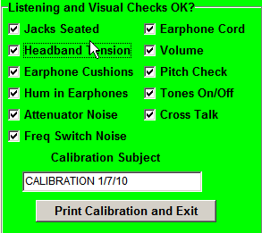
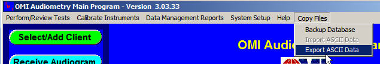
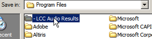
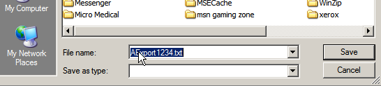

The following is referring to an OMI Audiometric Data Management Software ASW2004 system. Contact your MIE Implementer to see if your audio system model can be interfaced or quoted.

## Audiogram

{}
First ensure that a calibration has been performed for the day. If one has not been performed you will receive this pop up box:

{}

1. From the audiogram computer select OMI Audio Version 3 or if it has been renamed "Audio" shortcut from the desktop.
2. OMI Software will ask for user initials. Initials are not required to proceed

1. Put your initials in and select ok and then select cancel past the error.
2. You can also select "Cancel" on the Operator screen without putting in initials and proceed.
1. Performing a Calibration:
    1. Run Calibration on the Audiometer using Serial Number of Device
    2. When calibration is complete in OMI, select Receive Calibration on the main screen.
    3. The following screen will appear:

1. Please be sure that the <strong>Audiometer Serial # field is set.</strong> This will auto populate but need to confirm.
2. Select "Receive Data" results will pull forward. (Note: Sometimes you need to click the receive data button twice.)

1. Complete the "Listening and Visual Checks OK?" Section (Top Right Hand Corner) Add Calibration MM/DD/YYYY under "Calibration Subject" and select "Save" at the bottom of the screen and then select "Exit".

1. Performing an Audio Test:
    1. Choose Select/Add Client
    2. Choose correct patient from list and click the use selected match button; or
    3. Choose New Client and enter patient information into the database and select ok.
2. Next step is to perform the audiogram on the patient.
    1. <strong>Most do not use the social security number</strong>, and instead use the patient's MR# number when entering info into audiometer box.
3. Once audiogram is complete choose Receive Audiogram in OMI.
    1. Verify that the correct patient is chosen.
    2. Select receive data (<strong>occasionally this box may need to be clicked a second time</strong>)
    3. You may receive a pop up regarding the ID used to perform the test and it will ask about adding zero's to the ID number. Select YES.
    4. The data will upload from the audiometer to OMI (See Example)

1. Select "Save" and then "Exit"

## Exporting Audio Files

1. In OMI choose the Copy Files dropdown and choose Export ASCII data.

1. Under select date range choose the current day's date on the Starting Date and the Ending Date.

1. Select "Apply Selections"

1. Choose the correct patient from the list below and select begin export.
2. Box to save will pop up

1. At the top of this box the folder is currently showing Audiometry 2003. This should be changed to "-LCC Audio Results" to navigate to the correct folder select the drop down arrow, select program files and then select "-LCC Audio Results". This is the folder where the results will be exported.

1. If you would like you can add the patients MR# ID to the filename by clicking in the File name box and renaming the file and select save. (Please note that the file extension must by .txt.) See below for example.

1. After selecting "Save" you will receive the following pop up. Note that it states the file has been exported to C:\Program Files-LCC Audio Results\AExport1234.txt. Select "Ok"

1. Close out of OMI software.

## Importing Audio Files

1. Open {} (if not already open) and choose correct patient.
2. Choose correct encounter and make sure there is an audiogram procedure on the due list or in office/tests procedures section; or you may need to add an encounter and check the due list for the audiogram procedure. If there is no audiogram procedure, you will need to add it to the due list.

1. Or go to chart tab named Audio Tool and click add audiogram
2. Scroll down the page to the Audio section and click "new" button to import an audio file.

1. Choose reason for test and enter in any current test comments and/or overall comments. Even if the file you are importing has comments or overall comments, those will be imported there too.
2. Scroll down to the "filebox".

Make sure the audiogram result files are showing up in the file box.

1. If they are not, you may need to change the "smartcard" to point to the audiogram results.
    1. Changing smartcard:
        1. Right click on "filebox"
        2. Choose set smartcard folder

1. Choose the correct location of the audiogram files (C:\Program Files-LCC Audio Results and select ok

1. Audiogram files should populate the filebox

1. Choose the correct audiogram file for your patient.
2. Click the <em>upload file</em> button
    1. If you have no additional comments, Select ok on the first box stating no comment has been entered, upload anyway.
    2. Select <strong>YES</strong> on the second box asking if you want to delete as the folder should remain empty and only the current results should be showing. By deleting after each upload this will keep the folder clean and remove any confusion of selecting the incorrect file.
3. Audiogram results should populate in the Audio Tool.
4. You can answer the additional questions via that button also at any time and they will save when you save the encounter.
5. If working in an encounter, click the save button to save audiogram results to the patient's file.

You will see the audio file results in the encounter and also in the Audio chart tab of the patient's chart. You can view the document, use the compare feature, etc. On the document stored in the patient's chart, the MR# that populates within the file document that you uploaded looks at the user's default starting partition to determine which MR number to display there.
