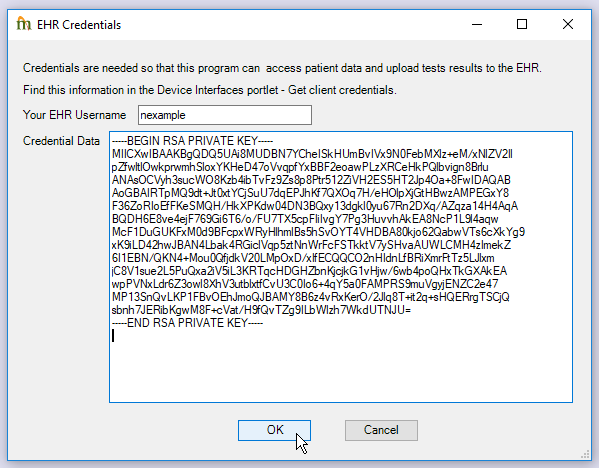
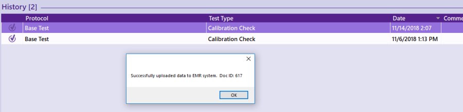

The following is referring to the NDD EasyOne Connect spirometry system (also referred to as Easy-On or EasyWare). Contact your MIE Implementer to see if your spirometer system model can be interfaced or quoted.

## Introduction

NDD's EasyOne Connect software employs a plugin system that EMR vendors can use to provide bi-directional connectivity.  Based on the Due List,  SYSTEM  can provide the NDD software with a list of people due for testing, along with key demographic information, avoiding dual-entry of this data.  Test results can be uploaded to  SYSTEM  to create PFT documents, including graphed curve data.

## Plugin Download and Installation

1. From Control Panel > Plugins, use the "Download NDD Easy-On Plugin" link to download the EHR plugin to a PC that has the NDD software already installed.
2. If Internet Explorer was used to download the file, rename the file from "nddplugin_mie.zip" to "nddplugin_mie.zemr"
3. Run the EasyOne Connect software as an administrator.

4. Click Utilities > Configuration.
5. Click the EMR tab.
6. Install new.
    * Find the plugin file you downloaded, called <strong>nddplugin_mie.zemr .</strong>
7. From Selected EMR System, choose MIE EMR Plugin.
8. For EHR URL, enter the  SYSTEM  URL as seen in a web browser, starting with https:// and ending with .cgi .  Omit any page-specific parts of the URL that start with a question mark "?".
9. Check "Include Curve Data" and "Include Trial values" to get discrete data included in PFT documents.
10. Close the NDD software.  The next steps require the software to reload to work.

### Updating Plugin

1. Open the NDD software
2. Click Utilities > Configuration
3. Click the EMR tab
4. Select "No EMR system" from the dropdown
5. Close the NDD software
6. Follow the Installation instructions above from steps 2 to 7
7. Click Yes when asked to overwrite the plugin:

8. Click the Save button
9. Close the NDD software

## Establishing Login Credentials

The plugin will get and send data under the authority of a  SYSTEM  user.  Each user on each PC that runs the NDD software will need to provide credentials to allow this to happen.  There should be a 1-to-1 relationship between client PC users and  SYSTEM  users.

1. In  SYSTEM , the user should go to Quick View > Select Portlets.
2. Make sure the <strong>Devices</strong> portlet is selected.
3. Once per user (not on every workstation), click the One-Time setup link.  This creates a public/private key pair and a login trust record.
4. On each workstation, the user should click the Get client credentials link then click in the box to copy their credentials to the clipboard.

* Be sure all of the text is copied.  It should:
    * Start with "----BEGIN RSA PRIVATE KEY----"
    * End with "----END RSA PRIVATE KEY----".
5. Open the NDD software, then go to Patients.
6. Click "Search EMR".  A warning that the software could not make a connection to EHR system should display.
7. Click "Search EMR" again.  This time you will be prompted to enter your  SYSTEM  username.
8. Click in the "Credential Data" text box and Ctrl+V or Right mouse click and Paste.

9. If successful, this setup should only need to be done once per user per PC.

## Finding People Due for Testing

The "Search EMR" function under Patients should show all people with a pending PFT order on the due list that the user has access to view.  If you double-click the name of a patient found this way, an "EMR Session" has begun.  This is a streamlined workflow that will start a test and automatically upload the results to  SYSTEM  once complete.

## Uploading Data to SYSTEM

If a test was performed "offline", perhaps with a laptop that did not have network connectivity, even for a patient whose information had to be manually entered in the NDD software, it is still possible to upload the data once connectivity can be established.

1. In the NDD software, be sure to set the "Patient ID" to match the partition-number of the record in  SYSTEM , eg "MR-12345".
2. Go to the list of tests for that patient in the NDD software and single click to select the test you want to upload.
3. Click the double-right arrow in the middle of the row of icons to expand options.
4. Click the EMR button.
5. If there were no problems uploading the data, you should see "Successfully uploaded data to EMR system.  Doc ID: ###".
6. To view the document in  SYSTEM :
    * From the side menu click E-Chart.
    * Select "Doc ID" from the search options.
    * Type the number shown in the popup after "Doc ID:".

## Calibration

[NDD states](https://www.nddmed.com/en-us/product/easy-on-pc.html) that their system "... delivers unprecedented accuracy and reliable results without needing calibration."  If regulatory, legal, or other professional organization (ATS/ERS) requirements necessitate record keeping of calibration despite this, the device can be calibrated and the results can be stored in  SYSTEM .

* To perform calibration of a spirometer, you will need a 3-Liter calibration syringe which can be purchased from NDD.
* Each spirometer has a unique serial number.  This can be found on a sticker on the base of the grip of the handheld spirometer.
* The suggested workflow is to use the Asset management feature of  SYSTEM  to create a chart for each spirometer.
    * This can be enabled by showing the "Assets" sidemenu tab
    * Click "Add New Asset"
    * The name field is how we uniquely identify devices, so this must be entered exactly.

* This name can be found in a PFT document that was created using the device.

* If you use all the same kind of device, then you can assume they will follow the same pattern, with just the serial number being different.
* To perform calibration in the NDD software, go to Utilities > Check Calibration
* After calibration, there will be a special patient created in the NDD patient list, named "Calibration Check" with an ID that is the serial number of the device.
* Double click on the Calibration Check row to see a history of calibrations
* Click to select the Calibration Check test that you want to upload
* Click the double-right arrow in the middle of the row of icons to expand options.
* Click the EMR button.

* The Doc ID is the unique ID of the calibration document and you can find it in the device's asset chart, or by searching for it by ID.
* The calibration document will be a PFT document, and the result of calibration will be shown as the Interpretation.

* If you try to upload calibration for a device that hasn't yet been entered as an asset, you will see an error like this displayed:

* After registering a chart with that name, you should be able to upload the calibration to a document type called PFT Calibration Tests (PFT_CAL).

## Collected Fields

* Overall test data
    * Location
    * Date + time
    * Prediction method
    * Spirometer name
    * Comments
* Maneuver (trial) data
    * FVC
    * FVC Predicted
    * FVC Abnormal
    * FVC LLN (Lower Limit of Normal)
    * FEV1
    * FEV1 Predicted:
    * FEV1 Abnormal
    * FEV1 LLN
    * FEV1 FVC
    * FEV1 FVC Predicted
    * FEV1 FVC Abnormal
    * FEV1 FVC LLN
    * FEF25 75
    * FEF25 75 Predicted
    * FEF25 75 Abnormal
    * FEF25 75 LLN
    * PEF
    * PEF Predicted
    * PEF Abnormal
    * PEF LLN
    * FEV6
    * FEV6 LLN
    * FEF25
    * FEF50
    * FEF75
    * Curve data
* Patient information
    * Height
    * Weight
* If calibration is performed and uploaded:
    * Calibration date
    * Calibration result
* Environmental factors:
    * Temperature
    * Humidity
    * Pressure
