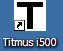
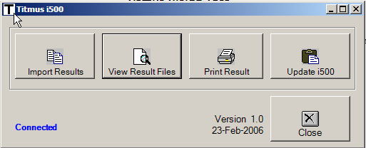
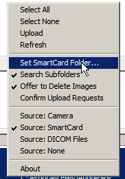
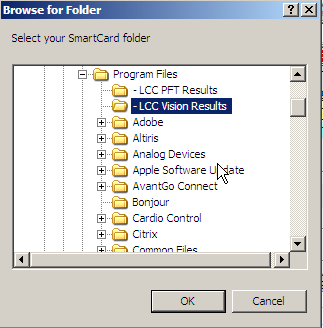
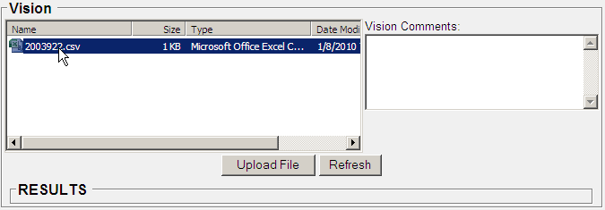

The following is referring to a Vision - Titmus i500 system. Contact your MIE Implementer to see if your vision system model can be interfaced or quoted.

## Titmus Vision Test

1. Use the Titmus Vision tester to do your vision test. If the machine is off, you will need to log on. Then follow directions on Titmus machine to do test and make sure to save the test when you are done.
2. Once the test has been completed, select the Titmus I500 icon on desktop to open.

1. Select import results button

1. Results will be imported to the correct folder "-LCC Vision Results".

1. Select close.
2. Open {} (if not already open) and pick correct patient.
3. Select correct encounter or open a new encounter or Vision tool chart tab.
4. Make sure a vision test is on the due list to be done.
5. Scroll down to Vision Screening section on page
6. Scroll down to "filebox"
7. Select the correct smartcard folder.
    1. Changing smartcard:
        1. Right click on filebox
        2. Choose set smartcard folder

1. Select the correct location of the Titmus vision files which will be "-LCC Vision Results" and select ok.

1. Titmus vision files will populate the filebox

1. Select the correct vision test for the correct patient. (Note: if the device is being kept clean your results should be the only ones listed)
2. Select upload file and when prompted select YES to delete the record as the folder should remain empty and only the current results should be showing. By deleting after each upload this will keep the folder clean and remove any confusion regarding selecting the correct file.
3. Titmus Vision Test results will populate the page on the encounter or Vision Tool chart tab.
    1. Abnormal results will be highlighted.
1. Scroll to bottom of encounter and choose save to ensure vision test is saved to this encounter.
2. Done
