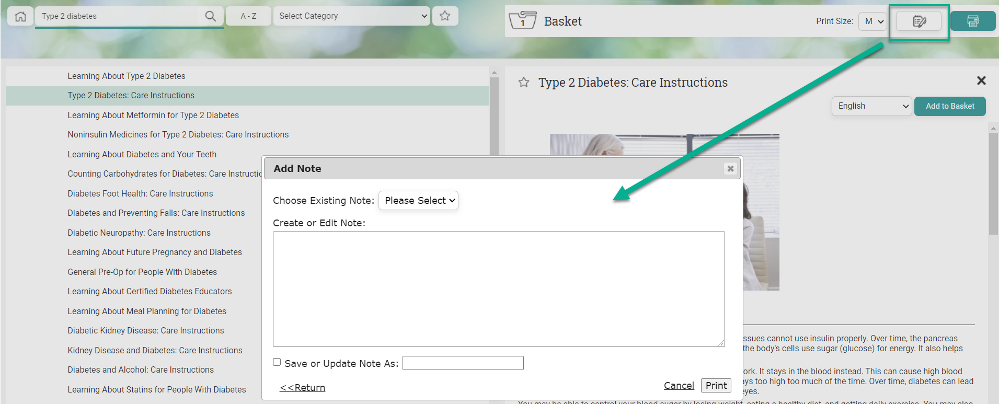
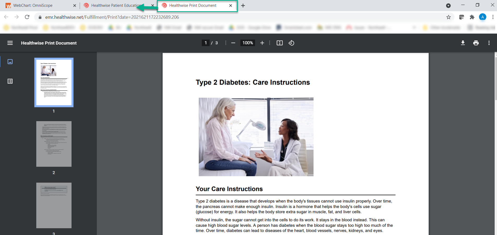
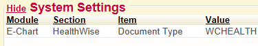

# Patient Education Interface

## WebMD Ignite (formerly Healthwise)

{}  has the ability to interface with Patient Education resources such as WebMD Ignite (formerly Healthwise). This is a billable add-on along with monthly costs that can be quoted out by your MIE Implementer. WebMD Ignite patient instructions integration then must be turned on and configured to your system.

Patient Education material from WebMD Ignite is available in several different selections. Whichever is selected would be a different monthly cost and can be a combination of any. These selections are:

EHR Information Therapy Patient Instructions (English/Spanish+10 additional languages) – Patient instructions are instructional consumer health content that can be generated by {} , and can be printed and/or sent to a patient NoMoreClipboard account. Topics include after visit, category topics, pre-op and post-op instructions. The monthly fee includes English, Spanish & 10 other languages as well for EHR.

Portal Knowledge Base (English) - This includes a health encyclopedia that contains evidence-based topics, illustrations, decision support tools, disease management tools and interactive health tools.

Portal Knowledge Base (Spanish) - This includes a health encyclopedia that contains evidence-based topics, illustrations, decision support tools, disease management tools and interactive health tools.

NoMoreClipboard PHR KnowledgeBase (English) - This includes a health encyclopedia that contains evidence-based topics, illustrations, decision support tools, disease management tools and interactive health tools.

NoMoreClipboard PHR Knowledge Base (Spanish) - This includes a health encyclopedia that contains evidence-based topics, illustrations, decision support tools, disease management tools and interactive health tools.

## Patient Education Links

The WebMD Ignite/Healthwise integration can be found in multiple areas within the system. Integration is found in the Patient Summary chart tab, the Conditions chart tab and Visit Encounters.

Users can click anywhere in the application where Search (PAT) links are available. These links will direct the user to WebMD Ignite/Healthwise education on the specific condition or medication that is displayed to the left of the link.

### Patient Summary tab

The Patient Summary tab contains Search (PAT) links within the Medications, Past Medical History and Medical History portlets.

### Conditions Chart Tab

The Conditions chart tab will display Search (PAT) links next to conditions in the Problem List, Past Medical History and Other Problems lists.

### Encounter Exams

If the patient education interface is enabled, the Patient Education encounter section will display a bullet list of the patient's conditions. Next to each condition users can click the Search (PAT) link to access educational materials.

When the Search (PAT) link is clicked, a new browser tab will open and navigate to the WebMD Ignite/ Healthwise Patient Education site.

If the user clicks search from a specific medication or condition on the patient's chart, it will take them directly to the material related to that topic. The user can also go to Categories or Favorites and get other material. Click in the "search" field and type in a new topic to search for material.

Switch languages to print by the language drop-down in the Healthwise window.

Select the font print size to print for the patient. The font will default to M (medium).

If desired, add additional patient educational materials to the "Basket" . Click the Printer icon to print materials.

You can also click the ADD NOTE icon to add your own text and notes for the handout you are going to be rendering for the patient. The ‘notes' you type in there will render as page 1 of the final document. You can also save note ‘templates' to use for future times. Type it in and then click the "save or update Note as:" and name it. Then you can use an "existing note template" from that drop-down on future education documents you render.

Click the **Print** button when ready to print it.

The material will print to a PDF in another browser window and the user can print to their local printer. Close the browser tab to return to the main WebMD Ignite/Healthwise search screen.

The user returns to the main WebMD Ignite/Healthwise screen, a summary of the patient education displays. Click the Close button to close the window or simply close the browser tab to return to Enterprise Health.

When a user prints the WebMD Ignite/Healthwise patient material, the system queries the Healthwise database and sends us back a notification of what was printed from their system.  The system will add the printed education sheets to the patient's chart as a PDF document with documentation of the date/time & user in a chart tab specified.

By default, the document is stored as doc.type WCHEALTH. You should have the doc.type WCHEALTH in your system with the description of it being "Healthwise Patient Education". You can change the system setting to store these to a different doc.type, however by default it's already set up to point to WCHEALTH doc.type.

*Note:*

If providers are enrolled in quality measures regarding patient education, you would **not** want to change this setting to store as doc.type WCPATED because WCPATED is used in the measures/calculations and could skew that data.

That doc.type should be specified to show in a specific chart tab. You can go to that chart tab to find the uploaded WebMD Ignite/Healthwise Patient Education and the subject line contains which education material it is. This stores as a PDF file type for accessing.

## Learning Management System

To learn more about the Patient Education Interface, follow the link below to the Learning Management System course:

* [Patient Education](https://mie.talentlms.com/shared/start/key:LSOIDNHR)
