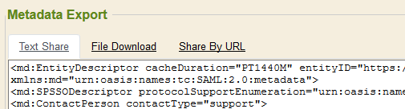
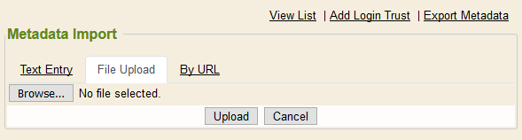
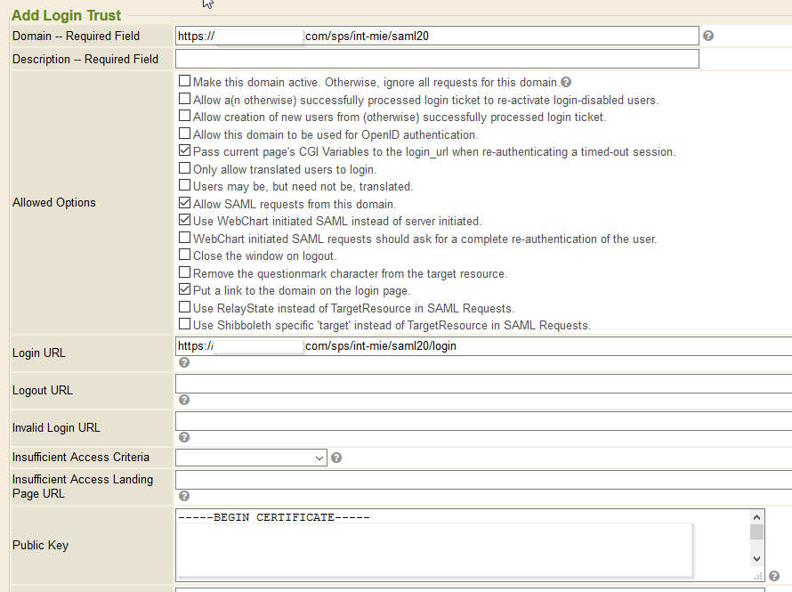
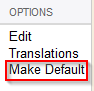
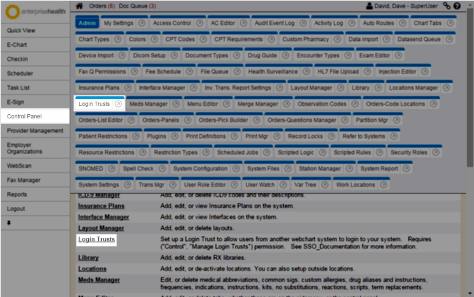
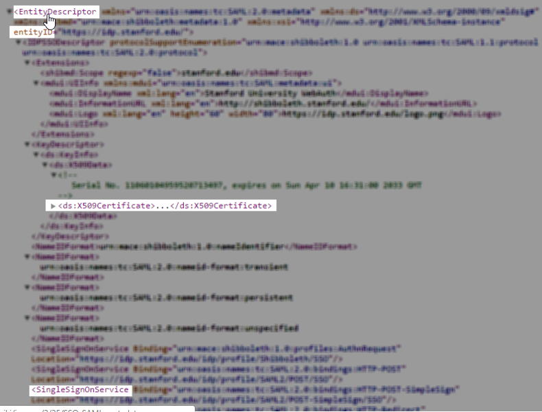

The following instructions provide users with the necessary procedural details to enable single sign-on (SSO) via [SAML](https://en.wikipedia.org/wiki/Security_Assertion_Markup_Language) in the {} system.
For more information on login trust terminology, see our [SSO Documentation](single-sign-on-sso.md).

## **_{}_** and SAML Metadata

Beginning with RC201906, {} can natively import and export SAML metadata files commonly used for setup between IDPs and SPs.
Older systems can utilize the *Manually Creating the Login Trust from SAML Metadata* instructions found below.
The first step is an exchange of metadata files. The Login Trusts editor under Control Panel → SuperUser is the access point for importing and exporting these files.

## Client-Provided Metadata

The information used to populate a new login trust is found in the IDP's SAML metadata file from the client. The client should provide a copy of this file to the {} Implementation Specialist.  This file may be in the form of an internet URL, email attached file, or a block of text shared with the Specialist.
For additional client requirements information, see our [SAML-based SSO documentation](saml-based-single-sign-on.md).

## **_{}_** -Provided Metadata

{} is able to publish it's SAML SP metadata in three ways: an Internet URL, a file download which may be emailed to the client or block of text which may be copy/pasted in communications to the client.

Once this metadata has been shared with them, most IDPs will then share their metadata with us.

## Setting up SAML in **_{}_**

The IDP metadata file will be imported into the {} system via the Import Metadata link in the Login Trusts editor.

The relevant data will be extracted from the metadata file and displayed in the Add Login Trust screen, as described below in Login Trust Fields.

Verify the information and then click the Submit button at the bottom.

The SAML IDP will now be available on the system's Login page under the Remote Log In heading.

## Removing the Login page

Once an SSO connection has been configured and tested, the  login page can now be disabled. This is accomplished by making an SSO server the system Default authentication mechanism.
In the listing of the Login Trusts editor, there is an option for "Make Default". This link is used to disable the login page and direct all authentication requests to that specific SSO server.

## Login Trust Fields

The {} **Add Login Trust** screen displays the following options:

The following list provides details and insight on using the fields available on the Add Login Trust screen:
**Domain** – **Required Field**: URL for single sign-on service domain.
* Found in the SAML metadata file with label <strong>entityID</strong>.
* This string must be alphanumeric and no more than 255 characters in length.
**Description** – **Required Field**: Text description of login trust.
* May be displayed to users at certain points during the login/logout process, and should be user-friendly.
* This string must be no more than 255 characters in length.
**Allowed Options**: Selected checkboxes will change the behavior of the SSO system. The following options are available:
* <strong>Make this Domain active</strong>: Required for the MIE SSO method.
* <strong>Allow a(n otherwise) successfully processed login ticket to re-activate login-disabled users</strong>: Reactivates an inactive {} user when that user attempts to log in via the employer SSO system.
* <strong>Allow creation of new users from (otherwise) successfully processed login ticket</strong>: Creates a new {} user when that person attempts to log in via the employer SSO system.
    * XML Login Tickets or SAML assertions are recommended for use with this option.
* <strong>Allow this domain to be used for OpenID authentication</strong>: Processes OpenID SSO requests. Required for use with OpenID.
* <strong>Pass current page's CGI variables to the login_url when re-authenticating</strong>: When a login session expires, the main window directs the user through the SSO server. If unchecked, expired sessions create a pop-up window to re-establish a valid user session.
    * The SSO server (IDP) must support this option.
* <strong>Only allow translated users to login</strong>: Requires all login requests to reference a known username via translation. Login requests which do not have a translation to an established {} username will be rejected. This is generally used in conjunction with a periodic user import process or HR feed.
    * This option allows the {} system to dictate which users have access through SSO.
* <strong>Users may be, but need not be, translated</strong>: Translation allows lookup of the IDP-specified username against a lookup table. This allows the IDP and the {} system to use a different identifier (username) for a user.
* <strong>Allow SAML requests from this domain</strong>: Indicates that SAML requests (assertions) are allowed from the listed domain.
* <strong>Use |System| initiated SAML instead of server initiated</strong>: Utilize SP-initiated bindings instead of IDP-initiated.
* <strong>Close the window on logout</strong>: For IDPs that log the user into {} using a pop-up window; this closes that window once their session ends.
* <strong>Remove the question mark ( ? ) character from the target resource</strong>: For IDPs that require state variables be passed as part of the URL instead of as CGI variables to the URL. This is not common.
* <strong>Put a link to the domain on the login page</strong>: The login page will have a list of links to these IDPs, in addition to the standard non-SSO login form.
* <strong>Use RelayState instead of TargetResource in SAML requests</strong>: Some IDPs require a RelayState variable instead of a TargetResource variable.
* <strong>Use Shibboleth specific ‘target' instead of TargetResource in SAML Requests</strong>: Use with Shibboleth systems.
**Login URL**: The URL that users are redirected to for obtaining a new session when they do not have one, or when an existing session becomes invalid.
* If this URL forwards any additional CGI variables sent to it, make sure the <em>Pass current page's CGI Variables</em> option is checked. This will present a more seamless experience to the user.
{}

Unless a Logout URL is also set, users will be redirected to this URL when they ask to have their session terminated.
{}
* This URL does not need to be accessible from within the MIE network.
* This URL must be accessible to all users who will utilize the SSO method.
**Logout URL**: Optional URL for users to be redirected to when they choose to end their session. If this is not provided, they will be sent to the Login URL.
**Public Key**: The key used to determine the validity of the SAML assertion or *login_signature* CGI variable. This will be provided by the SSO provider.
* The public key is also used to validate the digital signature in the SAML assertion.
* This key must be generated from the private key of the IDP. The private key should not be shared with MIE or any other entity.
* The most common key formats are PEM and X.509 certificate.
**Private Key**: May be used instead of the Public Key, but this would be extremely rare. Leave this field blank.
**Key Format**: The format of the Public/Private Key.
**Digest**: The hash algorithm used by the SSO provider for signing the login_ticket. SHA-256 is recommended.
* This option is specific to MIE SSO.
* SSO using SAML will ignore this field.
**Password Required**: This will generally not be used.
**Login Threshold**: Sets the frame of time for which a login_ticket is considered valid.
* This option is specific to MIE SSO.
* The default value is 180 seconds after the timestamp in the login_ticket. Additionally, login_tickets are only recognized as valid 15 seconds before the timestamp in the login_ticket.
* Systems with high network latency or a desire for a more strict security profile may request a customization of these times.
**Default Security Role**: Only needed if the *Allow Creation of New Users* option was selected. Newly created users will be assigned to the chosen Security Role.
**Default User Department**: Only needed if the *Allow Creation of New Users* option was selected. Newly created users will be placed into the chosen department (realm).
**Associate to an Employer Organization/Associated Employer Organization**: Allows each PO to manage its own SSO configuration without being able to access others.

### Manually Creating the Login Trust from SAML Metadata

The following instructions account for a system that is Shibboleth IDP-initiated, so be sure to adjust configuration, accordingly for other solutions.
To create a login trust for SSO:
1. Open the SAML metadata file provided by the client.
2. Log into the system.
3. Navigate to the <strong>Control Panel</strong> on the left side menu.
4. Click the <strong>Login Trusts</strong> tab.

   
5. Click the <strong>Add Login Trust </strong>link, in the top-right of the page.
6. In the received metadata file, search for <strong>entityID</strong>, to locate the <strong>Domain</strong>.

   
7. Enter that URL into the <strong>Domain</strong> field.
8. Enter the appropriate client information into the <strong>Description</strong> field.
9. Select the <strong>Allow SAML requests from this domain</strong> checkbox.
10. Select the <strong>Use Shibboleth specific target instead of TargetResource in SAML Requests</strong> checkbox. <em>Skip this step if not a Shibboleth system.</em>
11. Search the metadata file for <strong>IDPSSODescriptor</strong>, to find the remainder of the information necessary to populate the login trust form.
12. Sections after the heading <strong>AttributeAuthorityDescriptor</strong>, if present, can be collapsed by clicking the chevron in front of it. All information collected for the {} login trust (aside from the domain) appears under the heading <strong>IDPSSODescriptor</strong>.
13. In the metadata file, search for <strong>SingleSignOnService</strong>, to locate the login URL. The URL should indicate what type of SSO is used (in this case, IDP-initiated).
    {}
    There may be multiple options for <strong>SingleSignOnService</strong>. It is important to pick the correct one. In most cases, and in this example, the link that includes the HTTP-redirect is correct.
    {}
14. Enter the URL in the <strong>Login URL</strong> field.
15. Search the metadata file for <strong>X509Certificate</strong> to find the public key.
16. Enter the X509 Certificate information into the <strong>Public Key</strong> field. This public key should be a long string of characters.
17. The X509 certificate information must begin with <strong>—</strong>BEGIN CERTIFICATE<strong>—</strong> and end with <strong>—</strong>END CERTIFICATE<strong>—</strong>.
18. The certificate itself must have a multiple of 4 and be less than 80 characters, per line.
19. Select X509 from the <strong>Key Format</strong> dropdown.
20. Click the <strong>Submit</strong> button. A status message displays.
21. Click the <strong>View List</strong> button to view the login trusts.
