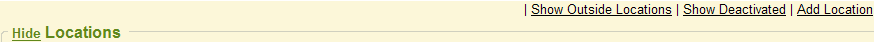
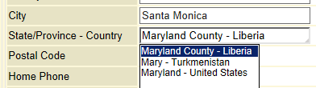
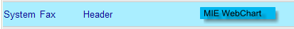
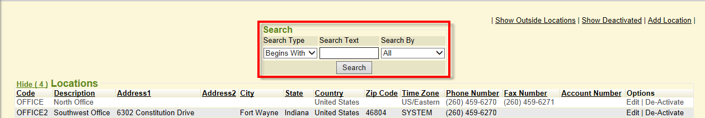
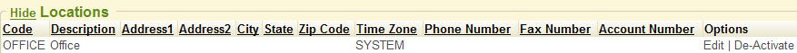
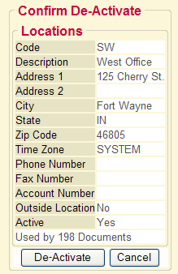
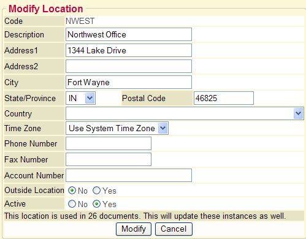

If you have security permission to manage locations (and depending on your security level) you can view, edit or delete locations in the Locations Manager tab found in control. These are the locations your practice utilizes. Locations that would need to be entered and stored here are the locations you would schedule your patient appointments for, create documents for, or where you provide services. Locations should also be entered for any location that a physician may do surgeries at and/or do rounds (ie: hospitals). Other locations that should be entered are locations that you receive results from (via any interface also) or where you may send a patient for an order (lab draw, xray, etc).

When you click the *Locations Manager* tab, it will open up to display all active locations in your system. Your MIE Implementer may have already entered in some locations for your practice. However, you can manage any locations here in this tab. If you are a new {} database with no locations previously added, the default will show an active OFFICE location in your system. Use this as the ‘main' location for your practice. Click edit to change that description to your practice and add address/phone/fax information. You can continue to add other locations after the main one has been edited to your specific location information.

## Add a New Location

To add a new location to your {} system, click the Add Location link found at the top right while in the Location Manager tab.

The *add location* screen will open. The fields are described below.

* <strong>Code:</strong> This is a required field. You must type in a brief abbreviated code for this specific location. It has to be unique and cannot be left blank. It only allows up to 10 characters.
* <strong>Description:</strong> Type in the full name of the location.
* <strong>Address1:</strong> Enter in the main address for the location.
* <strong>Address2:</strong> Enter in any secondary address information for the location.
* <strong>City/State/Zip:</strong> Enter in the full city, state & zip code for the location.
{}

Postal Code field will accommodate international postal codes and display as they are entered without auto-formatting.
{}
{}

There is a system setting to allow for international province/state selection. If system setting *US States Only* is disabled (value 0) then the State field in demographics will change to say *State/Province-Country* and you can use the autocomplete to select a state/province and country for the patient. It will result in international and US selections.
{}

* <strong>Country:</strong> Defaults to United States, but you can select the country where this location is.
* <strong>Time Zone:</strong> Defaults to Use System Time Zone, but you can select the specific time zone the location is.
* <strong>Phone Number/Fax Number:</strong> Enter full phone number & fax number and must include area code.
* <strong>Use in FAX header:</strong> If this location has a specific fax number entered above in this location's fax# field and you want all outgoing faxes from users using this default location to show this location's fax # as the "Sent From' on any outgoing faxes sent from {} in the top header of the fax, set this option to <strong>Yes</strong>. This means any outgoing faxes sent by users who are set to this default location will show this specific location's fax# in the top header of the fax that the recipient receives instead of your {} system's primary/main fax number.  This location fax# will override and display on the outgoing faxes instead of what your {} system's primary/main fax number is set to.
    * If this location has no FAX number or you don't want any faxes from users who are set to this default location to show this location's specific FAX number on the outgoing faxes, please set this option to <strong>No</strong>.  This means any fax sent by the user using this location as their default will show your {} system's primary/main fax number instead and won't show the location specific fax# on the header of the fax that the recipient receives.  System setting for fax header:

* There is also the security setting named <strong>Allow setting of FAX From:</strong> If set to Yes (default is No) the user can choose the CSI value of a fax they are sending from the ‘fax' mode. The CSI value is the Call Station Identifier that is part of the FAX header - it is essentially the caller id of the FAX. If user is set to Yes permission, in the print chart module (fax mode) a drop-down field named <strong>From</strong>: will show and user can select from a drop-down of fax #'s to set the fax ‘from' on the header that the recipient receives.
* <strong>Account Number:</strong> MIE will enter this field if necessary. Example, it may be the lab interface account number we need to attach for that specific location, etc. to send/receive results for. If your practice is set up with an orders interface with a lab vendor to submit lab orders electronically to a lab facility (ex: LabCorp), the lab's location account number for that specific location must be entered in the location tab of control tab. When we send the order electronically to the lab that account number for the location gets sent with it.
* <strong>Outside Location (No/Yes):</strong> This is automatically defaulted as ‘no', meaning this is <strong>not</strong> an outside location you are entering. It is an inside location if this is set to no. You can set inside vs outside based on the following: An <strong>‘inside'</strong> location is a place you would schedule appointments for, give injections at, create a document for (the add document screen).  Inside locations being your main locations the doctor sees patients at and provides services at, does rounds at, performs surgeries at, etc.  An ‘<strong>outside'</strong> location is a place you may send a patient to (for lab draws or x-rays, etc) or a locations you would receive results from (via interface also).
* <strong>Active (No/Yes):</strong> This is automatically defaulted as ‘yes', meaning this <strong>is</strong> an active location that you are entering. You would only mark a location as inactive if you no longer utilized a specific location, however you can ‘deactivate' a location from the main location summary screen using the deactivate link on the right options column. If you use the deactivate link, it will set that location as ‘inactive' which is the same as marking it as ‘no' active here. Any location set as ‘inactive' will not appear in any {} module to choose as a location selection. A location must be set as ‘active' in order for it to be used elsewhere in {} as a location selection.
Click the ADD button to add the location to the system and it will give you a confirmation message at the top.

## View Outside or Deactivated Locations

If you inactivated a location, or set a location as ‘outside', use the links provided in the locations manager tab to show those.

If there was a location that was deactivated in error, you can show deactivated, then click the activate link found in the options column for that location. That location would be reactivated and set as active.
There is also a search filter available in the Locations Manager to help search and find a specific location(s) you are looking for in this tab. This is helpful if you have an abundance of {} locations in your system.

## Deactivate a Location

You would only deactivate a location if you no longer utilized a specific location. To ‘deactivate' a location from the main location summary listing screen click the deactivate link on the right options column. Any location set as ‘inactive' will not appear in any {} module to choose as a location selection. The location must be set as ‘active' in order for it to be used elsewhere in {} as a selection.

Once you click the Deactivate link for that location, it will show a screen for you to confirm that you want to deactivate this location. It also notes how many documents will be affected by this when you deactivate it.

### 

Continue to deactivate the location by clicking the DEACTIVATE button. It will then give you a confirmation message at the top that the location was successfully deactivated.
If there was a location that was deactivated in error, you can click the show deactivated link in the locations summary listing, then click the activate link found in the options column for that location. Upon confirmation that you want to reactivate it, that location would be reactivated and set as active.

## Edit a Location

If you need to edit a location for any reason (phone number change, address change, name change, etc), simply click the edit link found in the options column at the right of the specific location listed in the summary.

Once you click edit to modify a location, the edit/modification screen will appear. You can change anything you wish. It also notes how many documents use this location and any edits/modifications will update those instances as well.

When done editing the location fields, click the MODIFY button to save and submit the changes.
It will give you a confirmation message at the top that the location was successfully updated.
