## Agenda

* <strong>Pre-requisites</strong>
* <strong>Overview</strong>
* <strong>Pre-placement workflow demonstration</strong>
    * <strong>Applicant portal</strong>
        * <strong>Registration</strong>
        * <strong>Consents</strong>
        * <strong>Questionnaires</strong>
        * <strong>Document upload</strong>
    * <strong>Tasking notification</strong>
    * <strong>Pre-placement surveillance panel</strong>
    * <strong>Pre-placement visit encounter</strong>
    * <strong>Pre-placement worklist</strong>
* <strong>Applicable reports</strong>
* <strong>System Configuration</strong>
    * <strong>Applicant partition</strong>
    * <strong>Applicant portal setup</strong>
    * <strong>Task rule and department setup</strong>
    * <strong>Consent and questionnaire flowsheets</strong>
    * <strong>Schedule job - auto-merging</strong>
* <strong>Key decision points </strong>
* <strong>Action items/timelines</strong>
* <strong>Resources</strong>
    * <strong>Documentation</strong>
    * <strong>LMS courses/videos</strong>

## Pre-requisites

## Pre-Recorded Foundational Trainings 

<table>
<tr>
<td><a href="https://employee-mie.talentlms.com/catalog/info/id:165">Pre-employment Management w/Applicant Portal</a> (LMS Course)</td>
<td>33 min</td>
</tr>
<tr>
<td><a href="https://employee-mie.talentlms.com/catalog/info/id:436">Patient Engagement Portals</a> (LMS Course)</td>
<td>22 min</td>
</tr>
<tr>
<td><a href="https://mie.talentlms.com/shared/start/key:LTGIDNHR">Chart Search</a> (LMS Course)</td>
<td>11 mins</td>
</tr>
<tr>
<td><a href="https://mie.talentlms.com/shared/start/key:LTBIDNHR">Patient Summary Dashboard Tab</a> (LMS Course)</td>
<td>10 mins</td>
</tr>
<tr>
<td><a href="https://mie.talentlms.com/shared/start/key:LBLIDNHR">Documents, Documents Summary Chart Tab, Documents Search Repor</a>t (LMS Course)</td>
<td>70 mins</td>
</tr>
<tr>
<td><a href="https://mie.talentlms.com/shared/start/key:AOSHRKMF">WebScan</a> (LMS Course) </td>
<td>47 mins</td>
</tr>
<tr>
<td><a href="https://mie.talentlms.com/shared/start/key:ZTEDNHRK">Checkin</a> (please skip the 30min course on No-Login Checkin Kiosk)</td>
<td>45 mins</td>
</tr>
<tr>
<td><a href="https://mie.talentlms.com/shared/start/key:AOZHRKMF">Scheduler</a> (LMS Course)</td>
<td>40 mins</td>
</tr>
<tr>
<td><a href="https://mie.talentlms.com/shared/start/key:LABIDNHR">Encounter Visit Workflows & Worklists</a> (LMS Course)</td>
<td>38 mins</td>
</tr>
<tr>
<td><a href="https://mie.talentlms.com/shared/start/key:ALEHRKMF">Restrictions & Accommodations Management</a> (LMS Course)</td>
<td>118 mins</td>
</tr>
<tr>
<td><a href="https://www.youtube.com/watch?v=jZzSK2HIAN4">Clinical Care Demo</a> - Non Occ</td>
<td>11 mins</td>
</tr>
<tr>
<td><a href="https://mieweb.webex.com/mieweb/ldr.php?RCID=4d33c7e01e32555b117c32298bd77b4e">Health Surveillance</a> (Demo)</td>
<td>14 min</td>
</tr>
<tr>
<td><a href="https://mie.talentlms.com/shared/start/key:LATIDNHR">Orders & Result Management</a> (LMS Course)</td>
<td>35 mins</td>
</tr>
<tr>
<td><a href="https://mie.talentlms.com/shared/start/key:ZOGDNHRK">Respiratory Fit Testing</a> (LMS Course)</td>
<td>22 mins</td>
</tr>
<tr>
<td><a href="https://mie.talentlms.com/shared/start/key:ZOBDNHRK">Data Import Tool Tab</a> (LMS Course)</td>
<td>21 mins</td>
</tr>
<tr>
<td><a href="https://mie.talentlms.com/shared/start/key:LATIDNHR">Due List orders, Order Requests/Resulting Order Requests, Encounter Orders</a>  (LMS Course)</td>
<td>35 mins</td>
</tr>
<tr>
<td><a href="https://mie.talentlms.com/shared/start/key:LSEIDNHR">Injections/Immunizations Management</a> (LMS Course)</td>
<td>11 mins</td>
</tr>
<tr>
<td><a href="https://mie.talentlms.com/shared/start/key:AOEHRKMF">Tasking</a>(LMS Course)</td>
<td>9 mins</td>
</tr>
<tr>
<td><a href="https://mieweb.webex.com/mieweb/ldr.php?RCID=0cb3223bbf108c40d5b2f5e712a94ec1">Standard Reporting</a> (Demo)</td>
<td>6 mins</td>
</tr>
<tr>
<td><a href="https://mie.talentlms.com/shared/start/key:ALBHRKMF">DataVis Reports</a> (LMS Course)</td>
<td>55 mins</td>
</tr>

</table>

Additional videos are also accessible via: [https://docs.enterprisehealth.com/videos-demonstrations](https://docs.enterprisehealth.com/videos-and-demonstrations.html)

Users always have access to (?) online help in the product at the top right corner or by visiting: [https://docs.enterprisehealth.com](https://docs.enterprisehealth.com)

## Overview

As a means to streamline applicant engagement and tracking, as well as offer easy access to request an appointment, complete questionnaires, upload immunization information, complete consent forms, and upload documentation, {} offers its certified applicant portal. The {} web-based applicant portal is available 24/7 and provides secure access for candidates to use when and where it is most convenient for them. The applicant portal is designed to prompt engagement with user-friendly, intuitive pre-placement questionnaires, with responses being captured electronically, automatically populating the appropriate fields and documents within the clinical application, thus minimizing data entry and management for clinic staff. Applicant records may be automatically purged from the system after a predetermined amount of time if they are not hired. Additionally, the supervisor portal provides an HR and manager dashboard to view applicant work status reports, which include employee surveillance status and restrictions/accommodations. The time savings is significant – no more endless phone calls to collect information or to schedule appointments.

New hires may be manually registered into a separate applicant (APP) medical record partition either on the clinical side or using an applicant portal. The pre-placement health surveillance panel tracks appropriate testing that is required based on the job role. If the employee is hired their temporary medical record may be merged to their permanent medical record automatically using a scheduled job or manually using the document queue merge tool. Custom configuration is required to add electronic pre-placement questionnaires, health surveillance panels, email templates, and automated business rules.

Standard functionality for the pre-placement workflow includes:
* Client-specific branding with logo
* Applicant portal
* Applicant (APP) partition
* Pre-placement questionnaire
* Appointment scheduling requests/tasking
* Appointment invitation, confirmation, and reminder emails
* Pre-placement visit encounter
* Quick View Pre-placement worklist
* Health surveillance pre-placement panel
* Document queue tool available for customer to merge duplicate records 
* Purge editor is available for customer use to purge documents for applicants that aren't hired after a predetermined time

## Pre Placement Workflow Demonstration

1. HR directs applicant to the applicant portal
2. Applicant completes a mini registration and fills out consents, questionnaire(s) needed, and uploads documentation on the applicant portal and prints completed questionnaires
    1. Pre-Placement (APP) partition chart is created in EH after they visit the applicant portal
    2. Applicant charts are manually created if they did not visit applicant portal
    3. Tasking notifications may be automatically triggered when pre-placement questionnaires are submitted on the portal or when documentation is uploaded
3. Schedule Pre Placement Exam
    1. Update demographics 
        1. or manually register a chart if applicant hasn't visited the portal prior to calling to schedule appt
    2. Merge all charts if applicable (if the applicant went and did multiple charts from portal) via the ‘Manual Merge' portlet found in Summary chart tab
        1. Currently only a handful of users have merge rights.  Use the fast task ‘Merge Chart Request' to send a task to Admin dept to merge duplicate charts if needed
    3. While in demographics, checkmark ‘Is Applicant' which marks chart as ‘temporary chart'
    4. Due List portlet: Add applicant to "PrePlacement Entry" surveillance program (hint: search in the order field for <strong>entry</strong>) and ‘evaluate' to trigger for what needs done during the exam
        1. Add any add-on testing programs needing done (ex: DOT, Crane, Hazmat, Hawoper, Vision, etc), but <em>DO NOT Put an Applicant/Preplacement in any entry with membership programs - make sure is just ‘entry' only.</em>
        2. After evaluating the PrePlacement Entry program (and any add-on programs needed) on their due list, a waitlist appointment is created.
    5. Create/schedule appointment for preplacement exam by going to Appointments portlet in Summary dashboard and clicking Appointment Needs Scheduled hyperlink next to the Preplacement waitlist appt displayed there.
        1. Send an Apt Confirmation when scheduling appt in the Add Appt Screen
4. Applicant arrives at Clinic for scheduled appointment
    1. Applicant visits the Front Desk, returns completed paperwork
    2. Front Desk Staff Check-in Applicant for scheduled appointment
5. Clinician performs Intake
    1. Pre-Placement Exam encounter
    2. Create Medical Surveillance case (if visit is going to be split into a Part 1 and a Part 2)
    3. View submitted questionnaires
    4. Manage Due List (Tests & Procedures section) of preplacement testing
        1. Create order to lab vendor (ie. LabCorp, Quest, etc.)
        2. Perform due list items during today's visit
            1. Audiogram - make sure to mark this test as<strong> baseline</strong> audiogram
6. Provider Evaluates Applicant
    1. Physical Exam
    2. Recommendations (clearance / written opinion)
        1. Complete the Written Opinion-Preplacement
        2. Complete any other add-on entry only (not with membership) program written opinions
    3. Archive and Close Encounter
7. Provider Check-out Applicant
8. Provider E-Signs Completed Encounter Document (document is e-signed automatically if encounter is archive and closed by the performing provider)
    1. Upon completing a Written Opinion - Preplacement and after closing & archiving the encounter, the system may be configured to email HR/Talent or the supervisor
9. Staff may index in documents and link them to the encounter
10. Pre-placement worklist on the Quick View shows open Pre-placement encounters
11. Preplacement applicant goes to get Physical Agility Testing (when applicable)
12. Clinician receives Physical Agility Testing results
    1. Creates Results Encounter
    2. Works encounter top to bottom including indicating overall Written Opinion determination
    3. Archive and Close Encounter
        1. Upon completing and closing & archiving the encounter, the system will auto email the HR/Talent or supervisor to give them notification of the Written Opinion determination
    4. Staff may index in documents and link them to the encounter as needed
13. Once hired, an EH scheduled job will look for hired employee's chart (from HR interface) and merge this temporary APP (applicant) chart with the permanent employee chart

    ## Applicable Reports

    ## System Configuration

    To more fully address preferred configurations and review available options and features, utilize the [Provider Management sidemenu](https://system/?f=layout&module=MASTER&name=EPM_Maintenance&tabmodule=+) to access and edit the employee and supervisor portals. These configurations will be visible from the respective portal when accessed. To begin the initial setup and finalize configuring of the portal(s), there is additional information that is important to understand before getting started. Review the following, and work with the Deployment Consultant to ensure the portal(s) configurations are suited to the business needs.

    * <strong>Applicant partition</strong>
    * <strong>Applicant portal setup</strong>
    * <strong>Task rule and department setup</strong>
    * <strong>Consent and questionnaire flowsheets</strong>
    * <strong>Schedule job - auto-merging</strong>

### Portal Setup

When configuring the web-based portal(s) for the first time, it is best to navigate to the [Portal Setup tab](https://system/?f=chart&s=pat&t=Portal+Setup&v=dashboard&pat_id=41) of the Portal Provider Organization. This tab contains options for first-time setup and some standard configurations. These options are designed to allow portals to be preliminarily customized and accessed according to the business needs.
To begin using the **First Time Setup**, click the section header to expand and display the options. Once opened, security roles may be selected to indicate which roles have access to the portal.
{}

By default, any {} user with the necessary user-patient relationships established can access the portal. This means that as long as the user-patient relationship is set correctly, the portal will be enabled for all security roles.
{}
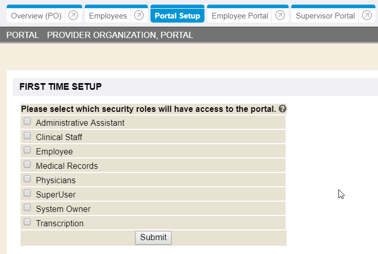
The **Portal** section, on the other hand, includes options to make label and verbiage changes, to update the logo, to disable either the employee or supervisor portal, and to add a consent form that would need to be electronically signed before being granted access to the portal.

Some of the options needing customized or addressed, include:
* <strong>Replacement text for Enterprise Health</strong>: This field is used to replace the <em>Enterprise Health</em> label with the provided text. The replacement text should be the business name.
* <strong>Logo - Upload new logo</strong>: Click the <em>Upload new logo</em> link to replace the default logo. The page will refresh after confirming the image selection.
* <strong>Consent forms needing completed</strong>: Click the <em>Add consent forms</em> link to add forms. This will determine which consent form(s) a user will be required to complete prior to being granted portal access. Users will not have portal access until all required forms are completed.
{}

An order for the consent must be added to the Portal Consent picklist, with an associated questionnaire flowsheet linked to the order for the verbiage.
{}
* <strong>Renewal interval</strong>: This determines the interval at which consent forms need completed. If no interval is provided, each form will only be required once. Setting the renewal interval to the shortest requirement is recommended.
All other options are part of the standard configuration and are enabled by default. No additional changes are required in this section, unless more customizations are needed to suit the business needs. In these cases, users are welcome to review the [Patient Portal](../../functions/portal-management/patient-portal-first-time-setup-and-configuration.md) online help documentation, for further details.

### Applicant Portal

The applicant portal is a web-based platform available for screening new employees and streamlining the hiring process. The applicant portal is an optional module designed as a login terminal for increased usability. With it, employers have the ability to simplify the onboarding process and ensure all pre-employment needs are addressed early and accurately.
This portal is configured so that candidates can be directed to the portal to complete forms and/or questionnaires, according to the hiring and pre-employment needs of the business. Candidates simply need to begin the portal session by entering their first and last name. Once the applicant has completed the forms/questionnaires, all of the information is submitted to the employer electronically. From here, a login-disabled user account will be drafted and linked to the pre-configured Applicant department, so if hired, the information can be easily merged into the employee user account.
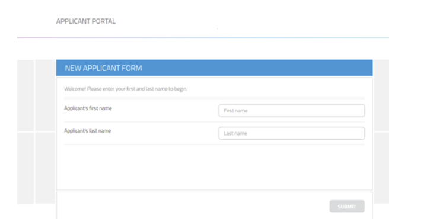

#### System Configuration and Setup

Be sure to speak with a Deployment Consultant if there is interest in maintaining an applicant portal, so any preferred configurations can be fully addressed and all available options and features can be reviewed. Once the portal has been configured, the URL will be made available for marketing purposes. From the Provider Management sidemenu, however, permitted users will have the ability to edit the title, color scheme, available questionnaires, and instructions. These configurations will then be visible within the portal accessed by the candidates.
**Questionnaire(s) for Applicants**: Clients will determine what types of information and number of forms/questionnaires applicants will be expected to complete. Discussions with the Deployment Consultant will help establish the necessary configurations and workflow (e.g., link necessary questionnaire(s) to corresponding order items; indicate what document type each questionnaire will be saved as; confirm the preferred chart tab to which each document type will be mapped).
**Questionnaire(s) Data Fields**: Additional discussions will be needed to determine what specific information is necessary from each questionnaire being presented to applicants, as well as in what way the information will be recorded. The Deployment Consultant will assist with configuring observations and observation flowsheets, to align with the appropriate free text data fields and pre-templated options needed on each questionnaire.
**Order Picklist**: Any questionnaires being used for the applicant portal must fall within an order picklist. Work with the Deployment Consultant to ensure an Applicant Portal order picklist is configured, listing each questionnaire needed for an Employer Organization (EO) or Provider Organization (PO) applicant portal.
**Applicant Portal EO or PO Chart Tab**: Customizations to the applicant portal can be done through the Applicant Portal chart tab of the EO or PO, as needed. It is through the Applicant Portal chart tab that users with the necessary permissions may configure the portal components. The portal URL suffix will be provided from this tab, which will be appended to the production database base URL and distributed for use.
**Tasking**: It is important to discuss and determine any tasklist events needing triggered whenever applicants register and submit information via the applicant portal.
**Merging**: Once an applicant is hired, it is important to merge the applicant chart with the employee chart. New employee charts are typically generated through the HR interface feed. Determine the workflow for merging charts, and ensure users who will be working applicant charts have the necessary merge security permissions.

### System Settings

In {} systems, workflows *use charts* for every patient, as well as users, employees, staff, etc. {} may already be set up to create a user when a chart is registered manually, or via an HR interface, by way of the *Enable PUR Routine* system setting. Correct relationships are then needed between charts and users for portal functionality to work for those users.

## Visit Workflow

#### HR directs applicant to applicant portal

HR will embed the applicant portal url into their email communications to the applicant and instruct the applicant as to which questionnaires need submitted by the specific applicant.

#### Applicant fills out questionnaire(s) needed

Applicant will visit the business applicant portal to key in their name, DOB and SSN then proceeding to fill out the specific questionnaire(s) HR indicated in their communications. When the applicant submits questionnaires via the applicant portal, a pre-placement partitioned chart is created in EH. Applicant should also print their submitted/completed questionnaires from their portal session.

#### Manually Provision Chart by Clinicians if applicant didn't visit the applicant portal

There may be an instance where an applicant does not visit the applicant portal prior to calling to make their appointment.  You can direct them to follow the directions to visit the applicant portal first and then call back to schedule the appointment.  If they refuse, you can manually create the chart in Enterprise Health. First search charts in EH to make sure a chart doesn't already exist for the individual.  If a chart doesn't exist, the staff can manually create the preplacement/applicant chart
* To create a new chart go to e-chart sidemenu tab then click Patient Registration
* Insert their name, DOB and search for the word <em>pre</em> in the organization field and select (from the auto-complete) <strong>Applicant/PrePlacement</strong> organization to relate the chart to. 
    * This is what puts the chart in the specific partition of preplacement.
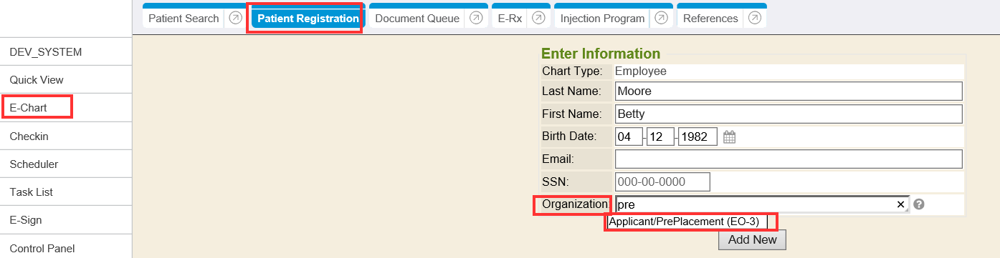
* Click the ADD NEW button
* The chart is created into the PRE partition and you will be taken to the edit demographics screen to continue keying in demographic information for this preplacement applicant.  You will see the PRE chart medical record # assigned in the top right corner.
    * Only information on the left side of the demographics screen needs filled out.  The right side is for employee specific chart information when they are hired.  
    * Make sure to checkmark <em>Is Applicant </em>on the left side
        * Checkmarking <em>Is Applicant </em>flags the chart as temporary, which is needed for auto-chart merging rules that happen in the background for when/if the applicant is hired
    * Click the SAVE button
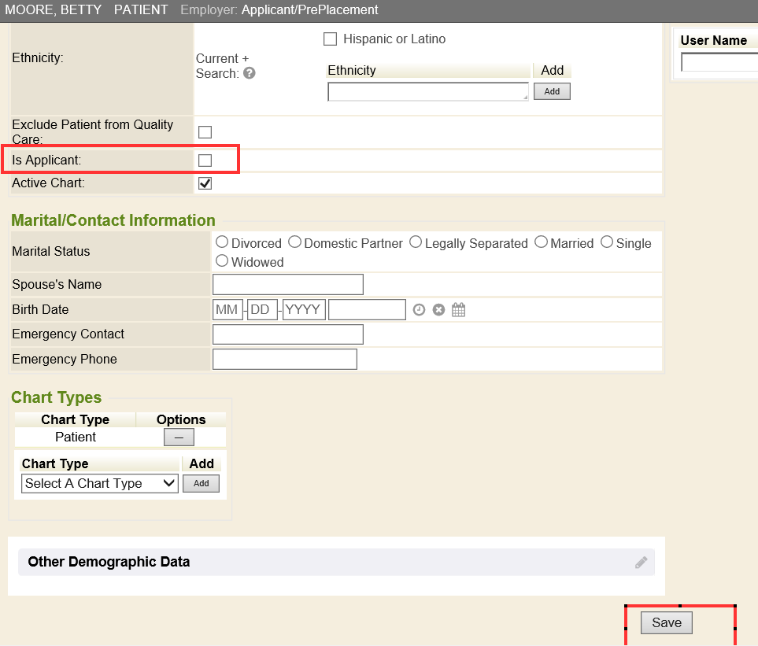

### Schedule Pre Placement Exam

Applicant contacts clinic to schedule pre placement exam appointment.

#### Staff Prepare to Schedule Pre Placement Appointment

1. Navigate into the specific applicants chart via E-Chart search
2. Verify in correct chart
3. Merge any duplicate charts if the applicant went on the applicant portal multiple times
    1. Currently only a handful of users have merge rights.  Use the fast task ‘Merge Chart Request' to send a task to Admin dept to merge duplicate charts if needed
4. Update any demographics information if needed
    1. On the Summary dashboard tab of the applicant's chart, click the pencil icon (manage info) on Demographics portlet to get to edit demographics screen
    2. Edit demographics to collect information (phone/address etc) and checkmark the <em>Is Applicant </em>box toward bottom left of the screen.
        1. Checkmarking <em>Is Applicant </em>flags the chart as a temporary record, which is needed for auto-chart merging rules that happen in the background for when/if the applicant is hired

#### Add Applicant to Initial PrePlacement Entry Program and any other Add On Programs

1. From Summary tab dashboard, verify preplacement due list items were not already previously triggered.  If they were, you skip this part as you do not want to trigger duplicate preplacement exam tests & procedures to have done.

2. On the Due List portlet is a pencil icon (manage info), click that to get directly to the Due List chart tab
    1. You can also go to Health Surveillance tab at the top, then to child tab Due List
3. Click <em>Add New Orders</em> button at the end of the Pending Items section of the list (top section)

4. In the <strong>Order </strong>auto-complete field, key in keyword <strong><em>Entry</em></strong><em> </em>and auto-complete choices will display.
5. Select <strong>Initial Preplacement Entry</strong> order
6. Use "add" button. 
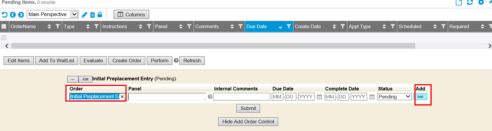
7. In the <strong>Order</strong> auto-complete field, if you need to also add on any other program testing for preplacement needs (ex: Crane, DOT, Hazmat, Hazwoper, FireB, Hearing Prot, Resp Prot, or Vision) begin typing in keyword <strong><em>Entry</em></strong> and auto-complete choices will display
8. <strong>MAKE SURE TO SELECT THE NEEDED ADD-ON PROGRAM THAT </strong><strong>DOES NOT</strong><strong> SAY </strong><strong><em>WITH MEMBERSHIP</em></strong>
    2. The <em>with membership </em>entry programs are for hired employees who get authorized to be put into the program.  Preplacement needs, make sure only to select the add-ons that do not say <em>with membership</em>
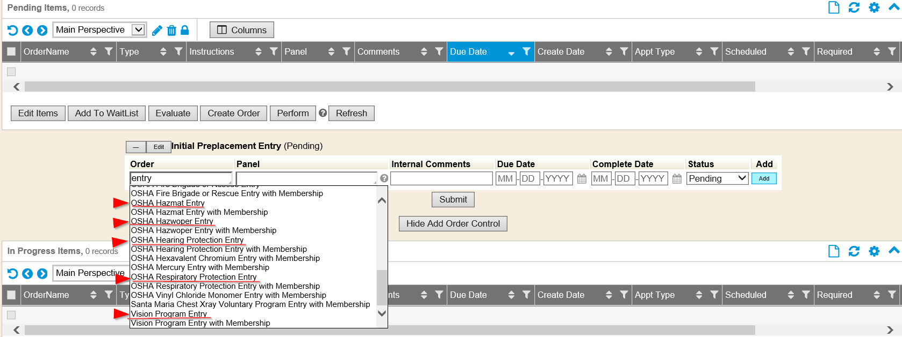
9. After adding all that are needed, Click <strong>SUBMIT</strong> button.

10. The Pending Items section of the due list will refresh to populate the Initial Preplacement Entry panel you indicated and any other add-on entry program testing if applicable.  Checkmark all testing programs you applied and click the Evaluate button.   <em>Do Not Put an Applicant/Preplacement in any entry surveillance with membership programs.</em>
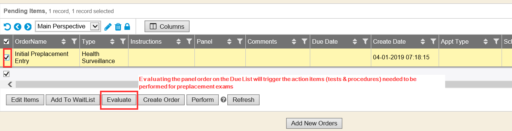
11. When a panel order is evaluated, the specific tests & procedures (action items) trigger on the chart's due list as to what needs done for the preplacement exam.
    3. Click the red X on the pop-up after verifying successfully evaluated message
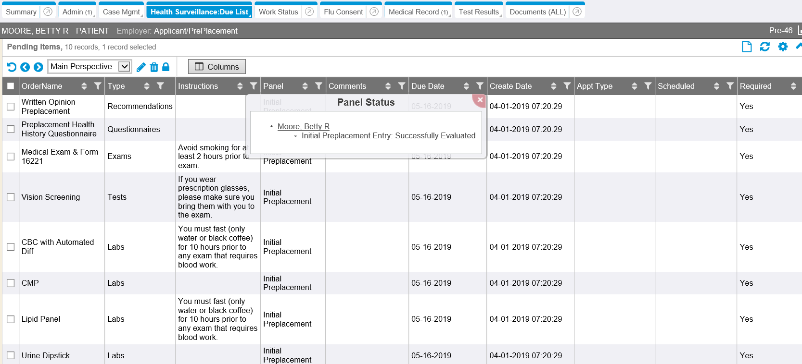

#### Schedule Pre Placement Pending Waitlist Appointment

1. Navigate to the Appointments portlet in the Summary dashboard of the chart
2. Since the chart was placed/evaluated for Initial Preplacement Exam program, a pending waitlist appointment should be displayed.
3. Click Appointment needs scheduled hyperlink on the pending waitlist appointment for PrePlacement needs

4. Schedule the appointment as needed and can send an Appointment Confirmation email if captured their email in demographics

### Checkin Applicant for scheduled appointment

#### Applicant Visits the Front Desk, Returns Completed Paperwork

1. Complete PrePlacement Packet prior to visit on Applicant Portal
2. Arrive for appointment and check-in with staff

#### Staff Check-In Applicant

1. Ask applicant for Pre-Employment Packet; confirm completed
    1. Scan in PrePlacement documents per scanning protocol

#### Check-in

Applicant presents to front desk for pre placement appointment. Staff member will:
1. Search for the applicant in E-Chart or in Quick View tab via the Chart Search portlet
2. Once in the correct chart, you will typically land on the Summary dashboard tab of the applicant's chart.  Click the Checkin link towards the upper left in the chart or the Checkin link in the Quick Links portlet.
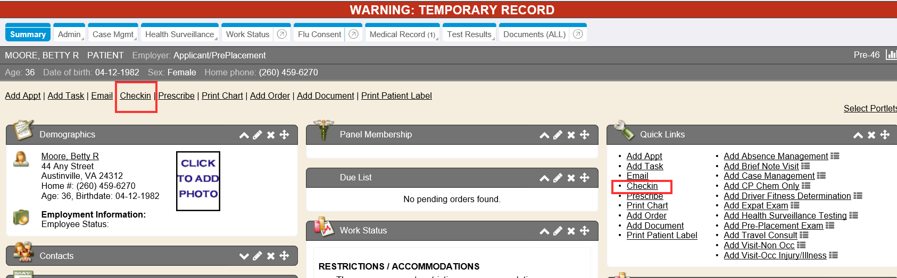
3. If the applicant is here for a scheduled appointment with today's date, the checkin screen will display that appointment date/time as a hyperlink.
    1. Click the appointment date/time hyperlink since they are checking in for that scheduled appointment

4. From the checkin function, the station will be <em>Checked-In</em>.  Simply ignore the rest of the screen as there is nothing to do or set (at some future point, this screen will omit those areas).  From this screen simply click the SAVE button

5. The applicant is checked in
6. Applicant will now show on Check-in sidemenu tab module or in the Checkin portlet of Quick View
    1. When the applicant checked in for a scheduled appointment, a Pre-Placement encounter is automatically initiated by the system and begins to track the time spent in the clinic for this visit. 
        1. If the applicant was a walkin, staff will need to get into the applicant's chart and click the specific Pre-Placement encounter type to initiate via the Quick Links portlet.
    2. The clinician and provider can see on the scheduler or the Check-in tab or Checkin portlet that the applicant is checked in.

####  Clinician performs Intake - Pre Placement Exam

1. Get into Preplacement Exam encounter on the applicant's chart, via the Open Encounters portlet on the Summary dashboard. 
    1. Depending on the amount of columns on your Summary tab dashboard, you may need to scroll to the right to access thePrePlacement Exam link.

1. Complete appropriate sections of the encounter
Subjective
    * <strong>Encounter Information - </strong>Displays the basic employee information that is associated with the current encounter being worked in.
        * Make sure the <em>Provider</em> is the name and location of the correct final provider whose signature will be on the document as performing provider.
    * <strong>Chief Complaint - </strong>Add/update Chief Complaint (this will pre-populate from the scheduler if checked in for a scheduled appointment).
    * <strong>Case - </strong>Create Medical Surveillance case (if preplacement visit is going to be split into a Part 1 and Part 2).  If this is the Part 2 appointment, <strong>link</strong> the exam encounter to the Medical Surveillance case that exists for the applicant.
    * <strong>Past medical history; Past Procedures</strong> - Confirm/update any past medical history for the applicant as appropriate.
    * <strong>Presenting medication - </strong>Entry of the applicant's list of medications that they are currently taking at time of visit. Confirm/update presenting medications.
    * <strong>Allergies / Intolerances - </strong>Confirm/update presenting allergies/Intolerances and family history as appropriate.
    * <strong>Injections / Immunizations </strong>– Past/historical injections or immunization history collected.
    * <strong>Social history - </strong>As appropriate.
    * <strong>Linked Documents - </strong>Displays a list of documents linked to this encounter.
2. Objective 
    * <strong>Tests & procedures</strong> - User to select predefined order items with the purpose of performing them in-house. This section also contains the Due List which will help to define what services an employee may be due for at today's visit. 
    * Review the list of items on the applicant's Due List. Check off any that you would like to perform at today's visit. You can also use this section to delete / decline any of the orders as well. 
        * Complete - check mark and "Set Completed" any items already completed, and enter a "completed date" ex: questionnaires the applicant submitted via the applicant portal

3. <strong>Performing In-House test/procedures: </strong>Checkmark the pending due list items you will be performing yourself during today's visit, then click <em>Add to Exam</em> button.
    
    * The specific test / procedure(s) you checkmarked to <em>Add to Exam</em> will now be applied as individual sections to the encounter.
    * Expand each test / procedure section to perform the test or procedure.
        * Make sure to checkmark each individual test or procedure applied section ‘complete' so the system knows that component of the health surveillance is done
        * <strong>Audiogram - </strong>Make sure to mark the audiogram performed for preplacement visit as the <strong>baseline</strong> on the audiogram test here in the encounter.
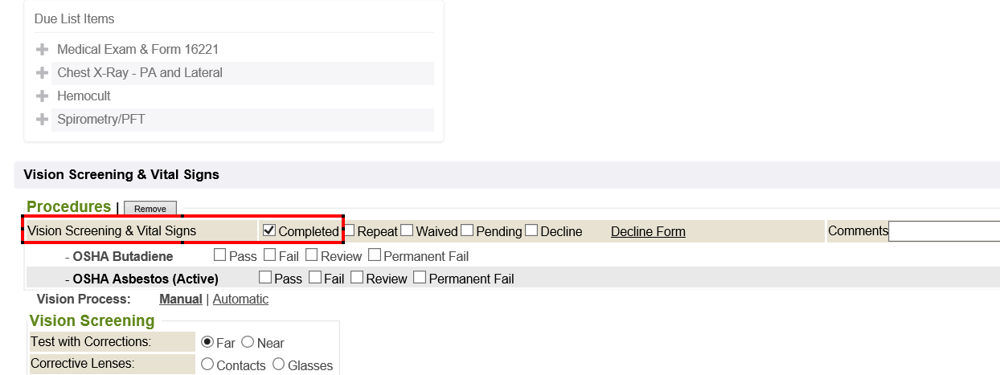
5. <strong>Generating Referral/Requisition Orders:</strong> Checkmark the ‘like' items listed on the due list (ex: Lab Work) that needs to be performed with an outside vendor, then click <em>Make Order </em>button to generate that order requisition. <em>Note: make sure to Make Orders based on type, meaning you would not checkmark a Chest Xray item to be in the same order as lab work that is going to a lab vendor to have performed.</em>
    * If you would like to create an order requisition for any of the Due list items simply check them off and click Create Order. This will open a new tab in your browser and allow you to generate an order requisition. 
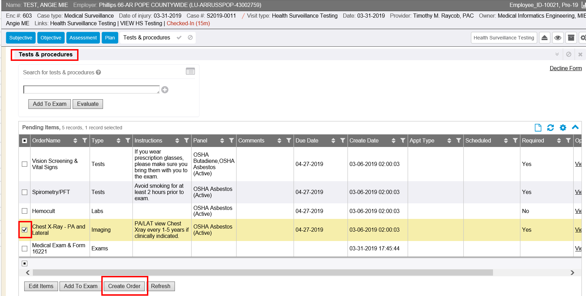
6. Save work
7. Work is saved each time you collapse a section in the encounter or click the NEXT button.
8. The "Save Incomplete and View" icon in the upper right of the screen will save what is charted and navigate the user to the encounter <strong>view</strong> screen.

vii. Once you've been in the open encounter (and it has not been archived & closed yet), the encounter will be accessible to get into at any time via the light grey header when in the chart.

#### Provider Examines PrePlacement Applicant

1. Navigate to Check-in tab in the left side menu or be in the Checkin portlet of Quick View
2. Click the employee's name or MR# to get directly into their chart

3. You will land on the Summary dashboard tab of the employee's chart where you see a dashboard view of information you can review.
4. To begin charting within the encounter, find the Open Encounters portlet within this summary dashboard.  
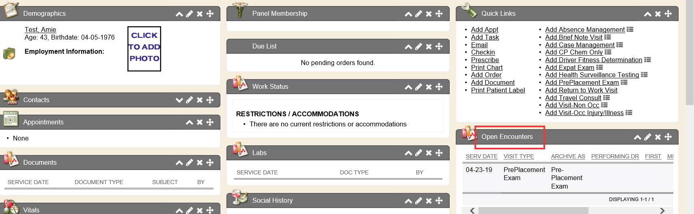
5. Click the hyperlink of the open encounter to begin charting within the encounter related to this visit. Note: depending on how many columns your Summary dashboard uses, you may have to scroll to the right to access open encounter hyperlinks to take you directly into the encounter.
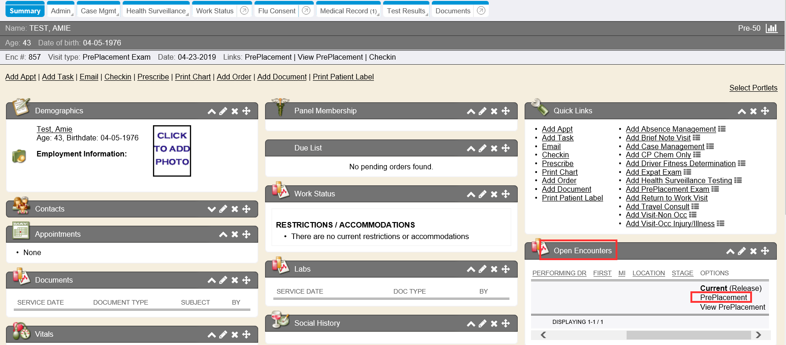
6. Complete the appropriate sections of the encounter while reviewing the information that your Clinician has already provided during Intake, including: 
1. Subjective
    * <strong>Encounter Information - </strong>Displays the basic employee information that is associated with the current encounter being worked in.
        * Make sure the <em>Provider</em> is the name and location of the correct final provider whose signature will be on the document as performing provider.
    * <strong>Chief Complaint - </strong>Add/update Chief Complaint (this will pre-populate from the scheduler if checked in for a scheduled appointment).
    * <strong>Past medical history; Past Procedures</strong> - Confirm/update any past medical history for the employee as appropriate.
    * <strong>Presenting medication - </strong>Entry of the employee's list of medications that they are currently taking at time of visit. Confirm/update presenting medications.
    * <strong>Allergies / Intolerances - </strong>Confirm/update presenting allergies/Intolerances and family history as appropriate.
    * <strong>Injections / Immunizations </strong>– Past/historical injections or immunization history collected.
    * <strong>Social history - </strong>As appropriate.
    * <strong>Linked Documents - </strong>Displays a list of documents linked to this encounter.
2. Objective 
    * <strong>Vitals</strong> - Review employee's vitals. 
    * <strong>Tests & Procedures: </strong>Checkmark the items you will be performing yourself during today's visit, then click <em>Add to Exam</em> button. (ex: Medical Exam / Physical Exam due list item that is due for surveillance)
        * Refer to same workflow guide steps above in Clinician Intake section
* <strong>Restriction/Accommodations</strong>
    * Enter any applicable restrictions and/or accommodations
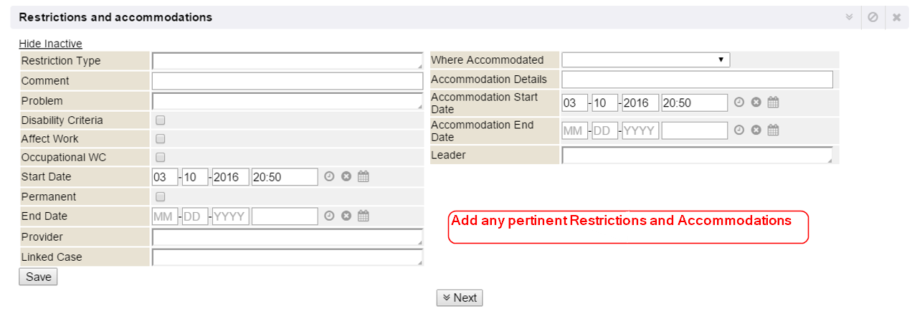
* <strong>Recommendations - </strong>Generates a work status report 
    * This section contains a link to add the Written Opinion-PrePlacement to the encounter.  You will use this section to document a written opinion to signify if they are fit, etc. To add the PrePlacement recommendation (written opinion) to the encounter to document, click <strong>Add to Exam</strong> link under the specific written opinion listed.
    * IF there were any add-on programs to do for the preplacement applicant, those program written opinions will also be displayed to apply. Click <strong>Add to Exam</strong> link under the specific written opinion listed.
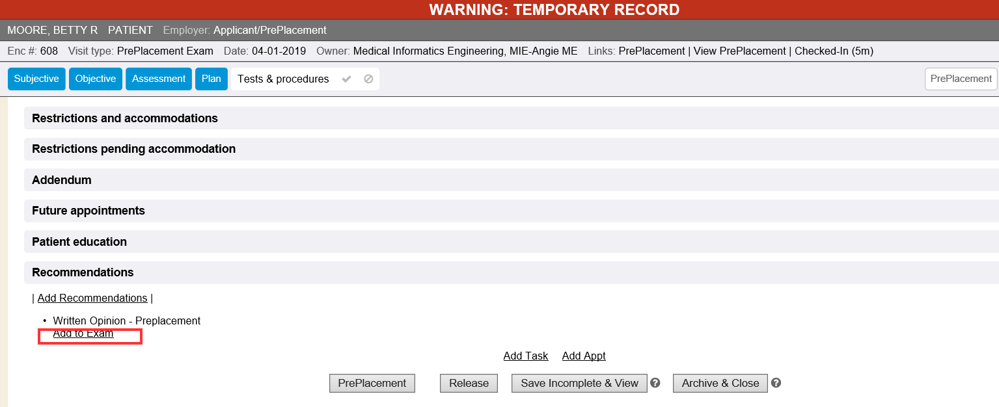
* Click on the written opinion grey title bar to expand the written opinion encounter section work them.
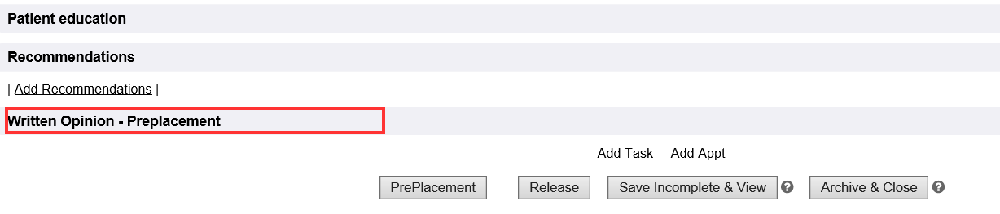
* Make sure to document the written opinion template and the overall opinion of fit/not fit or significant findings/no significant findings, etc.
    * In the Comments field, be sure to type in any add-on programs they were also cleared for, etc even though doing a separate written opinion for those programs.  Because the Due Diligence Team will only receive the Written Opinion-Preplacement document automatically to process and be able to see those comments.
* The Next Due Date field remains <strong>blank</strong> since a PrePlacement (and any add-on program testing) is not a routine testing that needs done as they have not been officially hired and not put into membership surveillance programs at this time.
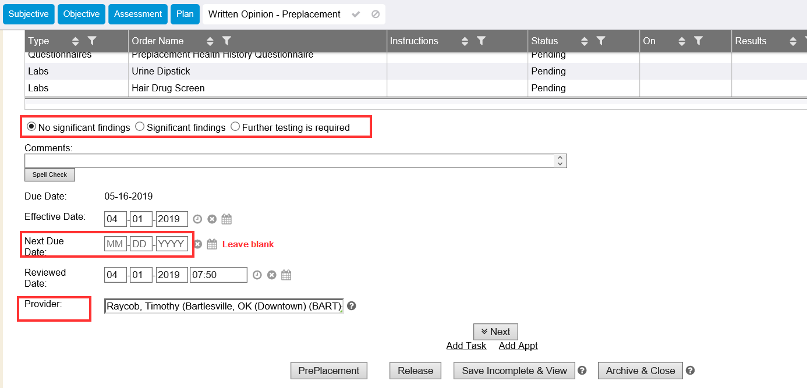
* Click the Archive and Close button at the top or bottom.  The encounter data that was keyed in will become a document record in the chart.
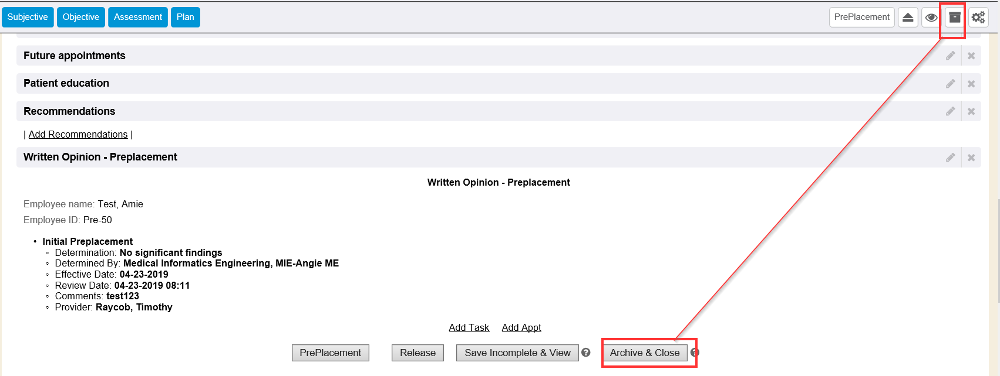

#### Provider Check-out Preplacement Applicant

Complete the visit by scheduling any follow-up appointments, and checking out the applicant
1. Schedule follow-up appointment if indicated.
2. Check-out.
    1. Click on check-in station found in chart various areas or in top grey encounter bar
    2. Move station to Check-out and Save.

**HR Notification of Preplacement Medical Clearance**
1. Once a Written Opinion - Preplacement has been completed in the recommendations encounter section and the encounter has been closed & archived, the Written Opinion-Pre Placement document will be automatically emailed (hourly) to the Due Diligence Team.
2. Due Diligence team will view the final clearance determination of the pre hire to send out the further appropriate notifications needed.

#### Staff Index scanned in Documents/Link to Encounter

1. Scan and index any forms or documents per scanning protocol, link to the PrePlacement encounter by clicking on the "Search"  button on the indexing <strong>Encounter </strong>field to find the correct encounter.  When done indexing a batch, click on the "Upload to Chart" button in index module.
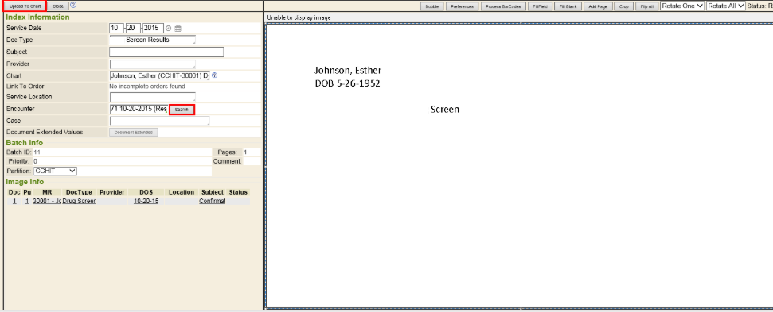

### Physical Agility Testing for Preplacement Exams

Preplacement applicant goes to get Physical Agility Testing (when applicable) with a separate vendor. Clinician receives Physical Agility Testing results and need to make the overall physical agility determination.

#### Physical Agility Determination Encounter

Create a Physical Agility Determination Encounter by going to the summary tab in the chart and using the hyperlink Physical Agility Determination found in the Quick Links portlet.
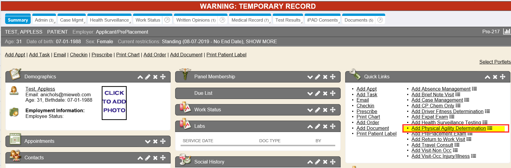

Work the encounter top to bottom including indicating the provider doing the determination (using the Encounter Info section),  indicating overall Physical Agility Determination selection in that section, and if any restrictions/accommodations needed in appropriate encounter section.

Archive and Close Encounter once done documenting.

Upon completing Physical Agility Determination encounter and after closing & archiving the encounter, the system will auto email the Due Diligence Team to give them notification of physical agility determination
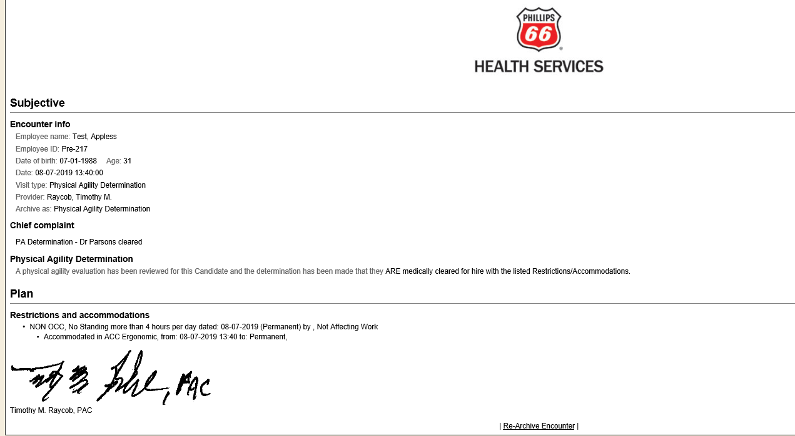
Staff scan & index in documents/Link to encounter as needed

## Key Decision Points

1. Determine abbreviation that will be used for the applicant partition (APP is the default)
2. Tasking notifications
3. Review applicant email template
4. Determine whether any automated email notifications should be sent out
5. Does HR need access to view applicant status on the supervisor portal? If so, what information do they need to see?
6. Does a purge rule need put into place to purge applicant records that are not hired? What is the criteria for the purge rule?

## Action Items/Timelines

1. Provide all pre-placement questionnaires that need loaded on the applicant portal
2. Provide all consent forms that need loaded on the applicant portal
3. Provide all testing that should be completed on new hires to configure the Pre-placement surveillance panel

## Resources

### Product Documentation

* [Linking Users for Portal Access](../../functions/portal-management/linking-users-for-portal-access.md)
* [Patient Portal Setup](../../functions/portal-management/patient-portal-first-time-setup-and-configuration.md)
* [Employer Portal Setup](../../functions/portal-management/employer-portal-setup.md)
* [Employer-Employee Second Portal Setup](../../functions/portal-management/employer-employee-second-portal-setup.md)

### LMS Courses/Videos

<table>
<tr>
<td><a href="https://employee-mie.talentlms.com/catalog/info/id:165">Pre-employment Management w/Applicant Portal</a> (LMS Course)</td>
<td>33 min</td>
</tr>
<tr>
<td><a href="https://employee-mie.talentlms.com/catalog/info/id:436">Patient Engagement Portals</a> (LMS Course)</td>
<td>22 min</td>
</tr>

</table>

### Technical Support Help Desk

[https://mie.support/](https://mie.support/)
260-459-6270 x 1

**Wake - Applicant Pre-Hire Front Desk Workflow**
***Make sure your Default Location in My Settings is set to the clinic location you are working at each day***
***Very important that you have your default location set to the campus you are working at today, otherwise you will check people into the wrong location and staff will not have visibility to them***

# Search for existing chart

Go to E-Chart sidemenu tab and search for the person who is coming into the clinic to be seen for a Pre-Hire/Applicant/Post Offer evaluation at the Front Desk.  Your search default is by name, meaning to search you need to type in last name, then first name.  

Do your search as general or as granular as needed to get the results.  A wild card % is available in the search for last names.

# Existing/Matching Chart Found

HR/Talent team is to register charts into the Applicant organization and schedule their pre-hire appointment at an employee health site that is allowed to do pre-hire evals.  So the person's chart should be in Enterprise Health when you go to search.  If the chart is not, you can manually register a chart into the Applicant organization in steps further down in this guide.
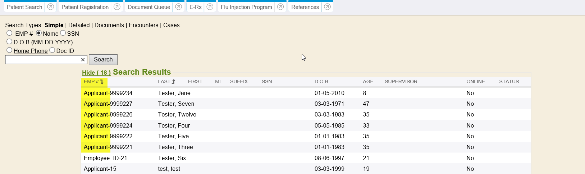
If the person has never been an employee at Wake before, their chart should be found in the Applicant MR# partition.  If they were an employee of Wake before, their chart may be found as Agility or Employee_ID partition because they were an employee before, terminated and perhaps are now being rehired.  We want to make sure to only have one chart per person and the ‘partition' or MR# prefix that the chart has depends on things such as brand new to Wake, or they've worked here before and left, etc.

## Pre-Hire Applicant Chart Found

If an existing chart has any scheduled appointments for it, you will see that information from the Summary chart tab.  You will see in the dark grey header bar at the top any *Next Appointments*.  You will also see an **Appointments** portlet on the Summary tab that lists any upcoming appointment information.  This can help you to visually notice if their visit to the clinic today is for a scheduled need or is a walk-in.

# Checkin Applicant

It is important to check the chart into the Waiting Room so that the timer starts and the worklists reflect who is in the clinic physically. Using the **Checkin** link will do that for you.  When in the chart, find the **Checkin** link above under the dark grey patient header bar, or in the Quick Links-EH portlet where quick accessibility to functions is.

Click **Checkin** link
The system will look to see if any scheduled appointments for today exist for the chart.

## Check Applicant Chart into Waiting Room for Scheduled Pre-Hire Appointment

If the system finds any existing scheduled appointments for today's date (the date you are signifying to check them in), it will display a screen such as this:
* 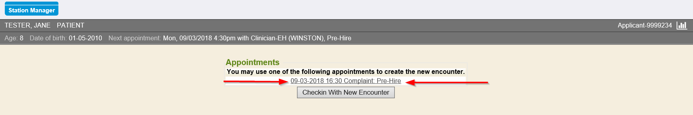
The screen tells you to click the hyperlink for the found pre-hire appointment date/time if you are checking them in for that appointment.  **It is important to click the appointment hyperlink there to link the checkin to their scheduled appointment if they are indeed being seen for that scheduled appointment**.  Click the hyperlink that lists their found appointment.
**	Note:** You would only click the box *checkin with new encounter* infrequently.  Such as if the person were not being seen/being checked in for their specific scheduled appointment (ex: It's 9am and they are coming in for a work injury/exposure, but later on in the day at 2pm they have a scheduled appointment for a Respirator Fit test).  You would not check them in for that scheduled Resp Fit test because their visit is for an injury, so you would not click the appointment hyperlink on this screen (to link the checkin to this scheduled appt) because you are not checking them in for that appointment, you are seeing them for a walk-in reason that isn't affiliated with the Resp Fit scheduled appointment they have later that day.

The system will display the Checkin screen to you.  You only need to do 2 things here because the system will do the rest for you:
1. Make sure the <strong>Station</strong> at the very bottom says ‘Waiting Room'
    1. If it does not, select that drop-down, but you should be defaulted to that station
2. Click the SAVE button to save the chart to station ‘Waiting Room'
**Note:** you will see the appointment information on this screen since you indicated to check them in linked to the found appointment, and you will also see the HR/Talent Team scheduling notes in the Notes/Comments field.
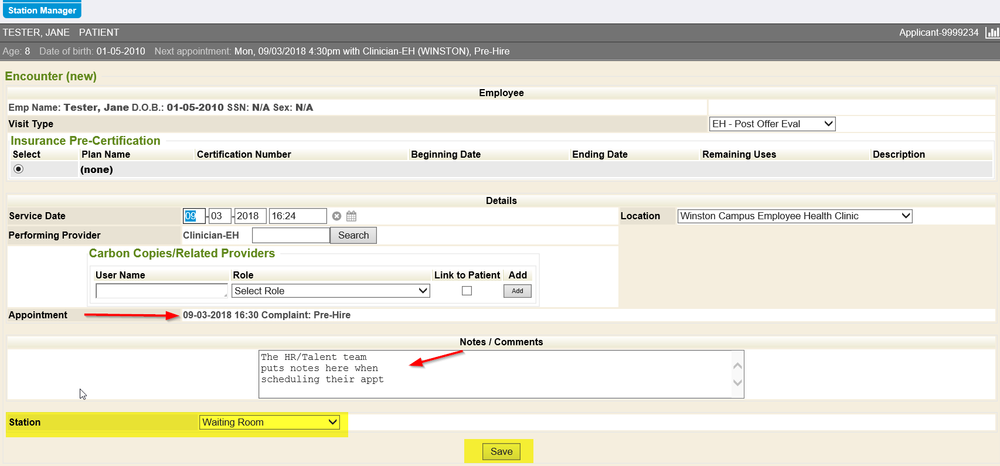
The system has now checked them into the Waiting Room and started the time tracking.
Your screen will show them as checked into the Waiting Room for the specific clinic/campus location you have set in your My Settings default location preference. ***Very important that you have your default location already set to the campus you are working at today, otherwise you have checked them into the wrong location***

Get back into the person's chart by clicking on their name at the very top left corner in the dark-grey bar.  You need to finish up the demographics for the Pre-Hire Applicant chart and get them *Ready for Clinician* next.
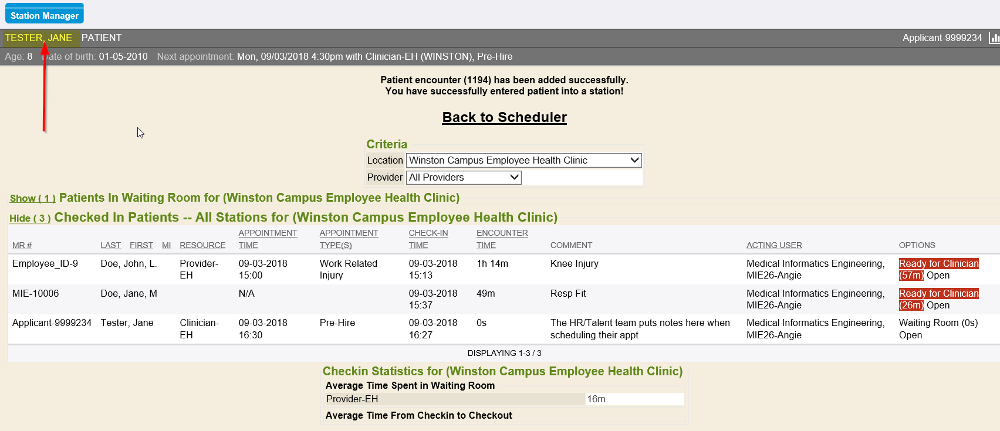
Back in the chart, you will land on the Summary chart tab.  You will see that the system added & created the appropriate open encounter for the specific pre-hire appointment reason you linked their Checkin to in previous steps.  You will see that open encounter in the **Open Encounters** portlet on the Summary tab.

## Update Demographics for Checked-In Applicant Chart & Flag as Temporary

When in the Summary chart tab, you will see no demographics besides the name & DOB for the applicant/pre-hire. HR/Talent Team does not have security to demographics so they can only key in name & DOB when registering the chart into the system.  When they come in for their pre-hire eval, you need to update their demographics.  Click on the pencil icon in the Demographics portlet to get to the **Edit Demographics** screen.

Once in **Edit Demographics** screen for the Applicant chart, you will work the left side.  
**Note:** you can update demographics for Applicant MR# charts because demographics info will stay there until they get hired, which then puts them into Peoplesoft which then feeds into Enterprise Health and merges the charts.

On the left side demographic fields, key in their address, cell, and any other important info.  The right side fields are what Peoplesoft will send in once hired.
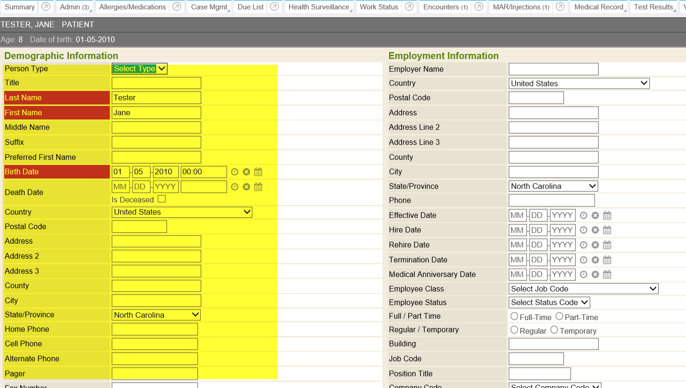
The last important step in the Applicant's chart is to checkmark the **Is Applicant** box.  ****Only do this if the chart you are in is set to Applicant Medical Record (MR) #.  If the top right corner Medical Record number says ‘Applicant' then make sure to checkmark ‘Is Applicant'**.  

If the chart you are in says Employee_ID at the top right corner for medical record number or Agility, please do not checkmark ‘is applicant' checkbox because that means the person has worked here before and had a chart come over from Peoplesoft and/or Agility and they are not new to the company.
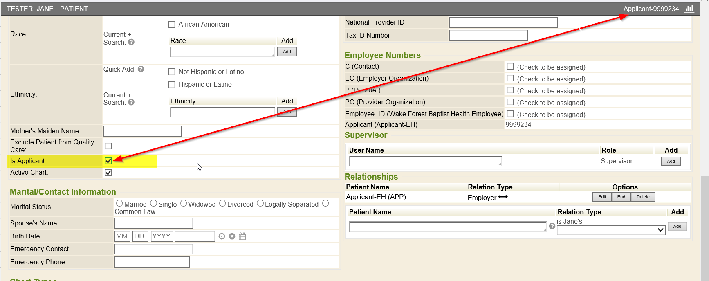
Once done with demographics and checkmarking Is Applicant if the chart is in the Applicant MR# partition, then click the **Save** button to save your work.
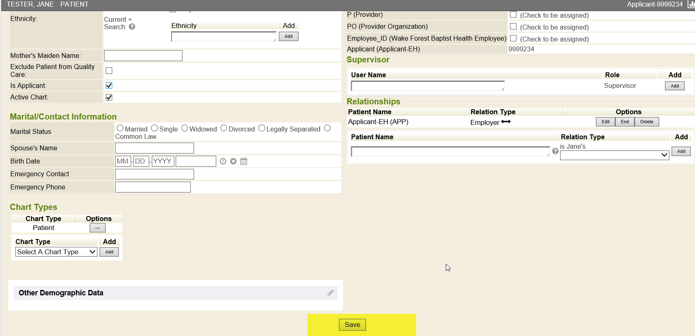
The reason to checkmark ‘Is Applicant' in an Applicant partitioned chart, it will mark the chart as ‘temporary' in a red banner and once they are hired, the system will link any matching ‘temporary' flagged Applicant chart into their Peoplesoft Employee_ID chart that will come in once hired.  Thus eliminates duplicate charts and having to manually merge later on when a duplicate is found.

## Move Applicant Chart to ‘Ready for Clinician' station

You will also see that the chart is still in the checkin station named **Waiting Room**. You will see this at the left up under the dark grey patient header bar of the Applicant's chart.  Because you've already checked them into the Waiting Room and linked the checkin to their scheduled appointment, then have updated their demographics and marked ‘Is Applicant'.  So now you are ready to set the station to ‘Ready for Clinician'.

You now need to move the chart out of the Waiting Room station to be ‘Ready for Clinician' station so that the clinicians know a person/chart is ready to be taken back and for what visit reason.

Click on the station (while still in the chart) that currently says **Waiting Room (x)** from either the top left under the dark grey patient header bar.  You are now going to change the station from ‘Waiting Room' to be now ‘Ready for Clinician' when you are done with your front desk activities for the chart (ex: done making copies of historical injection records they bring in, or copying their drivers license, etc)

When you click on the **Waiting Room (x)** link, it will pop-up a small box to Enter New Station Details.
1. Set <strong>New Station</strong> field (using the drop-down) to be <strong>Ready for Clinician</strong>
2. In the <strong>Comment</strong> field will be the HR/Talent Team notes. Keep those, but type in PRE-HIRE at the bottom of it.
3. Click <strong>Save</strong> button to save your work. 
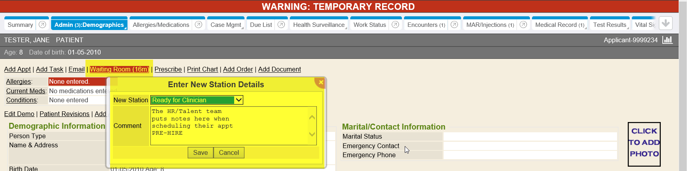
Go work the next person to checkin by getting out of this chart by clicking E-Chart sidemenu tab, etc.

# Chart Registration/Checkin for Pre-Hire WalkIn who was not registered or scheduled by HR/Talent Team

## Applicant Chart Registration

There may be one-off chances that someone comes in for a pre-hire that isn't in the system nor has as scheduled Pre-Hire appointment.  HR/Talent team is to register everyone and schedule them, but there could be a need for the front desk staff to have to do the Applicant chart creation.

If you cannot find the Applicant's existing chart in the system at all, go to E-Chart on the sidemenu tab and at the very top tabs click **Patient Registration**.** ** Only can register Applicant charts into Enterprise Health. Employees would already have an existing chart in Enterprise Health from Peoplesoft.
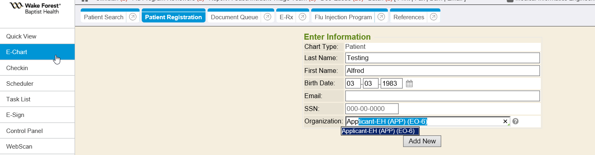
The mini-registration screen appears:
**Last Name:**  This is required - key in last name of Applicant
**First Name:**This is required - key in first name of Applicant
**Date of Birth:**This is required - must key in a date of birth (if they refuse, then just type in some default convention ilke 1/1/1900 so that signifies to staff they refused)
**Organization:** Must type in **Applicant** and select the Applicant choice from the auto-complete.  *Do not select anything else in the Organization auto-complete.  You* **_must_*** search/select Applicant as the organization.*
Click **ADD NEW** button to continue

Once in **Demographic Information** screen for the Applicant chart, you will work the left side.  
**Note:** you can key in demographics for Applicant MR# charts because demographics info will stay there until they get hired, which then puts them into Peoplesoft which then feeds into Enterprise Health and merges the charts.

On the left side demographic fields, key in their address, cell, and any other important info.  The right side fields are what Peoplesoft will send in once hired.

The last important step in the Applicant's chart is to checkmark the **Is Applicant** box.  ****Only do this if the chart you are in is set to Applicant Medical Record (MR) # (which should be since you registered the chart to that organization).   If the top right corner Medical Record number says ‘Applicant' then make sure to checkmark ‘Is Applicant'**.  

Once done with demographics and checkmarking Is Applicant if the chart is in the Applicant MR# partition, then click the **Save** button to save your work.

The reason to checkmark ‘Is Applicant' in an Applicant partitioned chart, it will mark the chart as ‘temporary' in a red banner and once they are hired, the system will link any matching ‘temporary' flagged Applicant chart into their Peoplesoft Employee_ID chart that will come in once hired.  Thus eliminates duplicate charts and having to manually merge later on when a duplicate is found.

## Checkin the Newly Registered Applicant Chart to Waiting Room

You will see the **Checkin** hyperlink available at the top left under the dark grey patient header bar.  Click on that **Checkin** hyperlink.
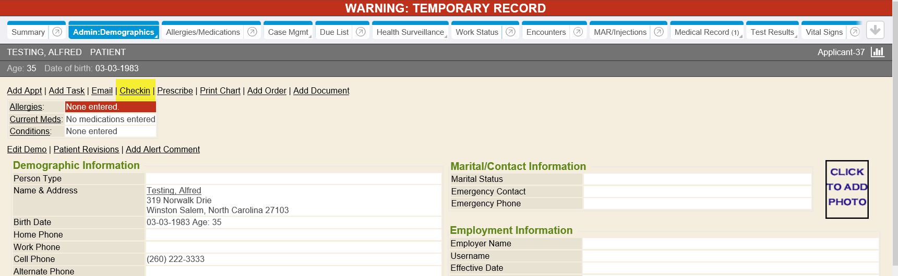
In the system (after clicking the Checkin hyperlink in steps above) you will see the Checkin screen and no option to checkin for any scheduled appointments, because this is a newly registered Applicant chart which doesn't have any appointments scheduled to it.   You only need to do 2 things here:
1. Make sure the <strong>Station</strong> at the very bottom says ‘Waiting Room'
    1. If it does not, select that drop-down, but you should be defaulted to that station
      2) Click the SAVE button to save the chart to station ‘Waiting Room'
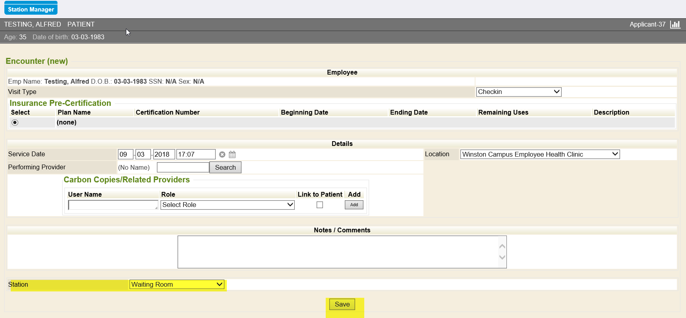
The system has now checked them into the Waiting Room and started the time tracking.
Your screen will show them as checked into the Waiting Room for the specific clinic/campus location you have set in your My Settings default location preference.  ***Very important that you have your default location already set to the campus you are working at today, otherwise you have checked them into the wrong location***

Get back into the person's chart by clicking on their name at the very top left corner in the dark-grey bar.  You need to finish up and get them *Ready for Clinician* next.

Back in the Applicant chart, you will land on the Summary chart tab.  Since the applicant wasn't in the system so obviously didn't have any scheduled appointment, the system has no idea what they are here for.  So you (the front desk staff) need to add & create an encounter for the clinicians/providers to document in.  You can verify this by seeing the **Open Encounters** portlet on the Summary tab.  There should be no open encounters in that portlet (because encounters should get closed & archived daily).

Go to the portlet **Quick Links-EH** and click on the hyperlink **EH-Post Offer Eval****** encounter to create for their visit through the clinic. 
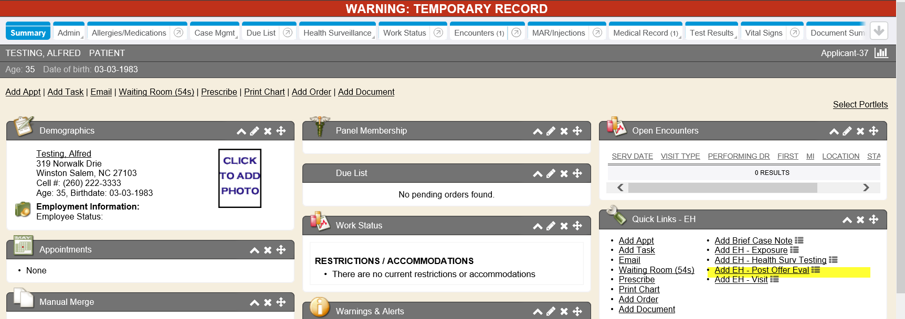
Once the Post Offer Eval encounter is selected from the Quick Links -EH portlet, the system will add and create the Post Offer Eval encounter.  You will be taken into the new created/open encounter where you can do 2 things:

Verify the correct encounter visit type & Archive As fields are appropriate according to what you selected.
**Note:** If not, simply expand the Encounter Info section by clicking anywhere on the grey title bar ‘Encounter Info' and change those fields if needed

You will also see that the Applicant chart is in the checkin station named **Waiting Room**. You will see this at the top of the new open encounter you created for the chart.

You now need to move the chart out of the Waiting Room station to be ‘Ready for Clinician' station so that the clinicians know a person/chart is ready to be taken back and for what visit reason.

Click on the station hyperlink that currently says **Waiting Room (x)** at the top of the Post Offer Eval encounter you created.  You are now going to change the station from ‘Waiting Room' to be now ‘Ready for Clinician' when you are done with your front desk activities for the chart (ex: done making copies of historical injection records they bring in, or copying their drivers license, etc)

When you click on the **Waiting Room (x)** link, it will pop-up a small box to Enter New Station Details.
1. Set <strong>New Station</strong> field (using the drop-down) to be <strong>Ready for Clinician</strong>
2. Type in the <strong>Comment</strong> field (using freetext) PRE-HIRE.  This allows the clinicians elsewhere in the clinic to see which person to call back easily so they know what they are here for.
3. Click <strong>Save</strong> button to save your work. 

Go work the next person to checkin by getting out of this chart by clicking E-Chart sidemenu tab, etc.

## Pre Placement/Candidate/Applicant

The words PrePlacement, Candidate or Applicant are used interchangeably

1. <em>The HR Portal is currently on HOLD</em><em>: Cargill Protein HR Recruiter visits the CARGILL PROTEIN HR INTERNAL HEALTH SERVICES PORTAL to submit the applicant information (which creates a temporary applicant flagged chart in EH for health services) and indicates the appointment detail of applicant to Cargill Protein Health Services</em>
2. <em>Cargill Protein Health Services clinicians work task from HR Rep</em>
    1. <em>Grabs Task</em>
    2. <em>Schedule the appointment for preplacement exam in applicants chart</em>
    3. <em>Mark task done</em>
3. Manually creating a chart in EH until HR portal is being used and/or Applicant Portal
    1. Patient Registration, organization = Cargill Protein Applicants xxxxx (meaning, select the appropriate applicant clinic location group name  ex: Cargill Protein Applicants Albert Lea, MN)
    2. Once in edit demographics screen checkmark <em>Is Applicant</em> box.
4. Applicant arrives at Clinic for scheduled appointment
    1. Applicant visits the clinic
    2. Clinic staff assist applicant to go to the Cargill Protein Applicant Portal to fill out questionnaire(s) needed and submit
    3. This creates another separate temporary flagged applicant chart
5. Merge all charts (the one HR created from their portal and the one the Applicant created from this portal) via the ‘Manual Merge' portlet found in Summary chart tab
    1. Currently only Administrative and SuperUsers have merge rights.  Use the fast task ‘Merge Chart Request' to send a task to Admin dept to merge duplicate charts if needed
    2. Or you can ‘move' questionnaire documents from one chart to the other via the document properties ‘move' functionality
6. Clinician performs Intake
    1. Pre-Placement Exam encounter
    2. View submitted questionnaires
    3. Manage Due List (Tests & Procedures section) of preplacement testing
        1. Add applicant to "Initial PrePlacement Entry" Program (hint: search in the order field for <strong>entry</strong>) and ‘evaluate' to trigger for what needs done during the exam
        2. Add any add-on testing programs needing testing for (ex: Hazmat, Hearing, etc) 
        3. After evaluating the Initial PrePlacement Entry program (and any add-on programs needed) the testing components display in the tests & procedures section of the encounter
        4. Create Drug and Alcohol Tracking encounter ([see other guide for Drug Screen Workflows](https://drive.google.com/open?id=17qKKNYDac683WteVba-75e1NIr2W9u2xcW52LhGMa2E))
        5. Perform due list items during today's visit
            1. Make sure to mark the applied items to <em>completed</em> status
7. Provider Evaluates Applicant
    1. Physical Exam
        1. Push to appropriate ‘stage' if need to leave PrePlacement encounter open
    2. Recommendations (clearance / written opinion)
        1. Complete the Written Opinion-Preplacement if not needing to wait for any other results to come back
    3. Archive and Close Encounter
    4. Staff Index in documents/Link to encounter
8. Written Opinion-PrePlacement is automatically routed to appropriate health services clinical departments.
    1. Health Service Clinic clinicians grab task and manually email the Written Opinion-PrePlacement document (in the task) to the appropriate HR Rep for the applicant
9. Once hired, EH scheduled job will look for hired employee's chart (from HR interface) and merge this temporary Applicant partitioned chart with permanent employee chart
10. Report for applicant partitioned charts not marked as ‘is applicant' box in demographics

## Screenshots

## PrePlacement/Candidate/Applicant

### Manually Create Applicant Chart (if not using HR portal nor Applicant portal)

Manually create a chart in EH for the applicant until HR portal is being used and/or Applicant Portal
From E-Chart, use the Patient Registration tab.

From the patient registration screen, key in the required fields of Last and First name, Date of Birth and for Organization, search for **_Cargill_** as the key organization word and select the specific clinic location grouped applicant organization.  *Note: you can start typing in Cargill or Applicant and will see the choice to select.*

Once you've created the applicant chart manually in the EH system, while still in the edit demographics screen, make sure to ✔ checkmark the **_Is Applicant_** box towards the bottom left.  This flags the chart with a red banner at the top that indicates to the system that it is a *temporary record. * This flag helps the system automatically merge applicant chart(s) to their permanently hired employee chart when the HR system sends that in.
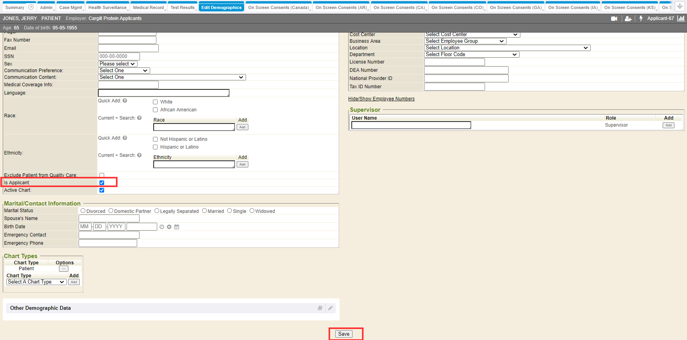

### Applicant/Candidate/PrePlacement Arrives for Scheduled Appointment

Navigate to search and find the specific Applicant's chart via E-Chart search and verify it is the correct chart.  Update any demographic fields as needed such as address, phone, gender, etc.

On the Summary dashboard tab of the applicant's chart, click the pencil icon (manage info) on Demographics portlet to get to edit demographics screen

Edit demographics to collect information (phone/address/gender etc) and make sure the checkmark for *Is Applicant* is marked towards the bottom left of the screen.  The checkmarked box named *Is Applicant* flags the chart as a temporary record, which is needed for auto-chart merging rules that happen in the background for the system to auto merge to their permanent employee chart for when/if the applicant is hired.

#### Applicant fills out questionnaire(s) needed

Applicants need to fill out the applicable questionnaires (for the job being considered for) using Cargill Protein's Applicant Portal.  Note: the applicant portal is only English supported. When the applicant submits questionnaires via the applicant portal, another separate Applicant partitioned chart (according to clinic location) is created in EH.

There may be an instance where an applicant does not go to the applicant portal to fill out the questionnaire(s) needed.  If they refuse or cannot, you can print off paper form versions of the questionnaires and scan/index in, or you can in real-time do the questionnaire when working in the exam encounter and complete together within the encounter using electronic format.

Enterprise Health will alert you of any possible duplicate charts matching name, DOB, and/or SSN if applicable.  View the **Manual Merge** portlet from the Summary dashboard to Merge any duplicate charts if the applicant went on the applicant portal multiple times.  **_Note: _**Currently only a handful of users have merge rights.  Use the Add Task method to submit a fast task ‘Merge Chart Request' to send a task to Health Service Managers department who can merge duplicate charts if needed

Clinicians can **_move_** questionnaires from the applicant's other chart, to be in the applicant chart that has the appointment information (from HR request) though, so that information can be in the chart when the exam is performed.

### PrePlacement Exam Visit Encounter

Clinicians will need to manually create and generate a *PrePlacement Exam* encounter.  Do this by going to the Quick Links portlet and clicking the Add PrePlacement Exam hyperlink.

The PrePlacement Exam encounter is now created and will take you directly into the encounter to begin documenting.

Other help documentation on how to work encounters [*https://docs.enterprisehealth.com/docs/eh/eh/working-in-a-dynamic-encounter-7344802.html*](https://docs.enterprisehealth.com/docs/eh/eh/working-in-a-dynamic-encounter-7344802.html)

Complete each encounter section starting at the top and working down.

#### Encounter top section

In the *Encounter* top section, make sure to have the **provider/location,** of who is seeing the applicant/candidate, set in the top Encounter Info section if it is different from who it was originally scheduled with/at.  Click the section titled *Encounter* to expand it open and set the provider/location.

#### 

Work the PrePlacement Exam encounter from the top down to collect information needed for the PrePlacement exam visit in various encounter sections.

#### Questionnaires Encounter Section

Any questionnaires the applicant filled out on the Applicant Portal will be displayed in the Questionnaires encounter section.
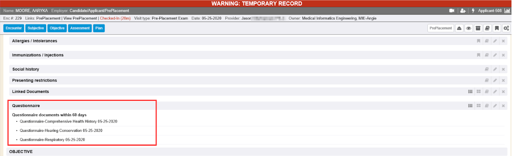

You can review their answers to the questionnaires by moving your mouse to the far right side of the specific questionnaire listed and click the ↗ northeast arrow icon to open the document (doc.id) stored in the chart. *Note: if using an ipad, swipe left to access the icons on that side of the screen.*
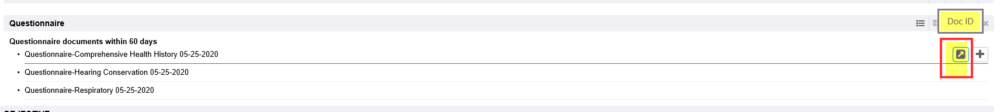
The system will open the stored questionnaire document in a separate browser tab where you can review their answers.  Simply exit out of that separate browser tab to get back to the PrePlacement encounter.

#### Tests & Procedures Encounter Section to Trigger the Initial PrePlacement Program Testing Items

This section contains the Due List which will help to define what preplacement/health surveillance tests /procedures you need to do on the applicant today.

Expand open the Tests & Procedures encounter section.
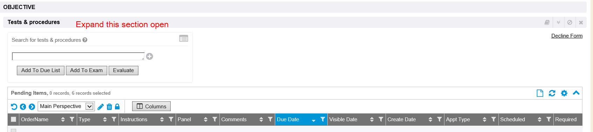

In the auto-complete field, key in the word **_entry_** to see a list of programs.
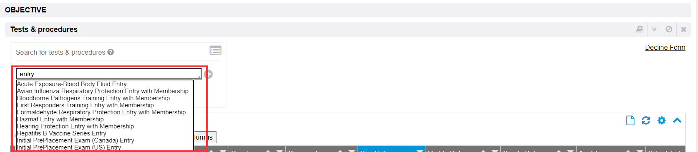

Select the "Initial PrePlacement Exam Entry" and select either US or Canada one.
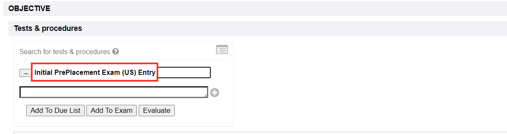
Add on any additional testing programs needing testing for (ex: Hazmat, Hearing, etc) as *entry with membership*

Then click the **EVALUATE** button from this section.  The system will evaluate the program(s) and display all the testing items needing to be performed.

You will see a pop-up that it has successfully evaluated the program(s) indicated.  Click the OK button.
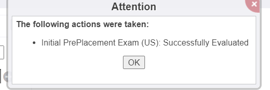
When you click the OK button, the tests & procedures section refreshes to display the testing items to be completed.

### Working the Tests & Procedures (aka: Due List) Encounter Section

The system displays the list of all testing that needs to be performed for Initial PrePlacement program.

#### PrePlacement Questionnaire

The applicant/candidate already should have completed the PrePlacement Questionnaire on the applicant portal. Therefore, we need to mark this item as ‘completed' off the due list.  You can select this item from the tests & procedures section with a checkmark.  Then click the **EDIT** button.  *Note: if the applicant didn't fill it out on the portal, one could ‘add to exam' this questionnaire and you can scribe their answers and then mark it complete within this encounter.*

The *Edit Encounter Order(s)* pop-up displays.  Change the status to **Completed** and click the DONE button.
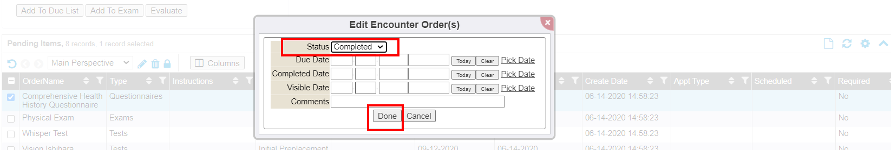

#### Other Testing for PrePlacement Exam

If the applicant/candidate will be receiving the full preplacement exam for their job role, checkmark the remaining items from the due list/Tests & Procedures section and click **ADD TO EXAM** button. 
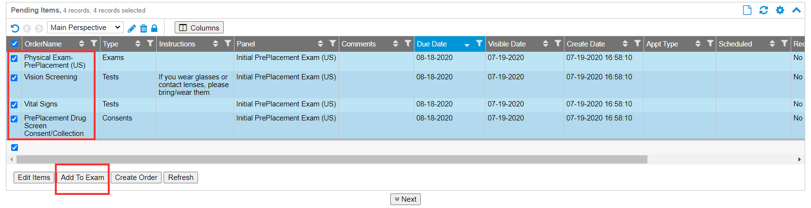
The specific items will be applied as their own unique encounter section.  Work each by expanding the section and using the ✔ icon to set the status as ‘completed' and key in the findings/results.   If using an ipad or touch screen type device, swipe left to get the **✔** icon to appear to quickly tap.
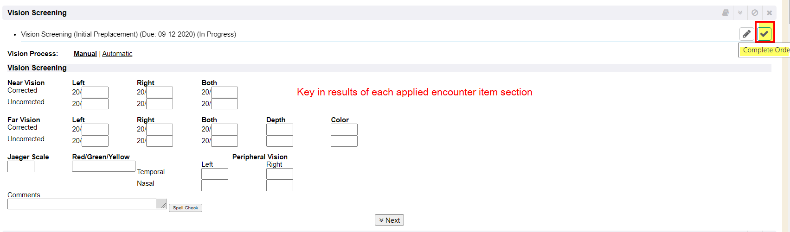

#### On-Demand Tests & Procedures Picklist Items

If you need to add a test or procedure to perform in-house during this visit that is not listed as pending on the due list, from the Tests & Procedures encounter section simply click the picklist grid icon.  This will open the **In House Testing Pick List.**

From the picklist pop-up window, check off the items you'd like to perform and complete at today's visit and click Add Procedures 
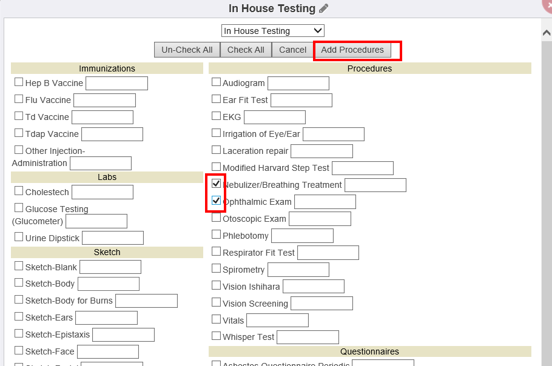

Individual sections for the specific test/procedure that you signified to perform during today's visit will be immediately applied to the encounter.

To complete the test/procedures that you have added to the encounter exam, click the grey title header section of the individual test/procedure and document the results using the data field flowsheets.  ** Then be sure to mark the item complete signifying you performed it.** 

#### PrePlacement Drug Screen Collection/Consent

Obtain the Drug Screen Consent (using forms library or On Screen Consent chart tab) and mark this item to *completed* status on the encounter.

Then generate and open a separate **_Drug and Alcohol Tracking_** encounter using the 🗲 lightning bolt icon at the top right of the chart.
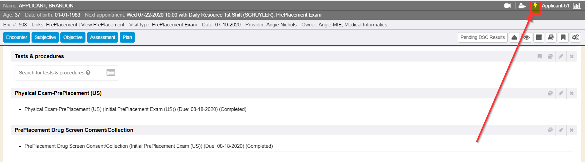

Click Add Drug and Alcohol Test Tracking hyperlink to create and generate that separate encounter.  Drug Screen collection details and Drug Screen results will be worked and housed in that separate encounter.
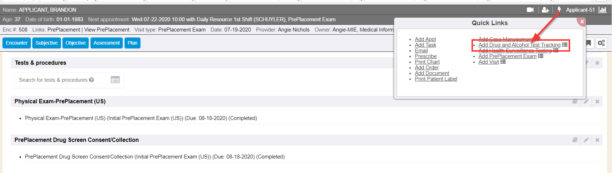

******Refer to separate** [**workflow guide for Drug and Alcohol Tracking Encounter**](https://drive.google.com/open?id=17qKKNYDac683WteVba-75e1NIr2W9u2xcW52LhGMa2E)

### Stages

The PrePlacement encounter may need to remain ‘open' and in some sort of ‘stage' to indicate to users why it is still open, what you are still waiting on, etc.
Stage buttons are available at the top right portion of the encounter (or at the bottom of the encounter).  When the PrePlacement encounter cannot be closed & archived yet (because there is a need for other information or other needs) and cannot perform the written opinion-PrePlacement yet, utilize the Stage buttons.
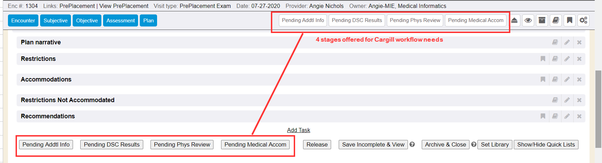
Keep the PrePlacement encounter open and manage via the PrePlacement Exam Worklist (found in Quick View sidemenu tab).

#### PrePlacement Exam Worklist

From the Quick View sidemenu tab, a portlet is available named **Pre-Placement Exam Worklist**.  This lists any PrePlacement Exam encounters that are still **open** status (not archived & closed) and what *Stage* they are in (if applicable due to results or info still pending before a written opinion-PrePlacement can be completed).

Use this worklist to manage and follow up getting the PrePlacement Exam encounters to archived & closed status after the Written Opinion-PrePlacement has been completed.

### Perform Written Opinion(s) in Recommendations Encounter Section

Once the PrePlacement Drug Screen results are in, back on this PrePlacement Exam encounter, the **Recommendations** encounter section contains the written opinion for PrePlacement.   You will use this section to document a written opinion Preplacement to signify if and what they are cleared for.   This is the overall PrePlacement clearance.  

Once this written opinion is performed, that written opinion PrePlacement document will automatically be tasked to the appropriate health services location Clinicians team.  The clinicians will grab the task and manually email the Written Opinion-PrePlacement document to the appropriate HR Rep. 

To add the Written Opinion-PrePlacement into the encounter to document, move your mouse to the far right side of the specific written opinion listed and click the **+** icon to add the written opinion to today's encounter.  If using an ipad or touch screen type device, swipe left to get the **+** icon to appear to quickly tap.
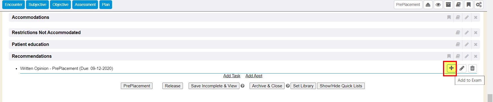

Another method is to expand the Recommendations section and checkmarking the Written Opinion-PrePlacement to apply to today's encounter.  Checkmark and click the *Add to Exam* button.

Either method above, each written opinion selected will be applied as its own individual section in the encounter to work.

Click on the written opinion to expand each applied health surveillance written opinion encounter section to work it.

Make sure to document the written opinion template data points needed and the overall determination radio button choice of recommended or incomplete, etc.  Signify the overall determination by selecting a radio button for medically recommended, or medically recommended with restrictions/accommodations or incomplete.

It is important to use the free text **Comment** field to indicate what else the candidate is all cleared or evaluated for and provide any information that the HR Rep needs to know in regards to overall determination of the candidate/ applicant.

Set the Date of Determination and the Provider fields with the date and provider who is performing this written opinion.  Click the NEXT button to save your work in that section or collapse the Written Opinion section to save your work.
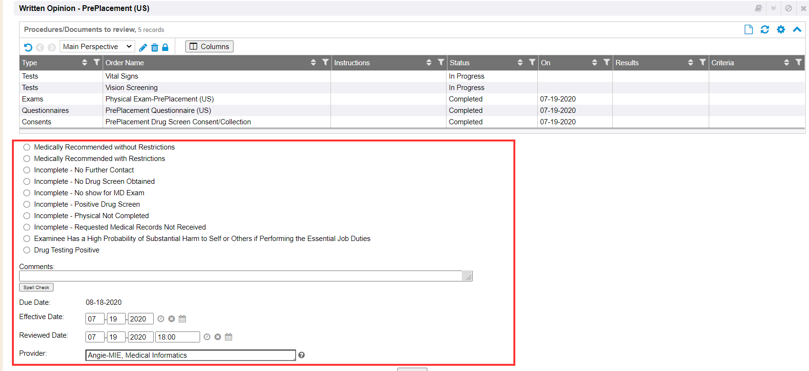
Click the NEXT button to save you work in that section or collapse the section to save your work.

### Archive & Close

There's nothing you need to do, unless you need to finish up documenting anything in the encounter, however you now need to Archive & Close the encounter.  Click the icon at the top that is for the Archive & Close or the button at the bottom of the encounter that says Archive & Close.

### Task to Email Written Opinion PrePlacement to HR Rep

Once a **Written Opinion - Preplacement** has been completed in the recommendations encounter section and the encounter has been closed & archived, the Written Opinion-PrePlacement document will be automatically routed via task to the appropriate health service location clinicians department.

The description of the task will be to email the written opinion-PrePlacement to the appropriate HR Rep.  Click on the **grab** link to grab a task to work.

Once a clinician has grabbed a task, the document showing the Written Opinion-PrePlacement will display on the screen towards the top, with the task details below it.  

Click **Print** or **Fax** hyperlink within the Written Opinion-PrePlacement document being displayed.

The print module screen will pop-up.  Select the **_Secure Email_** radio button.  Then manually key in the email address of the appropriate HR Rep to receive this.  Note: only cargill.com and crgl-thirdparty.com domains are whitelisted and allowed to be emailed to with documents attached.  You can type in a subject and free text any additional comments in the fields provided. The Written Opinion-PrePlacement document will be attached in the email and is signified as such in the *attachments* field.  Once ready, click the SEND** EMAIL** button.
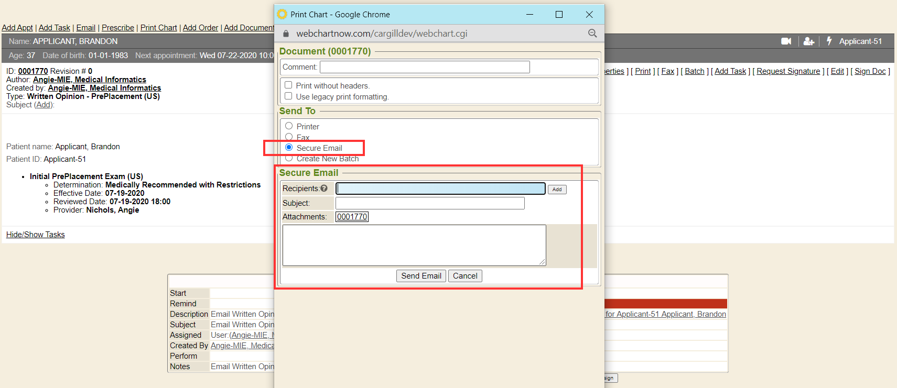
The email will process and send to the email address identified.  You will see the* email sent successfully.* Click X to close out of that pop-up screen.

The task should still be up on your screen.  Click **SIGN & MARK DONE w/o NOTE** to stamp the document with your name/signature that you reviewed the document and marks the task done indicating you emailed it out to HR Rep.  *Note: you can use the Sign & Mark Done* that then allows you to key in any free text note in regards to this task and is linked to the task.
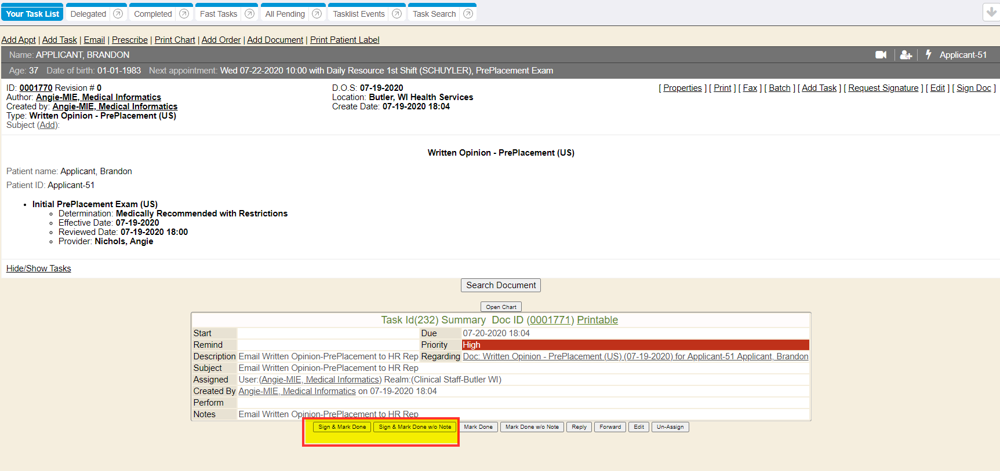

The Written Opinion-PrePlacement is housed in the Documents (catch all) chart tab, and in the Written Opinions chart tab found under the Health Surveillance parent chart tab for the specific applicant/candidate in their chart.

### Staff Index scanned in Documents/Link to Encounter

Scan and index any forms or documents per scanning protocol, link to the PrePlacement encounter by clicking on the "Search"  button on the indexing **Encounter** field to find the correct encounter.  When done indexing a batch, click on the "Upload to Chart" button in the index module.

### Health Service Manager E-Signs Completed Encounter Document

If the encounter is archived and closed by a staff member,  this will trigger an automated task to notify the HSM department to review and E-Sign the completed full PrePlacement encounter document and mark that task done. 

## Report

There is a report available to list applicant partitioned charts that do not have the **_Is Applicant_** checkbox marked.  Which then indicates the chart is not flagged as temporary and wouldn't be able to be merged with a permanent employee record once they are hired.

Clicking on that report will list any applicant partitioned charts without the *Is Applicant* box being checked in their chart. 
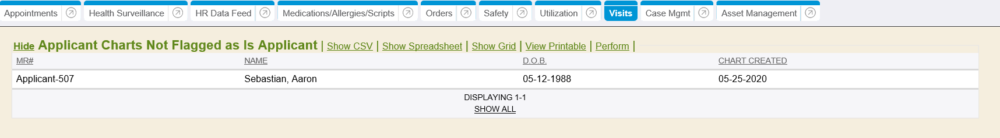

 This is the opportunity to go into the listed chart(s) and fix that via edit demographics.
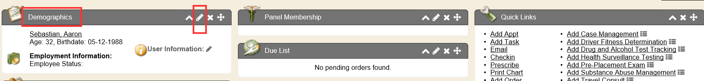

In edit demographics screen, checkmark the *Is Applicant* box and click Save to save your work.

## PrePlacement Exam Worklist

From the Quick View sidemenu tab, a portlet is available named **Pre-Placement Exam Worklist**.  This lists any PrePlacement Exam encounters that are still **open** status (not archived & closed) and what *Stage* they are in (if applicable due to drug screen results still pending before a written opinion-PrePlacement can be completed).

Use this worklist to manage and follow up getting the PrePlacement Exam encounters to archived & closed status after the Written Opinion-PrePlacement has been completed.

