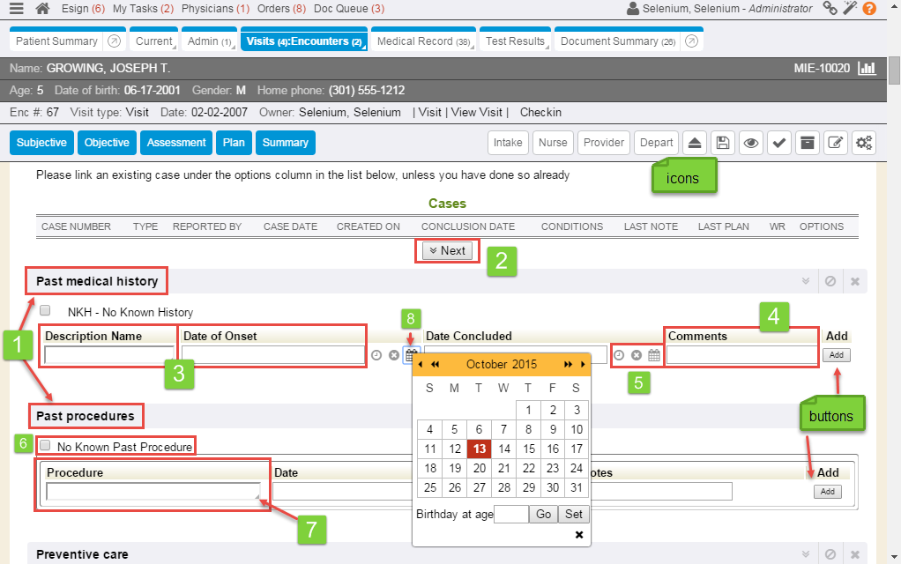

The following page provides details on the correct terminology for screens and items that appear in an MIE (WebChart, Enterprise Health) system.

For an overview on basic {} navigation and functionality, see [Intro to the System](https://docs.enterprisehealth.com/resources/intro-to-the-system/).

## Header and Side Navigation

MIE system navigation is driven through a number of toolbars and menus accessible at the top and sides of the system.

### Header Toolbars (Left Side)

Layered toolbars appear throughout the MIE system at the top of the page to provide navigation, patient details, and encounter details. The number of toolbars change depending on the page. Additionally, the toolbars collapse as you navigate some pages to maximize space for data entry.

When fully expanded, the toolbars appear from the very top of the MIE system as follows:

A. Application toolbar: Displays application ( {} ) navigation:

1. Show/hide menu icon: Shows or hides the left side menu tab.
2. Home icon: Opens the designated home page for the signed-in user (customized per user or department).
3. Department, task, and document links: Links open designated lists for tasks, documents, etc.
4. Subscription status icon: Chain links icon indicates whether or not the signed in user is connected to the database. This connection also displays messages to notify a user if another user is working in a document that is currently open.
5. Help bubble: Links to available help documentation.

B. Tab toolbar: Displays any tabs that pertain to the page that is currently open. Tabs in this toolbar are sometimes referred to as "chart tabs."

C. Patient info toolbar: Displays patient name and MR # when working in an E-chart.

1. Side chart icon: Opens the side chart when working in an encounter. Displays pertinent patient information (demographics, notes, medical records, orders/tests, comments) on the right side of the page.

D. Patient Extended toolbar: Displays demographic, encounter, and other related information (such as incidents) while working in an E-chart or an encounter.

E. Alerts toolbar: Displays available alert information for patients while working in an E-chart or encounter.

F. Encounter info toolbar: Displays links to open encounters while working in an E-chart or encounter.

G. Encounter navigation toolbar: Displays navigation tabs to skip to different sections while working in an encounter. Hover over the tabs to display the sections that appear under each category.

H. Encounter links: Links related to an open encounter, as well as a number of tabs and buttons, including:

1. Staging tabs: Changes the stage of an open encounter and indicates that one user is finished with the encounter. The next user takes over in the new stage.
2. Release button: Notifies other users that the current user is no longer editing an encounter.
3. Save incomplete button: Saves current changes to the encounter but does not archive and close it.
4. Save incomplete and view button: Saves current changes to the encounter and opens a copy of the encounter to view in a final format.
5. Note complete button: Used for taking a note on a patient; saves and closes the note.
6. Archive and close button: Archives (finalizes) the encounter and closes it.
7. Edit all sections button: Opens all sections of the encounter for editing.
8. Show hidden section list button: Displays the list of all additional encounter sections that are not displayed. Click a section to add it to the encounter.

### Header Bar (Right Side)

A.  If AI has been enabled/licensed for the database, the AI icon will display. Clicking this icon will open/close Ozwell, the AI Assistant.

B.  The person icon may display in a blue or black color depending on user security. If blue, the user person icon, allows users the switch between user accounts in a new session. If black, the user does not have this security feature enabled.

C.  The logged in user's name and security role will display to the right of the person icon. If the logged in user has access to edit user profiles, the name becomes a clickable link that takes the end user to the user account information. Beginning with RC202603, the User Detail box has been updated to display Eprescribe feature enrollment statuses and Meaningful Use (Quality) opt-in status and start dates.

As of database RC202409, a new system setting is available to determine how the users names displays on screens and on authored documents.

D.  The clock icon displays next to the user's preferred time zone. If the user has security that allows them to change their timezone, the icon/time zone becomes a clickable link, in which the user may change their time zone.

E.  The magnifying glass is a search feature that allows users with the proper security to search for key functions, layouts, system settings, etc by name to quickly navigate to that area.

F.  The magic wand icon displays for users with the security to add/edit configurable macros within the system.

G.  The world icon allows users to switch between different languages (as configured).

H.  The Keyboard icon displays a list of Keyboard shortcuts.

I.  The orange question mark bubbles directs users to the online help guides and videos.

J.  The gray circle icon displays page performance data.

### Menus and Tabs

The left side menu is accessible throughout the system from the show/hide menu icon in the upper left. The following terminology is applied to menus on the top and sides of an MIE system.

1. <strong>Left side menu</strong>: The navigational menu on the left side of the system. The left side menu is comprised of a number of customizable <strong>tabs</strong> The left side menu is accessed through the show/hide menu icon.
2. <strong>Side chart</strong>: The side chart displays information from a patient's chart. It is accessed only in an encounter by clicking the side chart icon.
3. <strong>Tabs</strong>: Tabs appear at the top of most pages. A tab is rounded, labeled, rectangular shape at the top of a page.
4. <strong>Subtabs</strong>: An extended tab that further organizes related information. Sub-tabs drop down from some tabs. A small, downward facing triangular shape at the corner of a tab indicates that subtabs are available.
5. <strong>Pop-out icon</strong>: A circular icon with an upward facing arrow is called a pop-out icon. This icon opens a new browser window or tab from the tab or sub-tab.

## Chart

The following items can be seen throughout MIE systems. Here, a patient chart is used for identification.

1. <strong>Quick link</strong>: Any underlined text (including text that displays an underline when the cursor hovers over it) that links to another page is identified as a link. The links on the left side of the header are identified as quick links.
2. <strong>Portlet</strong>: A movable customizable box that displays a summary of information or links is identified as a portlet. Portlets are displayed on the Quick View or on a patient's E-chart.
3. <strong>Icon</strong>: A small descriptive figure (such as those that appear on a portlet heading) is identified as an icon. Icons allow a user to perform an action or links to other information when clicked. This example displays portlet icons.
4. <strong>Link</strong>: Any underlined text (including text that displays an underline when the cursor hovers over it) that links to another page is identified as a link.

## Encounter

The following items can be seen throughout MIE systems. Here, an encounter is used for identification.

1. <strong>Section</strong>: A line of text that is obviously used to divide a longer page into distinct parts is identified as a section.
2. <strong>Button</strong>: A grey, labeled rectangle that enables the system to perform an action is identified as a button. Buttons are often squared and raised, but are sometimes smaller and rounded to fit in a smaller space.
3. <strong>Field</strong>: An empty, rectangular box that is populated with text is identified as a field.
4. <strong>Free text field</strong>: A field that allows the user to type in text as needed is referred to as a free text field. It is populated with text by typing into it and is not populated by any pre-written or selected text. These are often used for comments or notes.
5. <strong>Icon</strong>: A small descriptive figure (such as those that appear on a portlet heading) is identified as an icon. Icons allow a user to perform an action or links to other information when clicked. This example displays icons related to date selection.
6. <strong>Checkbox</strong>: A square box that displays a check mark or 'x' indicating that something (most often in a list) is selected is identified as a checkbox.
7. <strong>Autocomplete field</strong>: A field with a small triangle in the bottom right edge is identified as an autocomplete field. Autocomplete uses the text a user types to generate a number of options for them to select from.
8. <strong>Date Picker</strong>: A small icon that looks like a calendar and allows users to select a date is identified as a date picker.

1. <strong>Radio button</strong>: A circular icon that displays a darker circle in the center indicating that something (most often in a list) is selected is identified as a radio button.
2. <strong>Variable tree</strong>: Linked text that drops into a list from which a number of items can be selected by using a + icon is identified as a variable tree.
3. <strong>Free text field</strong>: A field that allows the user to type in text as needed is referred to as a free text field. It is populated with text by typing into it and is not populated by any pre-written or selected text. These are often used for comments or notes. Expanding free text fields can expand to hold more text and are marked with two small downward facing diagonal lines inside of a square in the lower right corner of the field.
4. <strong>Help bubble</strong>: A circular icon with a question mark or "i" for information is identified as a help bubble.
5. <strong>Column</strong>: The heading that displays at the top of a set of information that displays as a table is identified as a column heading. Refer to the heading in writing as the column name (Description, Date, or Options in this example) heading.
6. <strong>Drop-down</strong>: A field with a small, square, down-facing arrow icon in the right corner that allows users to select from a number of options to populate the field is identified as a drop-down.

## Related Pages

* [Intro to the System](../intro-to-the-system.md)
* [Dynamic Encounter](../../functions/encounters/working-in-a-visit-encounter.md)

## Learning Management System

To learn more about the System Anatomy, follow the link below to the Learning Management System course:

* [Basic Navigation](https://mie.talentlms.com/shared/start/key:AZGHRKMF)
