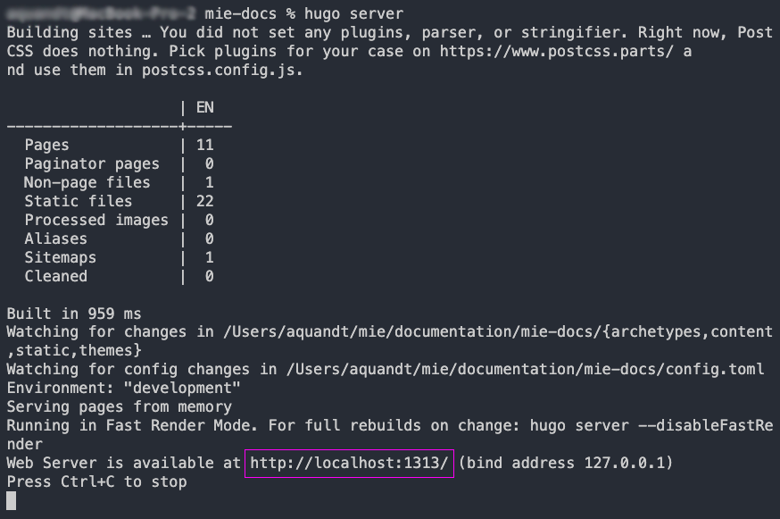

# MIE Docs

## Setup

**Requirements**

- [Git for Windows](https://git-scm.com/download/win)
- [Hugo](https://gohugo.io/)
- [Node.js](https://nodejs.org/en/download/package-manager/)
- [wikiGDrive](https://www.npmjs.com/package/@mieweb/wikigdrive)

### Mac Users

From your terminal, run:

```bash
brew install node hugo
```
```bash
npm i -g @mieweb/wikigdrive
```
```bash
git clone https://github.mieweb.com/aquandt/mie-docs.git
```

### Windows Users

If you do not have Git installed, [download](https://git-scm.com/download/win) and install it.

To install Nodejs and Chocolatey (package manager), [go here](https://nodejs.org/en/download/package-manager/) and choose the Windows (.msi) installer. If you are unsure about your computer being 32 or 64 bit, choose 32.

During the installation, you will reach a screen with a checkbox for installing Chocolatey. Make sure this is checked (it is not checked by default):


Once you have Chocolatey installed, open your terminal (run as administrator), run:

```bash
choco install hugo
```
```bash
npm i -g @mieweb/wikigdrive
```
```bash
git clone https://github.mieweb.com/aquandt/mie-docs.git
```

## Getting Started

### Overview

This project uses the following tools:

- **wikigdrive:**  A script that will download content from a Google Drive folder and convert it to [Markdown](https://www.markdownguide.org/cheat-sheet/) for use with Hugo.
- **Hugo:** A static HTML website builder.

You will use wikigdrive to download or watch for updates (and download) to the content in your Google Drive Folder.  You can use Hugo to:

- Run a local web server (usually at http://localhost:1313) to test/preview your documentation website.
- Build a copy of your documentation website.  You can then deploy this build to a public webserver, should you choose.

### Getting content from Google Drive:

We will need to run wikigdrive at least once in order to generate the content that Hugo will build the website with.  You will need to have the following:

- URL of the Google Drive folder you wish to use (example URL: `https://drive.google.com/drive/folders/1ahRhJjqSdokWHI6QllTJzms_u5jYxWBR` )
- [Google API client ID and client secret](https://console.developers.google.com/apis/credentials/oauthclient/762352378313-cfb109ipchpj1qij3i8u17t7faf6t5e0.apps.googleusercontent.com?project=wikigdrive)  You should see something like this:
  


**Quickstart With Sample Folder**

If you wish try a quick example with a simple Google Drive folder, move into your project directory `cd mie-docs` and run:

***Note:** Make sure you replace CLIENT_ID and CLIENT_SECRET with the values from the Google console.  Do not just copy, paste, and run.*

```bash
wikigdrive "https://drive.google.com/drive/folders/1ahRhJjqSdokWHI6QllTJzms_u5jYxWBR"  --client_id CLIENT_ID --client_secret CLIENT_SECRET  --dest content --link_mode uglyURLs --without-folder-structure --drive_id 0ALfGlL3hJS03Uk9PVA
```
The first time this runs, you will be asked to visit a URL and copy/paste a code.  Follow the following steps.  If done correctly, you should not have to do this again.

- Follow the URL
- If asked, log in with your MIE Google account
- You will be asked to agree to allow wikiGDrive permission to access Google Drive. Do so.
- You will then be given a code.  Copy it.
- Return to your terminal and paste it and hit enter.

This example will:
- Download and convert all Google Docs within the sample folder (and sub folders).
- All converted documents will be placed in the `content` directory. Specified with `--dest content`
- Page URLS will have the .html extension. Specified with `--line_mode uglyURLs`

If the script ran without error, you should see something like this: 


***Note:** content that is displayed may vary as the sample project gets updates*

Now, you can start a local server to preview the website by running:

```
hugo server
```

If the server started without error, you should see:



You should now be able to open your web browser and go to [http://localhost:1313](http://localhost:1313).  If that location is not available, look at the area in purple in the above screenshot.  Port 1313 may not be available, in which case Hugo will have assigned another port.   If so, change the `1313` in your browser to match what is in your terminal.

You should see something like this in your browser:


***Note:** content/look of the website may vary as the sample project gets updates*

To stop the server, return to your terminal and hit CTRL+C.

## Branding

There are currently 3 branding options.  

- MIE (Generic)
- Enterprise Health
- WebChart

The MIE branding option is the default and its configuration is stored in the `config.toml` file.  Enterprise Health's branding configuration is stored in `config-eh.toml` and WebChart's is within `config-wc.toml`.

If you wish to build or run a local server using a different branding configuration; add the `--config` flag to your Hugo command.

Example:

```bash
hugo server --config 'config-eh.toml'
hugo --config 'config-wc.toml'
```
