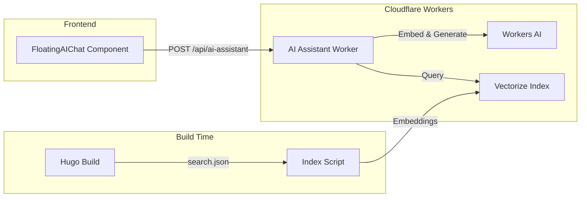

# AI Documentation Assistant

RAG-powered AI assistant for Enterprise Health / WebChart documentation, built with Cloudflare Workers AI and Vectorize.

## Architecture



## Components

### Worker (`workers/ai-assistant/`)

Cloudflare Worker that handles:

- Receiving chat messages from the frontend
- Generating embeddings for user queries using `@cf/baai/bge-base-en-v1.5`
- Querying Vectorize for relevant documentation chunks
- Generating responses using `@cf/meta/llama-3.1-8b-instruct`

### Indexing Script (`workers/scripts/`)

Build-time script that:

- Processes Hugo's search index (`public/eh/search.json`)
- Chunks documentation into optimal sizes for RAG
- Generates embeddings via Workers AI
- Uploads vectors to Cloudflare Vectorize

### Frontend (`src/components/AIDocAssistant.tsx`)

React component using `@mieweb/ui` FloatingAIChat that:

- Renders floating chat button in bottom-right corner
- Manages conversation history
- Displays AI responses with source citations

## Setup

### Prerequisites

1. Cloudflare account with Workers AI and Vectorize access
2. Wrangler CLI installed and authenticated

### 1. Create Vectorize Index

```bash
cd workers/ai-assistant
npx wrangler vectorize create docs-embeddings --dimensions=768 --metric=cosine
```

### 2. Create KV Namespace

```bash
npx wrangler kv:namespace create DOCS_CACHE
```

Update `wrangler.toml` with the returned KV namespace ID.

### 3. Install Dependencies

```bash
# Worker dependencies
cd workers/ai-assistant && npm install

# Indexing script dependencies
cd ../scripts && npm install
```

### 4. Index Documentation

After building the Hugo site:

```bash
# Dry run to preview
npm run index:docs:dry-run

# Full indexing
npm run index:docs
```

### 5. Deploy Worker

```bash
npm run worker:deploy
```

### 6. Configure Pages Worker Binding

In Cloudflare Dashboard:

1. Go to Pages > Your Project > Settings > Functions
2. Add a Worker binding:
   - Variable name: `AI_ASSISTANT`
   - Worker: `docs-ai-assistant`
3. Add route `/api/*` to the worker

Alternatively, use a custom domain pointing to the worker.

## Development

### Local Worker Development

```bash
npm run worker:dev
```

This starts a local worker at http://localhost:8787

### Testing the API

```bash
curl -X POST http://localhost:8787/chat \
  -H "Content-Type: application/json" \
  -d '{"message": "How do I schedule an appointment?", "brand": "eh"}'
```

## Configuration

### Hugo Config (`config-eh.toml` / `config-wc.toml`)

```toml
[params.ai]
  enabled = true        # Enable/disable AI assistant
  apiUrl = "/api/ai-assistant"  # Worker endpoint
```

### Worker Config (`wrangler.toml`)

```toml
[vars]
EMBEDDING_MODEL = "@cf/baai/bge-base-en-v1.5"
LLM_MODEL = "@cf/meta/llama-3.1-8b-instruct"
MAX_CONTEXT_CHUNKS = "5"
MAX_TOKENS = "1024"
```

## API Reference

### POST /chat

Send a message to the AI assistant.

**Request:**

```json
{
  "message": "How do I create a patient chart?",
  "brand": "eh", // optional, default: "eh"
  "history": [
    // optional conversation history
    { "role": "user", "content": "..." },
    { "role": "assistant", "content": "..." }
  ]
}
```

**Response:**

```json
{
  "answer": "To create a new patient chart...",
  "sources": [
    {
      "title": "Patient Registration",
      "url": "/eh/features/patient-registration/",
      "relevance": 0.92
    }
  ]
}
```

### GET /health

Health check endpoint.

```json
{
  "status": "healthy",
  "timestamp": "2026-02-03T12:00:00.000Z"
}
```

## Costs

Cloudflare Workers AI pricing (as of 2025):

- **Free tier**: 10,000 neurons/day
- **Paid**: $0.011 per 1,000 neurons

Typical usage per chat message:

- Embedding generation: ~500 neurons
- LLM inference: ~2,000-5,000 neurons

Vectorize:

- **Free tier**: 5M vectors, 30M queries/month
- **Paid**: $0.01 per 1M vectors stored

## Troubleshooting

### "No relevant documentation found"

The Vectorize index may be empty or outdated. Run:

```bash
npm run index:docs
```

### CORS errors

Ensure the worker includes proper CORS headers. Check `workers/ai-assistant/src/index.ts`.

### Rate limiting

Consider adding rate limiting for production:

```typescript
// In worker
const rateLimitKey = `rate:${request.headers.get("CF-Connecting-IP")}`;
const requests = await env.DOCS_CACHE.get(rateLimitKey);
if (requests && parseInt(requests) > 100) {
  return errorResponse("Rate limited", "RATE_LIMITED", 429);
}
```
